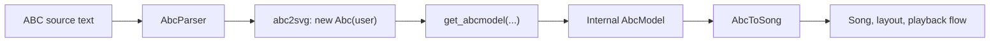
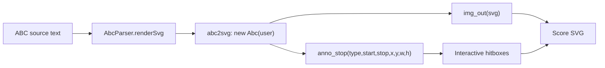

# abc2svg Stability Contract Request

## Purpose

This document describes the **actual abc2svg surface that `zupfnoter-ts` depends on today**.

Update: the parse path now reads the primary tune from `Abc.tunes` after `tosvg()`
instead of relying on the `get_abcmodel(...)` callback.

The goal is to send this to the abc2svg author and ask:

> Can these methods, callbacks, exported names, and model fields be considered
> stable enough for downstream consumers?

We intentionally do **not** ask for stability of the entire abc2svg internals.
We only ask for the subset that is used in this repository.

## Scope

Direct abc2svg access is intentionally limited to:

- `packages/core/src/AbcParser.ts`
- `packages/core/vendor/abc2svg-1.js`
- `packages/core/vendor/abc2svg-browser.ts`

Everything else in the codebase works against our own internal `AbcModel`.

## Integration Overview





## Requested Stable Runtime API

We currently depend on these runtime entry points:

### Module / global exports

- export name `Abc`
- export/global name `abc2svg`
- `abc2svg.C`

We support two loading styles:

1. CommonJS-style export via `module.exports`
2. fallback globals on `globalThis` named `Abc` and `abc2svg`

If one of these loading paths is intentionally deprecated, we need to know.

### Abc constructor and instance methods

We instantiate abc2svg like this:

```ts
const abc = new Abc(user)
abc.tosvg("zupfnoter", abcText)
```

We therefore depend on:

- `new Abc(user)`
- instance method `tosvg(fname, source)`

For score overlay injection we also depend on these instance methods inside the
render callback flow:

- `out_svg(fragment)`
- `out_sxsy(x, infix, y)`

## Requested Stable `user` Callback Contract

We currently pass these `user` properties to `new Abc(user)`:

- `keep_remark: true`
- `textrans: Record<string, string>`
- `img_out(svg: string)`
- `errmsg(msg: string, line?: number, column?: number)`
- `read_file(name: string): string | null`
- `Abc.tunes` for parse mode
- `anno_start(type, start, stop, x, y, w, h)` for render mode
- `anno_stop(type, start, stop, x, y, w, h)` for render mode

### Behavioral assumptions

We rely on the following semantics:

- `img_out` receives emitted SVG fragments / documents
- `errmsg` reports parser or render diagnostics with source position
- `get_abcmodel` is called with the parsed model
- `anno_stop` is called with stable source offsets `start` and `stop`
  and a stable bounding box `x`, `y`, `w`, `h`
- `read_file` may safely return `null` when include support is disabled
- `keep_remark: true` preserves `[r:...]` remarks in the model path

## Requested Stable Parsed Model Surface

We consume the `get_abcmodel(...)` callback arguments as an internal model.
The following fields are currently used by `zupfnoter-ts`.

### Top-level callback arguments

- `voice_tb`
- `music_types`
- `info`

We currently do **not** use `tsfirst` directly after callback receipt.

| Field | Expected type | Our interpretation | Used for |
| --- | --- | --- | --- |
| `voice_tb` | `Array<Voice>` | Parsed voices in score order | Build our internal `AbcModel.voices` |
| `music_types` | `string[]` | Lookup table from numeric symbol type id to symbolic type name | Dispatch from abc2svg symbol ids to our symbol transformers |
| `info` | `Record<string, string>` | Parsed ABC header fields, possibly newline-joined for repeated headers | Metadata extraction such as title, meter, key, tempo, lyrics |
| `tsfirst` | symbol pointer or `null` | Start of tune symbol stream; currently not consumed directly | Currently unused, but relevant to understand callback shape |

### `music_types`

We depend on:

- `music_types[symbol.type]` returning type names such as:
  - `note`
  - `rest`
  - `bar`
  - `part`
  - `tempo`
  - `clef`
  - `key`
  - `meter`
  - `staves`
  - `block`
  - `remark`
  - `grace`

We also use `abc2svg.C` as a fallback constant map for symbol ids.

### Voice fields

For each entry in `voice_tb` we currently use:

- `id`
- `nm`
- `sym`
- `meter`
- `key`
- `okey`

| Field | Expected type | Our interpretation | Used for |
| --- | --- | --- | --- |
| `id` | `string` | Voice identifier from abc2svg | Carry voice identity into our internal model |
| `nm` | `string \| undefined` | Human-readable voice name | `Song` voice naming |
| `sym` | symbol pointer \| `undefined` | First symbol in the linked list for this voice | Collect all symbols in voice order |
| `meter` | object \| `undefined` | Effective meter for the voice | Measure size and count-note calculation |
| `key` | object \| `undefined` | Effective key signature for the voice | Effective key metadata |
| `okey` | object \| `undefined` | Original key signature before transposition / shift, when available | Original-key metadata |

### Voice meter fields

We currently use:

- `meter.wmeasure`
- `meter.a_meter`
- `meter.a_meter[0].bot`

| Field | Expected type | Our interpretation | Used for |
| --- | --- | --- | --- |
| `meter.wmeasure` | `number` | Measure duration in abc2svg time units | Bar boundary tracking |
| `meter.a_meter` | `Array<{ top: number; bot: number }>` | Meter signature components | Preserve parsed meter structure |
| `meter.a_meter[0].bot` | `number \| undefined` | Denominator used by our count-note calculation | Count syllables like `1 e + a` |

### Voice key fields

We currently use:

- `key.k_sf`
- `okey.k_sf`

`k_mode` is carried through our internal type shims but is not currently used in
the transformation logic.

| Field | Expected type | Our interpretation | Used for |
| --- | --- | --- | --- |
| `key.k_sf` | `number \| undefined` | Effective number of sharps/flats | Derive effective key name in song metadata |
| `okey.k_sf` | `number \| undefined` | Original number of sharps/flats | Show original key when different from effective key |
| `key.k_mode` | `number \| undefined` | Mode identifier; currently carried through only | Not currently used, but part of our assumed key object shape |

## Requested Stable Symbol Linked-List Surface

We collect voice symbols by walking the linked list starting at `voice.sym`.

We therefore depend on:

- `sym.next`

The linked-list traversal order must reflect the logical order of symbols in the
voice.

| Field | Expected type | Our interpretation | Used for |
| --- | --- | --- | --- |
| `sym.next` | symbol pointer \| `undefined` | Next symbol in voice order | Flatten the abc2svg linked list into our symbol array and inspect tuplet continuation |

## Requested Stable Symbol Fields

For each symbol we currently use the following fields.

### Core identity and source mapping

- `type`
- `time`
- `dur`
- `istart`
- `iend`

We rely on `istart` / `iend` as source offsets into the original ABC text.

| Field | Expected type | Our interpretation | Used for |
| --- | --- | --- | --- |
| `type` | `number` | Numeric symbol kind id, resolved via `music_types` / `abc2svg.C` | Choose the matching transformer such as note, rest, bar, part |
| `time` | `number` | Time position in abc2svg units | Beat calculation, `znId` defaults, playback grouping, repeat/volta timing |
| `dur` | `number \| undefined` | Symbol duration in abc2svg units | Note/rest duration conversion and count-note calculation |
| `istart` | `number` | Inclusive start offset in original ABC source | Editor mapping, source ranges, diagnostics, score hitboxes |
| `iend` | `number` | End offset in original ABC source | Editor mapping, source ranges, diagnostics, score hitboxes |

### Notes / chords

- `notes`
- `notes[].midi`
- `notes[].dur`

We also rely on chord note order being reconstructible against the source slice
between `istart` and `iend`.

| Field | Expected type | Our interpretation | Used for |
| --- | --- | --- | --- |
| `notes` | `Array<NoteLike> \| undefined` | Pitches belonging to a note or chord symbol | Build `Note` or `SynchPoint` entities |
| `notes[].midi` | `number` | MIDI pitch value | Internal pitch values for layout and playback |
| `notes[].dur` | `number` | Note duration in abc2svg units | Duration conversion for note entities |

### Bars / repeats / voltas

- `bar_type`
- `text`
- `rbstart`
- `rbstop`

These fields are critical for our repeat and volta logic.

| Field | Expected type | Our interpretation | Used for |
| --- | --- | --- | --- |
| `bar_type` | `string \| undefined` | Barline token such as `|`, `||`, `|:`, `:|`, `[|:` | Repeat detection, bar handling, measure transitions |
| `text` | `string \| undefined` | Attached textual label, especially volta labels like `1` or `2` | Volta labeling and part markers |
| `rbstart` | `number \| undefined` | Volta start marker | Build variant-entry semantics |
| `rbstop` | `number \| undefined` | Volta end marker | Build variant-exit semantics |

### Visibility

- `invisible`
- `invis`

We currently treat both as accepted visibility flags.

| Field | Expected type | Our interpretation | Used for |
| --- | --- | --- | --- |
| `invisible` | `boolean \| undefined` | Hidden symbol flag | Visibility filtering and measure handling |
| `invis` | `boolean \| undefined` | Legacy / alternate hidden symbol flag | Same as `invisible`, accepted for compatibility |

### Ties and slurs

- `ti1`
- `slur_end`
- `slur_sls`

We handle two forms of `slur_sls`:

1. array form
2. packed numeric legacy form

| Field | Expected type | Our interpretation | Used for |
| --- | --- | --- | --- |
| `ti1` | `number \| undefined` | Tie-start marker on the symbol | Set `tieStart` / `tieEnd` on note entities |
| `slur_end` | `number \| undefined` | Number of slurs ending at this symbol | Close slur ids in the song model |
| `slur_sls` | `number[] \| number \| undefined` | Slur-start identifiers, either expanded or packed | Open slur ids in the song model |

### Decorations

- `a_dd`
- `a_dd[].name`

| Field | Expected type | Our interpretation | Used for |
| --- | --- | --- | --- |
| `a_dd` | `Array<{ name?: string }> \| undefined` | Decorations attached to the symbol | Decoration extraction |
| `a_dd[].name` | `string \| undefined` | Decoration token such as `fermata`, `segno`, `dacapo` | Supported decoration filtering and transfer into song entities |

### Chord symbols and inline annotations

- `a_gch`
- `a_gch[].type`
- `a_gch[].text`

We use these for:

- chord symbols
- inline annotations
- goto distance markers encoded in annotation text

| Field | Expected type | Our interpretation | Used for |
| --- | --- | --- | --- |
| `a_gch` | `Array<{ type: string; text?: string }> \| undefined` | Chord symbols and inline text annotations | Iterate extras attached to a playable |
| `a_gch[].type` | `string` | Annotation kind, e.g. `g`, `^`, `_`, `@`, `<`, `>` | Distinguish chord symbols, note annotations, goto markers |
| `a_gch[].text` | `string \| undefined` | Annotation payload text | Chord text, annotation text, goto-distance parsing |

### Tuplets

These fields are currently accessed dynamically and are therefore especially
important to confirm:

- `tp`
- `tp[0].p`
- `in_tuplet`
- `tpe`
- `next`

| Field | Expected type | Our interpretation | Used for |
| --- | --- | --- | --- |
| `tp` | `Array<{ p?: number }> \| undefined` | Tuplet metadata array | Detect tuplet start |
| `tp[0].p` | `number \| undefined` | Tuplet ratio/count, typically `3` for triplets | Store tuplet size on entities |
| `in_tuplet` | `boolean \| undefined` | Symbol is inside a tuplet span | Keep tuplet state across symbols |
| `tpe` | `boolean \| undefined` | Tuplet ends at this symbol | Detect tuplet end |
| `next` | symbol pointer \| `undefined` | Used to detect tuplet continuation/end | Inspect next symbol when end marker is implicit |

### Lyrics

These fields are currently accessed dynamically:

- `a_ly`
- `a_ly[0].t`
- `a_ly[0].ln`

| Field | Expected type | Our interpretation | Used for |
| --- | --- | --- | --- |
| `a_ly` | `Array<{ t?: string; ln?: unknown }> \| undefined` | Lyrics attached to the symbol | Extract per-note lyric text |
| `a_ly[0].t` | `string \| undefined` | First lyric fragment text | Build normalized lyric payload |
| `a_ly[0].ln` | unknown | Continuation/extender marker used by our lyric normalization | Add continuation dash semantics |

### Inline part markers

This field is currently accessed dynamically:

- `part`
- `part.text`

| Field | Expected type | Our interpretation | Used for |
| --- | --- | --- | --- |
| `part` | object \| `undefined` | Inline part marker object attached to a symbol | Detect part labels attached inline to a playable |
| `part.text` | `string \| undefined` | Inline part label | Materialize part-name annotations |

## Header / Info Fields

From the `info` object we currently use these ABC header keys:

- `X`
- `T`
- `C`
- `F`
- `M`
- `K`
- `Q`
- `W`

We assume `info[key]` is a string and may contain embedded newlines for repeated
headers.

| Header key | Expected type | Our interpretation | Used for |
| --- | --- | --- | --- |
| `X` | `string \| undefined` | Tune number | Song metadata |
| `T` | `string \| undefined` | Title, possibly repeated | Song metadata |
| `C` | `string \| undefined` | Composer / credit lines, possibly repeated | Song metadata |
| `F` | `string \| undefined` | Filename or source identifier | Song metadata |
| `M` | `string \| undefined` | Meter text from header | Song metadata |
| `K` | `string \| undefined` | Written key from header | Song metadata and original-key comparison |
| `Q` | `string \| undefined` | Tempo text from header | Tempo parsing and playback base tempo |
| `W` | `string \| undefined` | Lyrics block text | Harpnote options / lyrics export |

## Planned Near-Term Dependencies

The following items are not yet the primary runtime dependency in the current
implementation, but we expect them to become part of the effective abc2svg
contract soon and therefore want to mention them explicitly now.

### Part sequence from header `P:`

We plan to use header `P:` from `info['P']` as an input for playback-flow
computation.

This means we would like to rely on:

- `info['P']`

We assume the value preserves the part/playback sequence as parsed by abc2svg,
including repeated headers if applicable.

| Header key | Expected type | Our interpretation | Used for |
| --- | --- | --- | --- |
| `P` | `string \| undefined` | Part / playback sequence from the ABC header | Planned playback-flow computation |

### Nested repeat fallback semantics

For complex or nested repeat structures, we have observed the following
behavior in abc2svg and want to know whether it is intended and stable:

- if a repeat end has no explicit matching repeat start, we resolve it to the
  nearest preceding repeat start

Our playback engine intends to follow that interpretation. This means the
abc2svg model must continue to expose enough stable information for us to
detect:

- repeat-end bars
- repeat-start bars
- their order in the voice

In practice, this reinforces the importance of these existing fields:

- `bar_type`
- `time`
- `rbstart`
- `rbstop`
- `text`
- `sym.next`

If abc2svg already applies its own normalization for unmatched nested repeat
markers before exposing the model, that behavior should be documented and, if
possible, confirmed as stable, because it directly affects our playback
interpretation.

## Source-Position Stability Requirements

For Zupfnoter, source positions are not just diagnostics. They are used for:

- editor selection mapping
- score hitboxes
- note highlighting
- stable `sourceOffsets`
- diagnostics with line/column mapping

We therefore especially ask whether these are intended to remain stable:

- `istart`
- `iend`
- `anno_stop(..., start, stop, ...)`
- `errmsg(..., line, column)`

## Compatibility Notes

The following points are especially important for downstream compatibility:

- Both `invisible` and `invis` are currently accepted in the model.
- `slur_sls` may appear in more than one shape.
- Tuplet and lyric data are currently accessed as loose internal fields.
- Repeat / volta semantics depend on `bar_type`, `rbstart`, `rbstop`, and `text`.
- The symbol linked list via `sym.next` is part of our effective dependency.

## What We Are Not Asking To Freeze

We are **not** asking for stability of:

- the complete abc2svg internal object graph
- fields we do not currently read
- undocumented rendering internals outside the callbacks above
- playback APIs inside abc2svg

This request is intentionally narrow: only the subset listed in this document.

## Suggested Question To The Author

You can summarize the request like this:

> We are integrating abc2svg as a parser and score renderer, but we isolate all
> direct usage in a thin wrapper. The attached document lists the exact methods,
> callbacks, exports, and parsed-model fields we depend on. Can you confirm which
> of these are intended to remain stable for downstream tools, and which should
> be treated as internal and subject to change?
