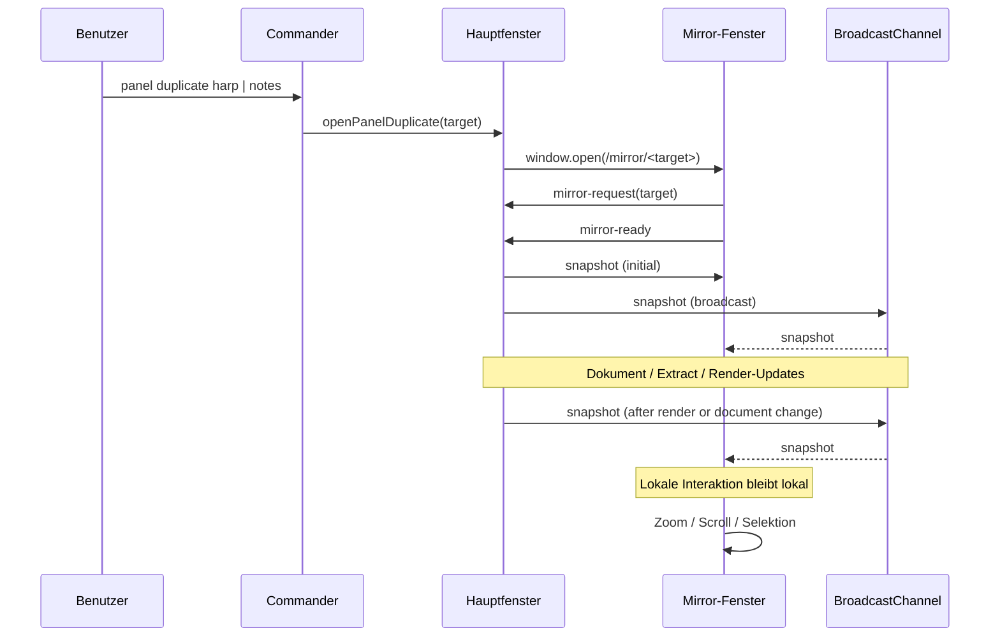

# Multi-Window Phase 1

## Architekturüberblick

Die erste Ausbaustufe nutzt ein gemeinsames BroadcastChannel-basiertes
Synchronisationsmodell. Das Hauptfenster bleibt führend und veröffentlicht einen
kompakten Snapshot für Dokument, Extract und Render-Ausgabe. Das Zweitfenster
rendert dieselbe Fachansicht als eigenständige Vue-Route und konsumiert diese
Snapshots für den Startzustand.

## Ereignisdiagramm

## Ablauf von `panel duplicate harp`

1. Der Commander-Parserschritt erkennt `panel duplicate harp`.
2. Der `panel`-Befehl ruft `openHarpDuplicate()` im Web-Runtime auf.
3. Das Hauptfenster öffnet ein Browserfenster unter `/mirror/harp`.
4. Das Zweitfenster meldet sich beim Hauptfenster als bereit.
5. Das Hauptfenster sendet den aktuellen Harp-Snapshot.
6. Beide Fenster erhalten danach weitere Dokument- und Render-Snapshots.

## Synchronisationsmodell

Synchronisiert werden in dieser Stufe:

- aktuelles Dokument
- aktueller Extract
- Render-Ausgabe der Harp-Ansicht
- Wiedergabe-Highlight
- Selektion
- Zoom
- Scrollposition

Das Hauptfenster ist die einzige Schreibquelle. Das Zweitfenster verarbeitet nur
eingehende Snapshots für den Ausgangszustand. Danach bleiben Zoom, Scroll und
Selektion lokal im jeweiligen Fenster.

## Erweiterung für generische View-Duplizierung

Die Implementierung ist absichtlich auf Harp als erste View fokussiert, nutzt
aber bereits eine generische Window- und Snapshot-Schicht:

- `panel duplicate <view>` kann weitere Views anstoßen
- aktuell unterstützt: `harp`, `notes`
- der Window-Manager kann um weitere Snapshots erweitert werden
- die Mirror-Route kann für andere Fachansichten parametrisiert werden

## Bekannte Einschränkungen

- Es gibt in dieser Stufe nur die Harp-Duplikation.
- Das Zweitfenster ist kein Bedienersatz für das Hauptfenster, sondern eine
  eigenständige Anzeige mit lokaler Interaktion.
- Die Synchronisation ist auf gleiche Origin und Browser-Unterstützung für
  `BroadcastChannel` angewiesen.
- Bei sehr alten Browsern gibt es keinen Fallback.
