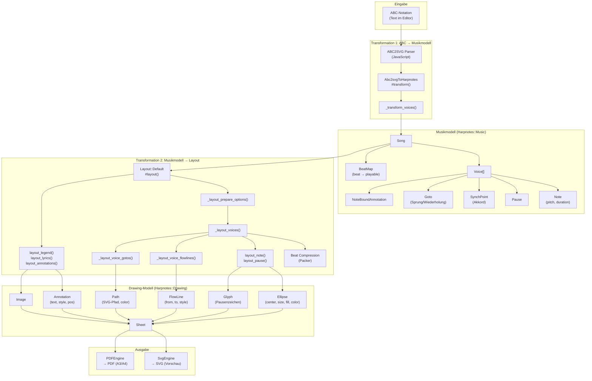
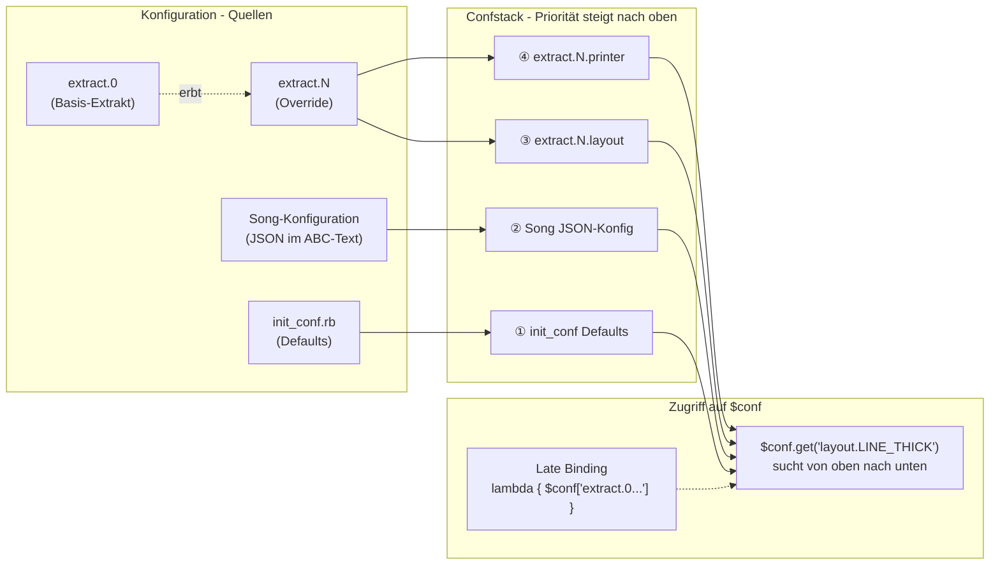
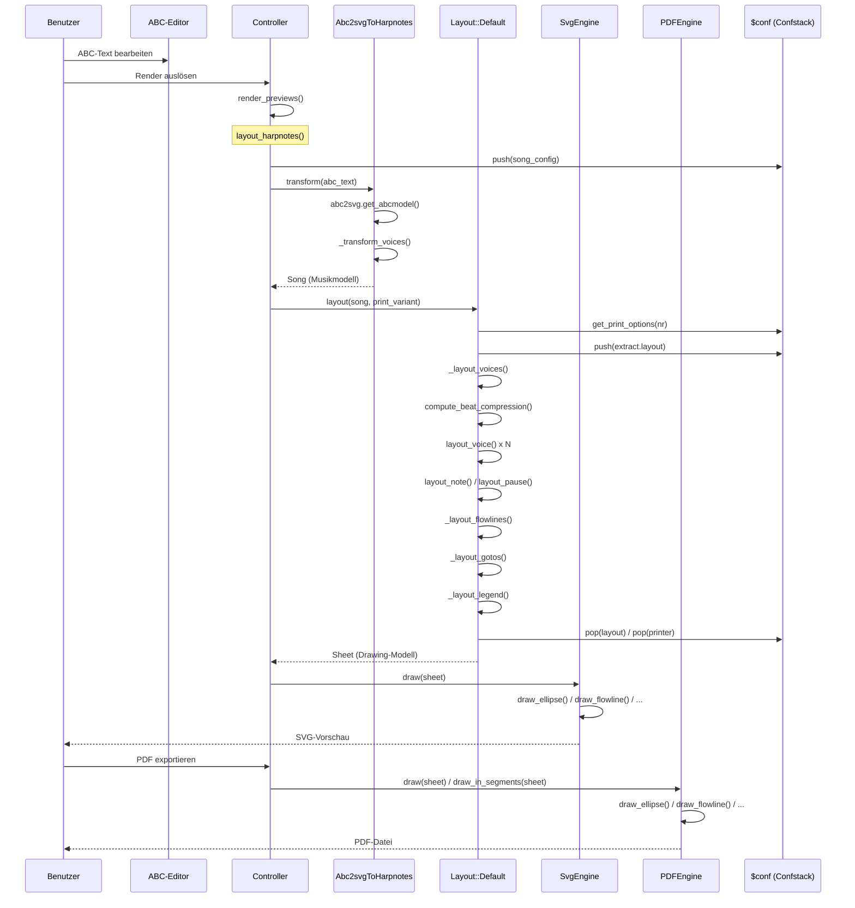

# Zupfnoter – Architektur und Transformationskette

## 1. Überblick

Zupfnoter ist eine Web-Anwendung (Opal/Ruby → JavaScript), die ABC-Notation in 
Harfennoten-Blätter (Zupfnoten) umwandelt. Die Transformation durchläuft vier Stufen:

```
ABC-Text → Musikmodell → Layout-Modell (Drawing) → Ausgabe (SVG / PDF)
```

Jede Stufe hat eigene Datenstrukturen und wird durch die zentrale Konfiguration (`$conf`) 
beeinflusst.


## 2. Hauptkomponenten

### Dateien und ihre Rollen

| Datei | Rolle |
|-------|-------|
| `application.rb` | Bootstrap: lädt alle Module, startet den Controller |
| `controller.rb` | Orchestrierung: Editor, Rendering, Dropbox, Player |
| `controller_command_definitions.rb` | Benutzer-Kommandos (Menü, Konsole) |
| `init_conf.rb` | Standard-Konfiguration (Defaults, Presets, Layout-Konstanten) |
| `confstack.rb` | Konfigurations-Stack mit hierarchischer Auflösung und Late Binding |
| `abc_to_harpnotes_factory.rb` | Factory für den ABC-Parser |
| `abc2svg_to_harpnotes.rb` | **Transformation 1**: ABC → Musikmodell (`Harpnotes::Music::Song`) |
| `harpnotes.rb` | **Datenmodell** (Music + Drawing) + **Transformation 2**: Musikmodell → Layout-Modell |
| `svg_engine.rb` | **Ausgabe 1**: Layout-Modell → SVG (interaktive Vorschau) |
| `pdf_engine.rb` | **Ausgabe 2**: Layout-Modell → PDF (Druck) |
| `user-interface.js` | W2UI-basierte Benutzeroberfläche |
| `config-form.rb` | Konfigurationsformular-Editor |
| `text_pane.rb` | ACE-Editor-Integration für ABC-Text |
| `harpnote_player.rb` | MIDI-Wiedergabe |
| `opal-svg.rb` | SVG-Rendering-Primitives |
| `opal-jspdf.rb` | jsPDF-Wrapper |
| `opal-dropboxjs.rb` | Dropbox-Anbindung |
| `snippet_editor.rb` | Schnipsel-Editor für ABC-Vorlagen |
| `chordengine.rb` | Akkord-Erkennung |


## 3. Die Transformationskette im Detail

### Gesamtübersicht (Diagramm)



### 3.1 Gesamtablauf

Der Gesamtablauf wird durch `Controller#layout_harpnotes` orchestriert:

```ruby
# controller.rb:854
def layout_harpnotes(print_variant = 0, page_format = 'A4')
  load_music_model           # Transformation 1: ABC → Musikmodell
  layouter = Harpnotes::Layout::Default.new
  result = layouter.layout(@music_model, nil, print_variant, page_format)  # Transformation 2
end
```

Die Ausgabe erfolgt dann über:
- `SvgEngine#draw(sheet)` → SVG für Bildschirm-Vorschau
- `PDFEngine#draw(sheet)` → PDF für A3-Druck
- `PDFEngine#draw_in_segments(sheet)` → PDF für A4-Druck (mehrseitig)


### 3.2 Transformation 1: ABC → Musikmodell

**Verantwortlich:** `Abc2svgToHarpnotes` (in `abc2svg_to_harpnotes.rb`)

**Eingabe:** ABC-Notation als String

**Ausgabe:** `Harpnotes::Music::Song`

#### Ablauf

1. **ABC parsen** (abc2svg JavaScript-Bibliothek)
   ```ruby
   abc_parser = ABC2SVG::Abc2Svg.new(nil, {mode: :model})
   @abc_model, player_model_abc = abc_parser.get_abcmodel(zupfnoter_abc)
   ```
   → Erzeugt ein JavaScript-Objekt (`@abc_model`) mit Staves, Voices, Symbolen

2. **Metadaten extrahieren** (`_make_metadata`)
   - Tonart, Tempo, Komponist, Titel aus ABC-Headern (T:, C:, M:, K:, F:, Q:)

3. **Stimmen transformieren** (`_transform_voices` → `_transform_voice`)
   - Iteriert über `@abc_model[:voices]`
   - Für jedes Symbol wird `_transform_{type}` aufgerufen (z.B. `_transform_note`, `_transform_bar`)
   - Erzeugt Harpnotes::Music-Objekte (Note, Pause, SynchPoint, Goto, etc.)
   - Behandelt Wiederholungen, Varianten, Tuplets, Bindebögen

4. **Song zusammenbauen**
   ```ruby
   Harpnotes::Music::Song.new(hn_voices)
   ```
   - Beat-Maps werden automatisch berechnet (`update_beats`)

#### Wo greift die Konfiguration ein?

| Parameter | Quelle | Wirkung |
|-----------|--------|---------|
| `abc_parser` | `$conf['abc_parser']` | Wahl des Parsers (aktuell nur ABC2SVG) |
| `layout.SHORTEST_NOTE` | `$conf` | Auflösung der Zeitdomäne |
| `layout.DECORATIIONS_AS_ANNOTATIONS` | `$conf` | Welche Dekorationen als Annotationen dargestellt werden |
| `annotations` | `$conf` | Vordefinierte Annotationsvorlagen |
| `produce` | `$conf` | Welche Extrakte erzeugt werden |
| `extract.<nr>.title` | `$conf` | Titel der Extrakte |


### 3.3 Das Musikmodell (`Harpnotes::Music`)

#### Klassenstruktur

```
MusicEntity (Basis)
├── Playable (spielbare Entitäten)
│   ├── Note              — Einzelne Note (pitch, duration)
│   ├── SynchPoint        — Akkord / synchrone Noten
│   └── Pause             — Pause (duration, pitch für Layout)
├── NonPlayable (nicht spielbar, aber relevant)
│   ├── MeasureStart      — Taktanfang
│   ├── NewPart           — Neuer Abschnitt
│   ├── NoteBoundAnnotation — Notenbezogene Annotation
│   ├── Chordsymbol       — Akkordsymbol
│   └── Goto              — Sprung (Wiederholung, da Capo etc.)
└── Song                  — Container für alle Stimmen
    ├── voices: Array<Voice>
    ├── beat_maps: Array<BeatMap>
    └── meta_data: Hash
```

#### Wichtige Attribute von MusicEntity

- `beat` — Zeitposition (für vertikale Platzierung)
- `time` — Position in der Zeitdomäne
- `start_pos` / `end_pos` — Position im ABC-Quelltext (für Highlighting)
- `decorations` — Verzierungen (Fermata, Dynamik etc.)
- `visible` — Sichtbarkeit
- `variant` — Variante bei Wiederholungen (0, 1, 2)
- `znid` — Zupfnoter-ID für Konfigurationsreferenz


### 3.4 Transformation 2: Musikmodell → Layout-Modell

**Verantwortlich:** `Harpnotes::Layout::Default` (in `harpnotes.rb`, ab Zeile 1302)

**Eingabe:** `Harpnotes::Music::Song` + Konfiguration

**Ausgabe:** `Harpnotes::Drawing::Sheet`

Dies ist die komplexeste Transformation. Sie besteht aus folgenden Schritten:

#### Ablauf in `Layout::Default#layout`

```ruby
def layout(music, beat_layout, print_variant_nr, page_format)
  _layout_prepare_options(print_variant_nr)   # 1. Konfiguration vorbereiten
  
  res_images          = layout_images(...)     # 2. Bilder
  active_voices, ..., res_voice_elements = _layout_voices(...)  # 3. Stimmen layouten
  res_synch_lines     = _layout_synclines(...)  # 4. Synchronisationslinien
  res_sheetmarks      = _layout_sheetmarks(...) # 5. Saitenmarkierungen
  res_instrument      = _layout_instrument      # 6. Instrument-Shape
  res_cutmarks        = _layout_cutmarks(...)    # 7. Schnittmarkierungen
  res_legend          = _layout_legend(...)      # 8. Legende
  res_zn_annotations  = _layout_zn_annotations(...) # 9. System-Annotationen
  res_lyrics          = _layout_lyrics(...)      # 10. Liedtext
  res_annotations     = _layout_sheet_annotations(...) # 11. Blatt-Annotationen
  
  sheet = Drawing::Sheet.new(all_elements, active_voices)
end
```

#### 3.4.1 Konfigurationsvorbereitung (`_layout_prepare_options`)

```ruby
def _layout_prepare_options(print_variant_nr)
  @print_options_raw = get_print_options(print_variant_nr)
  # → Confstack: erst extract.0 (Basis), dann extract.<nr> (Override)
  
  layout_options = @print_options_hash[:layout]
  $conf.push({layout: layout_options})   # Layout-Override auf den Stack
  $conf.push({printer: ...})             # Printer-Override auf den Stack
  
  initialize  # Neuinitialisierung mit den aktiven Layout-Werten
  # → @color_default, @color_variant1, @color_variant2, @beat_spacing
end
```

#### 3.4.2 Stimmen-Layout (`_layout_voices`)

```ruby
def _layout_voices(beat_layout, music, print_variant_nr)
  # 1. Beat-Compression berechnen (vertikale Optimierung)
  beat_compression_map = compute_beat_compression(music, layoutlines)
  
  # 2. Beat-Spacing berechnen
  @beat_spacing = [full_beat_spacing, max_spread * @beat_spacing].min
  
  # 3. Jede aktive Stimme layouten
  active_voices.each { |index|
    layout_voice(voice, beat_layout_proc, print_variant_nr, show_options)
  }
end
```

#### 3.4.3 Einzelne Stimme layouten (`layout_voice`)

Pro Stimme werden folgende Elemente erzeugt:

1. **Playables** (`_layout_voice_playables`)
   - `layout_note` → `Ellipse` (Position, Größe, Füllung, Farbe)
   - `layout_pause` → `Glyph` (Pausenzeichen)
   - `layout_accord` → mehrere `Ellipse` + `FlowLine` (Synchline)

2. **Flowlines** (`_layout_voice_flowlines`) — Verbindungslinien zwischen Noten
3. **Subflowlines** (`_layout_voice_subflowlines`) — Nebenflusslinien
4. **Jumplines** (`_layout_voice_gotos`) — Sprunglinien (Wiederholungen)
5. **Tuplets** (`_layout_voice_tuplets`) — Triolen-Klammern
6. **Barnumbers** (`layout_barnumbers_countnotes`) — Taktnummern
7. **Countnotes** — Zählhilfen
8. **Decorations** (`make_decorations_per_playable`) — Verzierungen
9. **Repeat signs** — Wiederholungszeichen
10. **Annotations** (`_layout_voice_notebound_annotations`) — Notenbezogene Beschriftungen

#### Wo greift die Konfiguration ein?

| Parameter | Konfig-Pfad | Wirkung |
|-----------|-------------|---------|
| Aktive Stimmen | `extract.<nr>.voices` | Welche Stimmen dargestellt werden |
| Flowlines | `extract.<nr>.flowlines` | Welche Stimmen Flusslinien bekommen |
| Subflowlines | `extract.<nr>.subflowlines` | Nebenflusslinien |
| Jumplines | `extract.<nr>.jumplines` | Sprunglinien |
| Synchlines | `extract.<nr>.synchlines` | Synchronisationslinien zwischen Stimmen |
| Layoutlines | `extract.<nr>.layoutlines` | Stimmen für vertikale Optimierung |
| Notengröße | `layout.ELLIPSE_SIZE` | Radien der Notenellipsen |
| Pausengröße | `layout.REST_SIZE` | Größe der Pausenzeichen |
| Linienbreiten | `layout.LINE_THIN/MEDIUM/THICK` | Strichstärken |
| Farben | `layout.color.color_default/variant1/variant2` | Notenfarben |
| Noten-Skalierung | `layout.DURATION_TO_STYLE` | Größe nach Notenwert |
| Vertikaler Abstand | `layout.Y_SCALE` | Vertikale Skalierung |
| Horizontaler Abstand | `layout.X_SPACING` | Saitenabstand |
| Horizontaler Offset | `layout.X_OFFSET` | Horizontale Verschiebung |
| Tonhöhen-Offset | `layout.PITCH_OFFSET` | Zuordnung Tonhöhe → Saite |
| Instrument | `layout.instrument` | Instrument-Typ (37-Saiten etc.) |
| Startposition | `extract.<nr>.startpos` | Y-Startposition |
| Packer-Methode | `layout.packer.pack_method` | Algorithmus für vertikale Kompression |
| Schriftarten | `layout.FONT_STYLE_DEF` | Text-Stile |
| Taktnummern | `extract.<nr>.barnumbers` | Position und Stil |
| Legende | `extract.<nr>.legend` | Position und Stil der Legende |
| Notizen | `extract.<nr>.notes` | Blatt-Annotationen |


### 3.5 Das Drawing-Modell (`Harpnotes::Drawing`)

#### Klassenstruktur

```
Sheet                    — Container für alle Drawables
  └── children: Array<Drawable>

Drawable (Basis)         — color, line_width, conf_key, visible
├── Symbol               — dotted, hasbarover
│   └── Ellipse          — center, size, fill, origin (→ Note)
├── FlowLine             — from, to, style (:solid/:dashed/:dotted)
├── Path                 — path (SVG-Pfad), fill, style
├── Annotation           — center, text, style, origin
├── Glyph                — center, size, glyph_name (Pausen-Glyphen)
├── Image                — url, position, height
└── CompoundDrawable     — shapes[], proxy (z.B. Note mit Barover + Flag)
```

#### Wichtige Eigenschaften von Drawable

- `color` — Farbe (String, z.B. "black", "grey")
- `line_width` — Strichstärke (Numeric, in mm)
- `conf_key` — Konfigurations-Schlüssel (für Drag&Drop und Kontextmenü)
- `conf_value` — Aktueller Wert (für Drag&Drop)
- `draginfo` — Handler-Info für interaktive Bearbeitung
- `more_conf_keys` — Zusätzliche Kontextmenü-Einträge

Diese Eigenschaften werden von den Ausgabe-Engines direkt verwendet.


### 3.6 Ausgabe: Layout-Modell → SVG / PDF

#### SVG-Ausgabe (`SvgEngine`)

```ruby
def draw(sheet)
  sheet.children.each do |child|
    @paper.line_width = child.line_width
    case child
    when Ellipse    then draw_ellipse(child)
    when FlowLine   then draw_flowline(child)
    when Glyph      then draw_glyph(child)
    when Annotation  then draw_annotation(child)
    when Path        then draw_path(child)
    when Image       then draw_image(child)
    end
  end
end
```

**Besonderheiten:**
- Erzeugt interaktive SVG-Elemente (Klick → ABC-Quelltext-Selektion)
- Drag&Drop für Annotationen, Jumplines, Tuplets
- Kontextmenü für Konfigurationsänderungen
- Highlighting bei Selektion im Editor

#### PDF-Ausgabe (`PDFEngine`)

```ruby
def draw(sheet)         # A3 (eine Seite)
def draw_in_segments(sheet)  # A4 (mehrere Seiten)
```

**Besonderheiten:**
- Verwendet jsPDF
- Farben werden als RGB-Arrays aufgelöst (`COLORS`-Lookup)
- Seitenaufteilung A4: horizontale Verschiebung pro Seite um `12 * X_SPACING`
- Offset konfigurierbar über `printer.a3_offset` / `printer.a4_offset`

#### Wo greift die Konfiguration ein?

| Parameter | Konfig-Pfad | Wirkung |
|-----------|-------------|---------|
| A3-Offset | `printer.a3_offset` | Verschiebung des Druckbereichs (A3) |
| A4-Offset | `printer.a4_offset` | Verschiebung des Druckbereichs (A4) |
| A4-Seiten | `printer.a4_pages` | Welche Seiten gedruckt werden [0,1,2] |
| Rahmen | `printer.show_border` | Seitenrahmen anzeigen |
| Schriften | `layout.FONT_STYLE_DEF` | Schriftgrößen und -stile |
| MM_PER_POINT | `layout.MM_PER_POINT` | Umrechnungsfaktor Punkt→mm |


## 4. Das Konfigurationssystem (`Confstack`)

### Konfigurations-Stack (Diagramm)



### 4.1 Prinzip

`Confstack` ist ein Stack von Hash-Objekten. Beim Zugriff auf einen Schlüssel wird der 
Stack von oben nach unten durchsucht – der oberste Wert gewinnt.

```
$conf-Stack:
┌─────────────────────────────┐  ← Top (höchste Priorität)
│ extract.<nr>.layout-Overrides│  (push in _layout_prepare_options)
├─────────────────────────────┤
│ extract.<nr>.printer-Overrides│
├─────────────────────────────┤
│ Song-Konfiguration (JSON)   │  (push in load_music_model)
├─────────────────────────────┤
│ init_conf Defaults          │  (push beim Start)
└─────────────────────────────┘  ← Bottom (niedrigste Priorität)
```

### 4.2 Late Binding

Konfigurationswerte können Lambdas sein, die erst bei Zugriff ausgewertet werden:

```ruby
# init_conf.rb
LINE_MEDIUM: lambda { $conf['extract.0.layout.LINE_MEDIUM'] }
```

Dies ermöglicht, dass Presets auf die aktuellen Basiswerte verweisen.

### 4.3 Hierarchischer Zugriff

```ruby
$conf['extract.0.layout.LINE_THICK']     # → 0.5
$conf.get('layout.ELLIPSE_SIZE')          # → [3.5, 1.7]
$conf['layout.color.color_default']       # → "black"
```

### 4.4 Extract-Vererbung

Extrakte erben von `extract.0`:

```ruby
def get_print_options(print_variant_nr)
  print_options_raw = Confstack.new()
  print_options_raw.push($conf.get("extract.0"))          # Basis
  print_options_raw.push($conf.get("extract.#{nr}"))      # Override
end
```

So muss `extract.1` nur die Abweichungen definieren (z.B. andere `voices`).


## 5. Vertikale Kompression (Beat Packer)

Die vertikale Anordnung der Noten wird durch "Packer" optimiert. Es gibt mehrere Algorithmen:

| `pack_method` | Algorithmus | Beschreibung |
|---------------|-------------|--------------|
| 0 | Standard | Berücksichtigt Notengrößen, Taktanfänge, Abschnitte |
| 1 | Kollisionserkennung | Prüft horizontale Überlappung benachbarter Noten |
| 2 | Linear | Einfache lineare Skalierung (`beat * 8`) |
| 10 | Legacy | Älterer Algorithmus (Fallback) |

Zusätzlich kann der Benutzer manuelle Inkremente (`minc`) pro Zeitposition setzen.


### Rendering-Ablauf (Sequenzdiagramm)




### Stimmen-Layout-Detail (Diagramm)

```mermaid
flowchart TB
    subgraph layout_voice["layout_voice() - Elemente pro Stimme"]
        direction TB
        PLAY["Playables\nlayout_note() - Ellipse\nlayout_pause() - Glyph\nlayout_accord() - Ellipsen + Synchline"]
        DECO["Decorations\nmake_decorations_per_playable()"]
        BARN["Barnumbers + Countnotes\nlayout_barnumbers_countnotes()"]
        FLOWL["Flowlines\n_layout_voice_flowlines()"]
        SUBFL["Subflowlines\n_layout_voice_subflowlines()"]
        JUMPL["Jumplines\n_layout_voice_gotos()"]
        TUPL["Tuplets\n_layout_voice_tuplets()"]
        SLUR["Slurs + Ties\n_layout_voice_slurs()"]
        REPT["Repeat Signs\n_layout_voice_repeatmarks()"]
        NANN["Notebound Annotations\n_layout_voice_notebound_annotations()"]
        CHORD["Chord Symbols\n_layout_voice_chordsymbols()"]
    end

    subgraph config_input["Konfiguration pro Element"]
        C1["layout.ELLIPSE_SIZE\nlayout.LINE_THICK\nlayout.DURATION_TO_STYLE"]
        C3["extract.N.barnumbers\nextract.N.countnotes"]
        C4["extract.N.flowlines\nlayout.LINE_THIN"]
        C6["extract.N.jumplines\nlayout.jumpline_anchor"]
        C7["defaults.notebound.tuplet"]
        C8["layout.SHOW_SLUR\nlayout.LINE_MEDIUM/THICK"]
        C9["extract.N.repeatsigns"]
    end

    C1 -.-> PLAY
    C3 -.-> BARN
    C4 -.-> FLOWL
    C6 -.-> JUMPL
    C7 -.-> TUPL
    C8 -.-> SLUR
    C9 -.-> REPT

    subgraph farben["Farbsteuerung"]
        CDEF["layout.color.color_default"]
        CV1["layout.color.color_variant1\n1. Wiederholung"]
        CV2["layout.color.color_variant2\n2. Wiederholung"]
        CALC["compute_color_by_variant_no()"]
    end

    CDEF --> CALC
    CV1 --> CALC
    CV2 --> CALC
    CALC -.-> PLAY
```




## 6. Interaktion zwischen Editor und Vorschau

### Highlighting-Kette

1. Benutzer klickt im **ABC-Editor** → `start_pos` / `end_pos` wird ermittelt
2. `SvgEngine#range_highlight(from, to)` findet SVG-Elemente mit passendem `origin.startChar`
3. CSS-Klasse `highlight` wird hinzugefügt

### Reverse Highlighting

1. Benutzer klickt im **SVG-Preview** → `_clickabcnote(evt, id)`
2. `origin` des Drawables enthält `startChar`/`endChar`
3. Editor selektiert den entsprechenden ABC-Textbereich

### Drag&Drop → Konfigurationsänderung

1. Benutzer zieht ein Element im SVG-Preview
2. `draginfo.handler` bestimmt den Handler (`:annotation`, `:jumpline`, `:tuplet`)
3. Neue Position wird berechnet
4. `conf_key` und neuer Wert werden in die Song-Konfiguration (JSON) geschrieben
5. Re-Rendering wird ausgelöst


## 7. Worker-Architektur

Rechenintensive Operationen laufen in einem Web Worker (`znworker.rb` / `znworker.js`):

- ABC-Parsing
- Layout-Berechnung
- PDF-Erzeugung

Der Controller kommuniziert über `NamedWebworker` mit Named Messages:

```ruby
@worker = NamedWebworker.new("public/znworker.js")
@worker.post_named_message(:render_harpnotepreview, data)
```

Es gibt auch einen UI-Thread-Fallback (`render_previews_in_uithread`).
