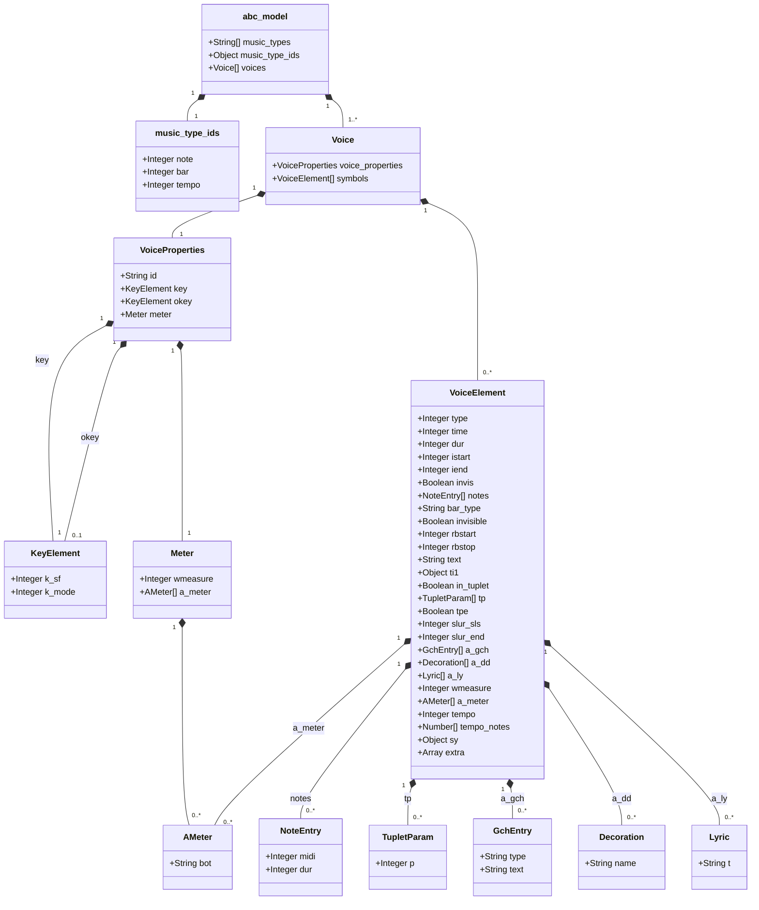
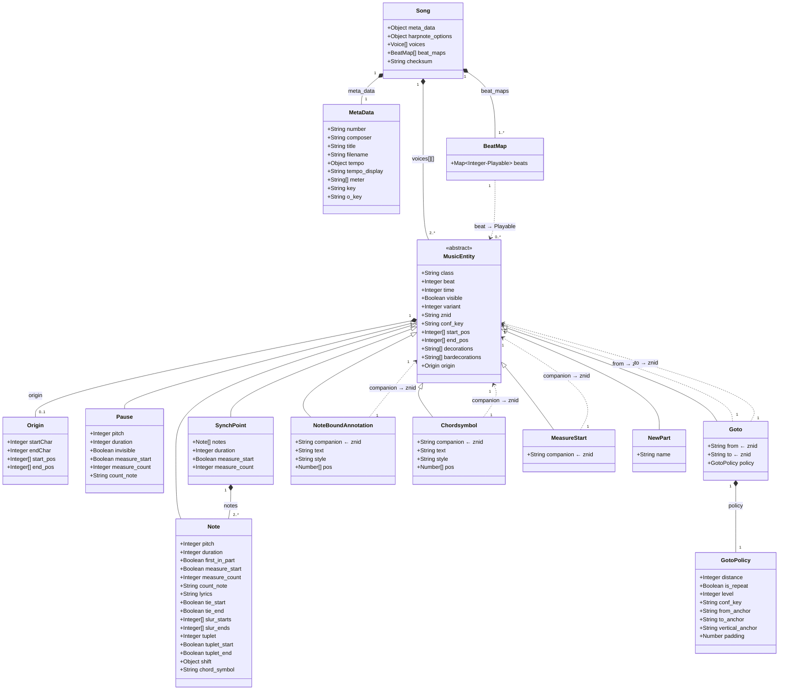
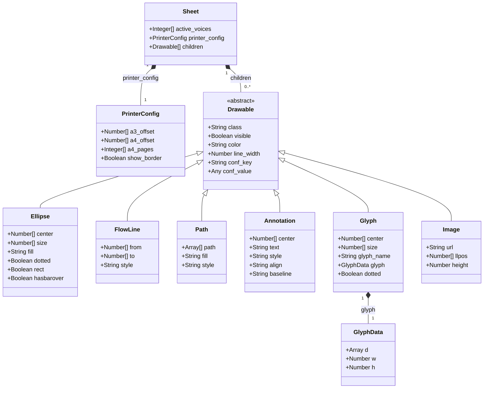

# Konzept: JSON-Serialisierung der Transformationsstufen

## Übersicht

Zupfnoter durchläuft drei Transformationsstufen mit jeweils eigenen Datenmodellen.
Dieses Dokument beschreibt, wie die Ergebnisse jeder Stufe als JSON serialisiert
werden können, und liefert ein JSON-Schema für jede Stufe.

```
Stufe 1: ABC → abc_model        (JavaScript-Objekt aus abc2svg)
Stufe 2: abc_model → Song       (Harpnotes::Music::Song — Musikmodell)
Stufe 3: Song → Sheet           (Harpnotes::Drawing::Sheet — Layout/Drawing-Modell)
```

### Serialisierungspunkte

| Stufe | Objekt | Erzeugt in | Serialisierungsmethode |
|-------|--------|-----------|----------------------|
| 1 | `@abc_model` | `abc2svg_to_harpnotes.rb:41` | Bereits ein JS-Objekt, direkt `JSON.stringify` |
| 2 | `@music_model` (Song) | `controller.rb:929` | `Song#to_json` (existiert bereits, Zeile 577) |
| 3 | `@song_harpnotes` (Sheet) | `controller.rb:877` | Neu zu implementieren: `Sheet#to_json` |

---

## Stufe 1: abc_model (ABC2SVG-Ausgabe)

### Beschreibung

Das `abc_model` ist das Ergebnis des ABC2SVG-Parsers. Es ist ein JavaScript-Objekt,
das über `abc_parser.get_abcmodel()` erzeugt wird. Ein bestehendes Schema existiert 
bereits in `abc2svg-model.schema.json`.

### Property-Erläuterungen

#### Top-Level

| Property | Bedeutung |
|----------|-----------|
| `music_types` | Lookup-Tabelle: Index → Name des Symboltyps. abc2svg weist jedem Symbol einen numerischen Typ zu (z.B. 8 = "note"). Zupfnoter nutzt diese Tabelle, um den Typ-Namen zu ermitteln und daraus den Methodennamen `_transform_note`, `_transform_bar` etc. abzuleiten. |
| `music_type_ids` | Umkehrung: Name → Index. Wird genutzt, um gezielt nach bestimmten Symbolen zu filtern (z.B. "finde alle Noten" über `music_type_ids[:note]`). |
| `voices` | Array aller Stimmen im Stück. Jede Stimme hat `voice_properties` (Metadaten) und `symbols` (die eigentlichen Musiksymbole in zeitlicher Reihenfolge). |

#### voice_properties (Stimmen-Metadaten)

| Property | Bedeutung |
|----------|-----------|
| `id` | Die Stimmen-ID aus dem `V:`-Header der ABC-Notation (z.B. "1", "2"). |
| `key` | Aktuelle Tonart mit `k_sf` (Anzahl Vorzeichen, -7 bis +7: -1=F-Dur, 0=C-Dur, 1=G-Dur etc.) und `k_mode` (Modus: 0=Ionisch/Dur, 5=Äolisch/Moll etc.). |
| `okey` | Original-Tonart vor einer eventuellen Transposition. Wird verglichen mit `key`, um einen Hinweis wie "(Original in D)" anzuzeigen. |
| `meter.wmeasure` | Taktlänge in abc2svg-Zeiteinheiten. Eine ganze Note = 1536. Bei 4/4-Takt ist `wmeasure` = 1536. Wird gebraucht, um Taktgrenzen zu erkennen und Zählhilfen zu berechnen. |
| `meter.a_meter[].bot` | Nenner der Taktart als String (z.B. "4" bei 4/4, "8" bei 6/8). Bestimmt die Zählweise für `count_notes`. |

#### symbols[] (Musik-Symbole einer Stimme)

| Property | Typ | Bedeutung |
|----------|-----|-----------|
| `type` | Integer | Numerischer Typ-Index. Wird über `music_types[type]` in einen Namen aufgelöst (siehe Tabelle unten). |
| `time` | Integer | Zeitposition des Symbols in abc2svg-Einheiten (1536 pro ganze Note). Dient als eindeutiger Zeitstempel und wird zur Berechnung von Beat, Taktposition und `znid` verwendet. |
| `dur` | Integer | Dauer des Symbols (nur bei Ganztaktpausen ohne `notes`-Array). Bei Noten steht die Dauer in `notes[].dur`. |
| `istart` | Integer | Zeichenposition im ABC-Quelltext, an der dieses Symbol beginnt. Wird für Highlighting und Fehlermeldungen in Zeile/Spalte umgerechnet. |
| `iend` | Integer | Zeichenposition im ABC-Quelltext, an der dieses Symbol endet. |
| `invis` | Boolean | `true` bei unsichtbaren Noten/Pausen (ABC-Notation `x` statt `z`). Die Note existiert musikalisch, wird aber nicht gezeichnet. |
| `notes` | Array | Die einzelnen Töne. Bei einer Einzelnote ein Array mit einem Element, bei einem Akkord mehrere. Jeder Eintrag hat `midi` (MIDI-Pitch, 60=mittleres C) und `dur` (Dauer). |
| `bar_type` | String | Art der Taktlinie: `"\|"` (normal), `"\|\|"` (Doppelstrich), `"\|:"` (Wiederholungsbeginn), `":\|"` (Wiederholungsende), `"\|]"` (Schlussstrich). Steuert Flowline-Unterbrechungen und Wiederholungslogik. |
| `invisible` | Boolean | Unsichtbare Taktlinie (z.B. in Auftakten). Verhindert die Erzeugung einer `measure_start`-Markierung. |
| `rbstart` | Integer | Beginn einer Volta-Klammer (Variantenende). `2` = eine neue Variante beginnt hier. Löst die Erzeugung von Variant-Annotationen und Jumplines aus. |
| `rbstop` | Integer | Ende einer Volta-Klammer. `2` = die aktuelle Variante endet hier. |
| `text` | String | Text bei Volta-Klammern (z.B. "1.", "2.") oder bei Part-Markierungen (P:-Header). |
| `ti1` | Object | Bindebogen-Start (Tie). Wenn vorhanden (nicht `nil`), beginnt hier ein Haltebogen zur nächsten Note gleicher Tonhöhe. |
| `in_tuplet` | Boolean | `true` wenn das Symbol innerhalb eines Tuplets (z.B. Triole) liegt. |
| `tp` | Array | Tuplet-Parameter. `tp[0].p` enthält die Tuplet-Zahl (z.B. 3 für Triole, 5 für Quintole). Nur beim ersten Symbol des Tuplets vorhanden. |
| `tpe` | Boolean | Tuplet-Ende. `true` beim letzten Symbol eines Tuplets. |
| `slur_sls` | Integer | Slur-Start als Bitfeld. Jeder Slur belegt 4 Bits. Mehrere gleichzeitig startende Slurs werden durch Bit-Shifting codiert. |
| `slur_end` | Integer | Anzahl der hier endenden Slurs (Legatobögen). |
| `a_gch` | Array | "Annotations above chord" — Texte über/unter Noten. Enthält Akkordsymbole, Annotationen (`"!text"`), Zielmarken (`":label"`), Sprungbefehle (`"@target@distance"`). Jeder Eintrag hat `type` und `text`. |
| `a_dd` | Array | Dekorationen (ABC-Notation `!fermata!`, `!f!` etc.). Jeder Eintrag hat einen `name` (z.B. "fermata", "f", "coda"). Nur unterstützte Dekorationen werden verarbeitet. |
| `a_ly` | Array | Lyrics — Liedtext-Silben (aus `w:`-Zeilen). `a_ly[0].t` enthält den Text. Zeilenumbrüche werden zu "-", Unterstriche entfernt. |
| `wmeasure` | Integer | Taktlänge (nur bei Meter-Symbolen). Wird bei Taktwechseln genutzt, um die interne Zählung anzupassen. |
| `a_meter` | Array | Taktart-Details (nur bei Meter-Symbolen). `a_meter[0].bot` = Nenner. |
| `tempo` | Integer | BPM-Wert (nur bei Tempo-Symbolen). |
| `tempo_notes` | Array | Notenwerte für Tempoangabe (nur bei Tempo-Symbolen). Z.B. `[384]` für eine Viertelnote bei `Q:1/4=120`. |
| `sy` | Object | Score-Statement-Info (nur bei staves-Symbolen). `sy.voices` enthält die Stimmen-Zuordnung aus `%%score`. |
| `extra` | Array | Zusätzliche Informationen (z.B. Grace Notes). Wird über `_get_extra()` gelesen. |

**Symbol-Typen (`type`-Werte):**

| Index | Name | Verarbeitung | Bedeutung |
|-------|------|-------------|-----------|
| 0 | `bar` | `_transform_bar` | **Taktlinie.** Erzeugt `measure_start`-Markierung, verarbeitet Wiederholungen (`:| |:`), Volta-Klammern (`rbstart`/`rbstop`) und Doppelstriche. Steuert auch Flowline-Unterbrechungen bei `||` und `|]`. |
| 1 | `clef` | `_transform_clef` | **Notenschlüssel.** Wird erkannt aber ignoriert (Stub). Harfennoten haben keinen Notenschlüssel. |
| 2 | `custos` | — | **Custos** (historisches Zeichen). Nicht verarbeitet. |
| 4 | `grace` | `_transform_grace` | **Vorschlagsnote.** Wird erkannt aber ignoriert (Stub). Vorschlagsnoten werden auf Tischharfen nicht dargestellt. |
| 5 | `key` | `_transform_key` | **Tonart-Wechsel.** Wird erkannt aber ignoriert (Stub). Die initiale Tonart wird aus `voice_properties.key` gelesen. |
| 6 | `meter` | `_transform_meter` | **Taktart-Wechsel.** Aktualisiert `wmeasure` (Taktlänge) und `countby` (Zählweise). Erzeugt Warnung bei Taktwechsel mitten im Takt. |
| 7 | `Zrest` | `_transform_rest` | **Ganztaktpause** (ABC: `Z`). Wird wie eine normale Pause verarbeitet, aber die Dauer kommt aus `dur` statt aus `notes[].dur`. |
| 8 | `note` | `_transform_note` | **Note oder Akkord.** Kern der Transformation: erzeugt `Note` (Einzelton) oder `SynchPoint` (Akkord). Verarbeitet Pitch, Duration, Ties, Slurs, Tuplets, Dekorationen, Lyrics, Zählhilfen, Varianten. |
| 9 | `part` | `_transform_part` | **Abschnitts-Markierung** (ABC: `P:A`). Speichert den Part-Namen in `@part_table` für spätere Zuordnung als Annotation. |
| 10 | `rest` | `_transform_rest` | **Pause** (ABC: `z`). Erzeugt ein `Pause`-Objekt. Der Pitch für die horizontale Positionierung wird aus den umgebenden Noten berechnet (Durchschnitt, vorherige oder nächste Note). |
| 11 | `yspace` | `_transform_yspace` | **Vertikaler Abstand.** Stub — keine Verarbeitung. |
| 12 | `staves` | `_transform_staves` | **Score-Statement** (ABC: `%%score`). Definiert die Stimmen-Zuordnung. Wird in `@score_statements` gesammelt. Bei mehreren `%%score`-Anweisungen wird eine Warnung erzeugt. |
| 13 | `Break` | — | **Zeilenumbruch.** Nicht verarbeitet (in Harfennoten irrelevant). |
| 14 | `tempo` | `_transform_tempo` | **Tempo-Angabe** (ABC: `Q:1/4=120`). Nur die erste Tempo-Angabe wird akzeptiert, weitere erzeugen eine Fehlermeldung (Tempo-Wechsel werden nicht unterstützt). |
| 16 | `block` | `_transform_block` | **Block-Anweisung.** Stub — keine Verarbeitung. |
| 17 | `remark` | `_transform_remark` | **Bemerkung** (ABC: `[r:name]`). Speichert den Text in `@remark_table`, damit er als benutzerdefinierte `znid` für die zugehörige Note verwendet werden kann. |


### Klassendiagramm (Stufe 1)



### JSON-Schema (Stufe 1)

Die folgenden Properties werden tatsächlich von `Abc2svgToHarpnotes` gelesen:

```json
{
  "$schema": "http://json-schema.org/draft-07/schema#",
  "title": "abc_model — Verarbeitete Properties",
  "type": "object",
  "required": ["music_types", "music_type_ids", "voices"],
  "properties": {

    "music_types": {
      "type": "array",
      "description": "Mapping Index→Symboltyp-Name. Genutzt in _transform_voice via @abc_model[:music_types][element[:type]]",
      "items": { "type": "string" },
      "examples": [["bar","clef","custos","","grace","key","meter","Zrest","note","part","rest","yspace","staves","Break","tempo","","block","remark"]]
    },

    "music_type_ids": {
      "type": "object",
      "description": "Mapping Name→Index. Genutzt für :note, :bar, :tempo Lookups",
      "properties": {
        "note":   { "type": "integer" },
        "bar":    { "type": "integer" },
        "tempo":  { "type": "integer" }
      },
      "required": ["note", "bar", "tempo"]
    },

    "voices": {
      "type": "array",
      "description": "Array der Stimmen. Iteriert in _transform_voices und _make_metadata",
      "items": {
        "type": "object",
        "required": ["voice_properties", "symbols"],
        "properties": {

          "voice_properties": {
            "type": "object",
            "description": "Stimmen-Metadaten",
            "properties": {
              "id":   { "type": "string", "description": "Stimmen-ID aus V: Header" },
              "key":  { "$ref": "#/$defs/key_element" },
              "okey": { "$ref": "#/$defs/key_element", "description": "Original-Tonart (vor Transposition)" },
              "meter": {
                "type": "object",
                "properties": {
                  "wmeasure": { "type": "integer", "description": "Taktlänge in abc2svg-Zeiteinheiten (1536 = ganze Note)" },
                  "a_meter": {
                    "type": "array",
                    "items": {
                      "type": "object",
                      "properties": {
                        "bot": { "type": "string", "description": "Nenner der Taktart (z.B. '4')" }
                      }
                    }
                  }
                },
                "required": ["wmeasure"]
              }
            },
            "required": ["key", "meter"]
          },

          "symbols": {
            "type": "array",
            "description": "Symbole der Stimme — verarbeitet durch _transform_{type}",
            "items": { "$ref": "#/$defs/voice_element" }
          }
        }
      }
    }
  },

  "$defs": {

    "key_element": {
      "type": "object",
      "properties": {
        "k_sf":   { "type": "integer", "description": "Vorzeichen: -7..+7" },
        "k_mode": { "type": "integer", "description": "Modus: 0=Dur, 1=Dorisch, ..., 5=Moll" }
      },
      "required": ["k_sf"]
    },

    "voice_element": {
      "type": "object",
      "description": "Ein Symbol in der Stimme (Note, Taktlinie, Pause, etc.)",
      "properties": {
        "type":     { "type": "integer", "description": "Symbol-Typ (Index in music_types)" },
        "time":     { "type": "integer", "description": "Zeitposition in abc2svg-Einheiten" },
        "dur":      { "type": "integer", "description": "Dauer (bei Ganztaktpausen ohne :notes)" },
        "istart":   { "type": "integer", "description": "Start-Zeichenposition im ABC-Text" },
        "iend":     { "type": "integer", "description": "End-Zeichenposition im ABC-Text" },
        "invis":    { "type": "boolean", "description": "Unsichtbare Note/Pause (x-Notation)" },

        "notes": {
          "type": "array",
          "description": "Einzelnoten (auch bei Akkorden mehrere)",
          "items": {
            "type": "object",
            "properties": {
              "midi": { "type": "integer", "description": "MIDI-Pitch (60=C4)" },
              "dur":  { "type": "integer", "description": "Dauer der Note" }
            },
            "required": ["midi", "dur"]
          }
        },

        "bar_type":  { "type": "string", "description": "Taktlinien-Typ: '|', '||', '|:', ':|', '|]' etc." },
        "invisible": { "type": "boolean", "description": "Unsichtbare Taktlinie" },
        "rbstart":   { "type": "integer", "description": "Beginn einer Volta-Klammer (2=Start)" },
        "rbstop":    { "type": "integer", "description": "Ende einer Volta-Klammer (2=Stop)" },
        "text":      { "type": "string", "description": "Text bei Volta/Part (z.B. '1.', '2.')" },

        "ti1":       { "type": "object", "description": "Bindebogen-Start (Tie). Vorhanden = Tie beginnt" },
        "in_tuplet": { "type": "boolean", "description": "Innerhalb eines Tuplets" },
        "tp":        {
          "type": "array",
          "description": "Tuplet-Parameter",
          "items": {
            "type": "object",
            "properties": {
              "p": { "type": "integer", "description": "Tuplet-Zahl (z.B. 3 für Triole)" }
            }
          }
        },
        "tpe":       { "type": "boolean", "description": "Tuplet-Ende" },

        "slur_sls":  { "type": "integer", "description": "Slur-Start (Bitfeld, je 4 Bit pro Slur)" },
        "slur_end":  { "type": "integer", "description": "Anzahl der endenden Slurs" },

        "a_gch": {
          "type": "array",
          "description": "Chord-Annotationen (Texte über/unter der Note)",
          "items": {
            "type": "object",
            "properties": {
              "type": { "type": "string" },
              "text": { "type": "string" }
            }
          }
        },

        "a_dd": {
          "type": "array",
          "description": "Dekorationen (Fermata, Dynamik etc.)",
          "items": {
            "type": "object",
            "properties": {
              "name": { "type": "string", "description": "Name der Dekoration (z.B. 'fermata')" }
            }
          }
        },

        "a_ly": {
          "type": "array",
          "description": "Lyrics (Liedtext)",
          "items": {
            "type": "object",
            "properties": {
              "t": { "type": "string", "description": "Lyrics-Text" }
            }
          }
        },

        "wmeasure": { "type": "integer", "description": "Taktlänge (bei Meter-Symbolen)" },
        "a_meter": {
          "type": "array",
          "description": "Taktart-Info (bei Meter-Symbolen)",
          "items": {
            "type": "object",
            "properties": {
              "bot": { "type": "string" }
            }
          }
        },

        "tempo":       { "type": "integer", "description": "BPM (bei Tempo-Symbolen)" },
        "tempo_notes": { "type": "array", "items": { "type": "number" }, "description": "Tempo-Notenwerte" },

        "sy": {
          "type": "object",
          "description": "Score-Statement-Info (bei staves-Symbolen)",
          "properties": {
            "voices": { "type": "array" }
          }
        },

        "extra": {
          "type": "array",
          "description": "Extra-Informationen (z.B. Grace Notes)"
        }
      },
      "required": ["type", "time", "istart", "iend"]
    }
  }
}
```

### Serialisierung

```ruby
# Bereits möglich — abc_model ist ein natives JS-Objekt
abc_model_json = `JSON.stringify(#{@abc_model.to_n})`
```


---

## Stufe 2: Song (Musikmodell)

### Beschreibung

Das `Song`-Objekt (`Harpnotes::Music::Song`) enthält die musikalische Struktur
mit Stimmen, Noten, Pausen, Sprüngen und Metadaten. Es hat bereits eine
`to_json`-Methode (Zeile 577 in `harpnotes.rb`).

### Property-Erläuterungen

#### Song (Top-Level)

| Property | Bedeutung |
|----------|-----------|
| `meta_data` | Metadaten des Stücks, extrahiert aus den ABC-Headern (T:, C:, F:, M:, K:, Q:). |
| `harpnote_options` | Harfennoten-spezifische Optionen: welche Extrakte erzeugt werden (`print`), Liedtext (`lyrics`), Template-Info. |
| `voices` | Array aller Stimmen. **Achtung:** Index 0 ist eine Kopie von Index 1, damit die Stimmen 1-basiert adressiert werden können (wie in der ABC-Notation V:1, V:2 etc.). |
| `beat_maps` | Pro Stimme ein Hash, der jeden Beat (Zeitposition) auf das zugehörige Playable abbildet. Wird für Synchlines und vertikale Optimierung genutzt. |
| `checksum` | Prüfsumme des ABC-Textes. Dient zur Erkennung, ob sich der Text geändert hat. |

#### MusicEntity (Basisklasse aller Elemente in einer Stimme)

| Property | Bedeutung |
|----------|-----------|
| `class` | Vollqualifizierter Klassenname (z.B. `"Harpnotes::Music::Note"`). Ermöglicht Typ-Erkennung bei Deserialisierung. |
| `beat` | Diskretisierte Zeitposition. Wird aus `time` berechnet und bestimmt die vertikale Position auf dem Notenblatt. |
| `time` | Exakte Zeitposition in der abc2svg-Zeitdomäne. Dient als Schlüssel für `znid`, Zählhilfen und die BeatMap. |
| `visible` | Sichtbarkeit. `false` bei unsichtbaren Pausen oder durch Konfiguration ausgeblendeten Elementen. |
| `variant` | Varianten-Nummer bei Wiederholungen. `0` = Normaltext, `1` = 1. Wiederholung, `2` = 2. Wiederholung. Steuert die Farbgebung (`color_variant1`/`color_variant2`). |
| `znid` | **Zupfnoter-ID** — eindeutiger Bezeichner pro Element. Normalerweise der Zeitstempel als String, kann aber über `[r:meinname]` im ABC manuell vergeben werden. Wird als Schlüssel in der Konfiguration verwendet (z.B. `notebound.annotation.v_1.384`). |
| `conf_key` | Konfigurations-Schlüssel. Verknüpft das Element mit einem Eintrag in der JSON-Konfiguration des Songs. Wird für Drag&Drop und Kontextmenü genutzt. |
| `start_pos` | Position im ABC-Quelltext als `[Zeile, Spalte]`. Für Highlighting im Editor. |
| `end_pos` | End-Position im ABC-Quelltext als `[Zeile, Spalte]`. |
| `decorations` | Array von Dekorations-Symbolen (z.B. `["fermata", "f"]`). Werden im Layout als Annotationen oder Glyphen dargestellt. |
| `bardecorations` | Dekorationen, die an der vorhergehenden Taktlinie hängen (z.B. Dynamik-Angaben). |
| `origin` | Rückverweis auf das abc2svg-Quellobjekt. Enthält `startChar`/`endChar` (Zeichenpositionen im ABC) für Highlighting. |
| `next_pitch` | MIDI-Pitch der nächsten Note. Wird für Layout-Entscheidungen bei Wiederholungszeichen genutzt (links/rechts platzieren). |
| `prev_pitch` | MIDI-Pitch der vorherigen Note. |
| `next_playable` | Referenz auf das nächste spielbare Element. **Zirkulär — bei Serialisierung durch `znid` ersetzen.** |
| `prev_playable` | Referenz auf das vorherige spielbare Element. **Zirkulär.** |
| `sheet_drawable` | Referenz auf das zugehörige Drawable nach dem Layout. **Erst nach Stufe 3 gesetzt, nicht serialisieren.** |

#### Note (Einzelne Note)

| Property | Bedeutung |
|----------|-----------|
| `pitch` | MIDI-Pitch (60 = mittleres C = C4, 72 = C5). Bestimmt die horizontale Position auf dem Harfennotenblatt (welche Saite). |
| `duration` | Dauer als ganzzahliger Wert. `64` = ganze Note, `32` = halbe, `16` = viertel, `8` = achtel, `4` = sechzehntel etc. Bestimmt Größe und Füllung der Ellipse. |
| `first_in_part` | `true` wenn diese Note der erste Ton nach einem Abschnittswechsel ist. Bewirkt eine Unterbrechung der Flowline. |
| `measure_start` | `true` wenn diese Note am Anfang eines Takts steht. Erzeugt den Taktstrich (Barover) über der Note. |
| `measure_count` | Fortlaufende Taktnummer (1-basiert). Wird für Taktnummern-Anzeige (`barnumbers`) verwendet. |
| `count_note` | Zählhilfe als String (z.B. `"1-e-u-e"`, `"3"`, `"u"`). Wird aus Taktposition und Taktart berechnet. |
| `lyrics` | Liedtext-Silbe für diese Note (aus `w:`-Zeilen). |
| `tie_start` | `true` wenn hier ein Haltebogen beginnt. Die nächste Note gleicher Tonhöhe wird gebunden dargestellt. |
| `tie_end` | `true` wenn hier ein Haltebogen endet. |
| `slur_starts` | Array von Slur-IDs, die hier beginnen. Jeder Legato-Bogen bekommt eine eindeutige ID. |
| `slur_ends` | Array von Slur-IDs, die hier enden. |
| `tuplet` | Tuplet-Zahl. `1` = kein Tuplet, `3` = Triole, `5` = Quintole etc. Beeinflusst die Zeitberechnung. |
| `tuplet_start` | `true` beim ersten Ton eines Tuplets. Hier beginnt die Tuplet-Klammer. |
| `tuplet_end` | `true` beim letzten Ton eines Tuplets. Hier endet die Tuplet-Klammer. |
| `shift` | Manuelle Verschiebung der Note nach links oder rechts. `{dir: -1, size: "..."}` oder `{dir: 1, ...}`. Wird über `<` und `>` Annotationen im ABC gesetzt. |
| `chord_symbol` | Akkordsymbol-Text (z.B. "Am", "G7"). |

#### Pause (Ruhezeichen)

| Property | Bedeutung |
|----------|-----------|
| `pitch` | "Virtuelle" Tonhöhe für die horizontale Positionierung. Wird aus den umgebenden Noten berechnet (Durchschnitt oder vorherige/nächste Note je nach `restposition`-Konfiguration). |
| `duration` | Dauer (wie bei Note). |
| `invisible` | `true` bei unsichtbaren Pausen (`x` in ABC). Unterschied zu `visible`: `invisible` ist eine Eigenschaft der Quelle, `visible` kann durch Layout-Entscheidungen geändert werden. |

#### SynchPoint (Akkord / gleichzeitige Noten)

| Property | Bedeutung |
|----------|-----------|
| `notes` | Array der einzelnen Noten des Akkords. Werden im Layout als separate Ellipsen gezeichnet und durch Synchlines verbunden. |
| `synched_notes` | Alle beteiligten Noten (inkl. der `notes` selbst). Wird für Subflowline-Erkennung genutzt. |

#### Goto (Sprung / Wiederholung)

| Property | Bedeutung |
|----------|-----------|
| `from` | Das Playable, von dem der Sprung ausgeht (z.B. die letzte Note vor einem Wiederholungszeichen). |
| `to` | Das Playable, zu dem gesprungen wird (z.B. der Anfang der Wiederholung). |
| `policy.distance` | Horizontaler Abstand der Sprunglinie von den Noten (in Saitenabständen). |
| `policy.is_repeat` | `true` wenn es eine Wiederholung ist (im Gegensatz zu einem expliziten Sprung via `@target@`). |
| `policy.conf_key` | Konfig-Schlüssel für die Feinpositionierung der Sprunglinie. |
| `policy.from_anchor` | Andockpunkt am Quell-Playable: `:after` (rechts/unten) oder `:before` (links/oben). |
| `policy.to_anchor` | Andockpunkt am Ziel-Playable. |
| `policy.vertical_anchor` | Welches Ende der Jumpline die vertikale Position bestimmt (`:from` oder `:to`). |

#### NoteBoundAnnotation (Notenbezogene Beschriftung)

| Property | Bedeutung |
|----------|-----------|
| `companion` | Referenz auf das zugehörige Playable (die Note, an der die Annotation hängt). |
| `text` | Der Beschriftungstext. |
| `style` | Text-Stil (z.B. `:regular`, `:bold`, `:small_italic`). Wird in `FONT_STYLE_DEF` aufgelöst. |
| `pos` | Offset-Position relativ zur Note als `[x, y]`. |
| `policy` | Steuerungsinformation (z.B. `:Goto` für Volta-Annotationen). |

### Klassendiagramm (Stufe 2)

Gestrichelte Pfeile (`..>`) zeigen **znid-Referenzen** — zirkuläre Beziehungen,
die bei der Serialisierung durch String-IDs aufgelöst werden.



### JSON-Schema (Stufe 2)

```json
{
  "$schema": "http://json-schema.org/draft-07/schema#",
  "title": "Harpnotes::Music::Song",
  "type": "object",
  "required": ["voices", "meta_data"],
  "properties": {

    "meta_data": {
      "type": "object",
      "properties": {
        "number":        { "type": "string", "description": "X:-Feld" },
        "composer":      { "type": "string", "description": "C:-Felder" },
        "title":         { "type": "string", "description": "T:-Felder" },
        "filename":      { "type": "string", "description": "F:-Feld" },
        "tempo": {
          "type": "object",
          "properties": {
            "duration": { "type": "array", "items": { "type": "number" } },
            "bpm":      { "type": "integer" }
          }
        },
        "tempo_display": { "type": "string", "description": "z.B. '1/4=120'" },
        "meter":         { "type": "array", "items": { "type": "string" } },
        "key":           { "type": "string", "description": "Tonart (z.B. 'C', 'G', 'Am')" },
        "o_key":         { "type": "string", "description": "Original-Tonart Hinweis" }
      }
    },

    "harpnote_options": {
      "type": "object",
      "properties": {
        "lyrics":   { "type": "object" },
        "template": { "type": "object" },
        "print": {
          "type": "array",
          "items": {
            "type": "object",
            "properties": {
              "title":        { "type": "string" },
              "view_id":      { "type": "integer" },
              "filenamepart": { "type": "string" }
            }
          }
        }
      }
    },

    "voices": {
      "type": "array",
      "description": "Array der Stimmen. Index 0 ist eine Kopie von Index 1 (1-basierte Zählung)",
      "items": {
        "type": "array",
        "description": "Eine Stimme als Array von MusicEntity-Objekten",
        "items": { "$ref": "#/$defs/music_entity" }
      }
    },

    "beat_maps": {
      "type": "array",
      "description": "Pro Stimme ein BeatMap-Objekt (beat → Playable)",
      "items": {
        "type": "object",
        "description": "Mapping beat (integer) → Playable-Referenz"
      }
    }
  },

  "$defs": {

    "music_entity": {
      "type": "object",
      "description": "Basisklasse aller Musik-Elemente",
      "properties": {
        "class":          { "type": "string", "description": "Klassenname (Note, Pause, SynchPoint, Goto, ...)" },
        "beat":           { "type": "integer", "description": "Beat-Position (für vertikales Layout)" },
        "time":           { "type": "integer", "description": "Zeitposition (time-Domain)" },
        "visible":        { "type": "boolean" },
        "variant":        { "type": "integer", "description": "0=normal, 1+=Variante bei Wiederholungen" },
        "znid":           { "type": "string", "description": "Zupfnoter-ID (Zeitstempel oder [r:]-Bezeichner)" },
        "conf_key":       { "type": "string", "description": "Konfigurations-Schlüssel" },
        "start_pos":      { "$ref": "#/$defs/source_pos" },
        "end_pos":        { "$ref": "#/$defs/source_pos" },
        "decorations":    { "type": "array", "items": { "type": "string" } },
        "bardecorations": { "type": "array", "items": { "type": "string" } },
        "origin":         { "$ref": "#/$defs/origin" }
      },

      "oneOf": [
        { "$ref": "#/$defs/note" },
        { "$ref": "#/$defs/pause" },
        { "$ref": "#/$defs/synch_point" },
        { "$ref": "#/$defs/goto" },
        { "$ref": "#/$defs/notebound_annotation" },
        { "$ref": "#/$defs/chordsymbol" },
        { "$ref": "#/$defs/new_part" },
        { "$ref": "#/$defs/measure_start" }
      ]
    },

    "note": {
      "type": "object",
      "description": "Einzelne Note (Harpnotes::Music::Note)",
      "properties": {
        "class":          { "const": "Harpnotes::Music::Note" },
        "pitch":          { "type": "integer", "description": "MIDI-Pitch (60=C4)" },
        "duration":       { "type": "integer", "description": "Dauer (64=ganze Note, 32=halbe, ...)" },
        "first_in_part":  { "type": "boolean", "description": "Erster Ton nach Abschnittsgrenze" },
        "measure_start":  { "type": "boolean", "description": "Beginn eines Takts" },
        "measure_count":  { "type": "integer", "description": "Taktnummer" },
        "count_note":     { "type": "string", "description": "Zählhilfe (z.B. '1-e-u-e')" },
        "lyrics":         { "type": "string", "description": "Liedtext-Silbe" },
        "tie_start":      { "type": "boolean" },
        "tie_end":        { "type": "boolean" },
        "slur_starts":    { "type": "array", "items": { "type": "integer" } },
        "slur_ends":      { "type": "array", "items": { "type": "integer" } },
        "tuplet":         { "type": "integer", "description": "Tuplet-Zahl (1=kein Tuplet, 3=Triole)" },
        "tuplet_start":   { "type": "boolean" },
        "tuplet_end":     { "type": "boolean" },
        "shift":          {
          "type": "object",
          "properties": {
            "dir":  { "type": "integer", "enum": [-1, 1] },
            "size": { "type": "string" }
          }
        },
        "next_pitch":     { "type": "integer" },
        "prev_pitch":     { "type": "integer" }
      },
      "required": ["pitch", "duration"]
    },

    "pause": {
      "type": "object",
      "description": "Pause (Harpnotes::Music::Pause)",
      "properties": {
        "class":        { "const": "Harpnotes::Music::Pause" },
        "pitch":        { "type": "integer", "description": "Pitch für Layout-Positionierung" },
        "duration":     { "type": "integer" },
        "invisible":    { "type": "boolean", "description": "Unsichtbare Pause (x-Notation)" },
        "measure_start": { "type": "boolean" },
        "measure_count": { "type": "integer" },
        "count_note":   { "type": "string" },
        "lyrics":       { "type": "string" },
        "tuplet":       { "type": "integer" },
        "tuplet_start": { "type": "boolean" },
        "tuplet_end":   { "type": "boolean" }
      },
      "required": ["pitch", "duration"]
    },

    "synch_point": {
      "type": "object",
      "description": "Akkord / Gleichzeitige Noten (Harpnotes::Music::SynchPoint)",
      "properties": {
        "class":  { "const": "Harpnotes::Music::SynchPoint" },
        "notes":  {
          "type": "array",
          "items": { "$ref": "#/$defs/note" },
          "description": "Die einzelnen Noten des Akkords"
        },
        "duration":     { "type": "integer" },
        "measure_start": { "type": "boolean" },
        "measure_count": { "type": "integer" },
        "count_note":   { "type": "string" },
        "lyrics":       { "type": "string" },
        "tuplet":       { "type": "integer" },
        "tuplet_start": { "type": "boolean" },
        "tuplet_end":   { "type": "boolean" }
      },
      "required": ["notes"]
    },

    "goto": {
      "type": "object",
      "description": "Sprung/Wiederholung (Harpnotes::Music::Goto)",
      "properties": {
        "class": { "const": "Harpnotes::Music::Goto" },
        "from":  { "type": "string", "description": "znid des Quell-Playables" },
        "to":    { "type": "string", "description": "znid des Ziel-Playables" },
        "policy": {
          "type": "object",
          "properties": {
            "distance":        { "type": "integer", "description": "Horizontaler Abstand der Jumpline" },
            "is_repeat":       { "type": "boolean" },
            "level":           { "type": "integer" },
            "conf_key":        { "type": "string" },
            "from_anchor":     { "type": "string", "enum": ["before", "after"] },
            "to_anchor":       { "type": "string", "enum": ["before", "after"] },
            "vertical_anchor": { "type": "string", "enum": ["from", "to"] },
            "padding":         { "type": "number" }
          }
        }
      },
      "required": ["from", "to", "policy"]
    },

    "notebound_annotation": {
      "type": "object",
      "description": "Notenbezogene Annotation (Harpnotes::Music::NoteBoundAnnotation)",
      "properties": {
        "class":     { "const": "Harpnotes::Music::NoteBoundAnnotation" },
        "companion": { "type": "string", "description": "znid des zugehörigen Playables" },
        "text":      { "type": "string" },
        "style":     { "type": "string" },
        "pos":       { "type": "array", "items": { "type": "number" }, "minItems": 2, "maxItems": 2 }
      }
    },

    "chordsymbol": {
      "type": "object",
      "description": "Akkordsymbol (Harpnotes::Music::Chordsymbol)",
      "properties": {
        "class":     { "const": "Harpnotes::Music::Chordsymbol" },
        "companion": { "type": "string" },
        "text":      { "type": "string" },
        "style":     { "type": "string" },
        "pos":       { "type": "array", "items": { "type": "number" } }
      }
    },

    "new_part": {
      "type": "object",
      "description": "Neuer Abschnitt (Harpnotes::Music::NewPart)",
      "properties": {
        "class": { "const": "Harpnotes::Music::NewPart" },
        "name":  { "type": "string" }
      }
    },

    "measure_start": {
      "type": "object",
      "description": "Taktanfang (Harpnotes::Music::MeasureStart)",
      "properties": {
        "class":     { "const": "Harpnotes::Music::MeasureStart" },
        "companion": { "type": "string" }
      }
    },

    "origin": {
      "type": "object",
      "description": "Rückverweis zum ABC-Quelltext",
      "properties": {
        "startChar": { "type": "integer" },
        "endChar":   { "type": "integer" },
        "start_pos": { "$ref": "#/$defs/source_pos" },
        "end_pos":   { "$ref": "#/$defs/source_pos" }
      }
    },

    "source_pos": {
      "type": "array",
      "description": "[Zeile, Spalte] im ABC-Text",
      "items": { "type": "integer" },
      "minItems": 2,
      "maxItems": 2
    }
  }
}
```

### Serialisierung

```ruby
# Existiert bereits in Song#to_json (harpnotes.rb:577)
music_model_json = @music_model.to_json

# Hinweis: Zirkuläre Referenzen (next_playable, prev_playable, sheet_drawable)
# müssen bei der Serialisierung durch znid-Referenzen ersetzt werden.
# Die existierende to_json-Methode in MusicEntity filtert bereits
# @constructor und @toString heraus, muss aber erweitert werden:
def to_json
  skip = ['@constructor', '@toString', '@next_playable', '@prev_playable', '@sheet_drawable', '@companion']
  Hash[[['class', self.class]] + (instance_variables - skip).map { |v|
    [v, instance_variable_get(v)]
  }].to_json
end
```


---

## Stufe 3: Sheet (Drawing/Layout-Modell)

### Beschreibung

Das `Sheet`-Objekt (`Harpnotes::Drawing::Sheet`) enthält die visuellen Primitive,
die direkt von `SvgEngine` und `PDFEngine` gerendert werden. Jedes Element hat
Position, Größe, Farbe und Linienbreite.

### Property-Erläuterungen

#### Sheet (Top-Level)

| Property | Bedeutung |
|----------|-----------|
| `children` | Array aller zeichenbaren Elemente in der Reihenfolge, in der sie gerendert werden. Elemente, die zuerst kommen, werden zuerst gezeichnet und können von späteren überdeckt werden (z.B. Flowlines unter Noten). |
| `active_voices` | Array der Stimmen-Indizes, die in diesem Extrakt dargestellt werden (z.B. `[1, 2]`). Wird auch an den Player übergeben. |
| `printer_config` | Druckereinstellungen aus `extract.<nr>.printer`. |

#### printer_config

| Property | Bedeutung |
|----------|-----------|
| `a3_offset` | Verschiebung `[x, y]` in mm für A3-Druck. Erlaubt Feinabstimmung der Position auf dem Druckbogen. |
| `a4_offset` | Verschiebung `[x, y]` in mm für A4-Druck. |
| `a4_pages` | Array der zu druckenden A4-Seitenindizes (z.B. `[0, 1, 2]` für 3 Seiten). Jede Seite zeigt einen horizontalen Ausschnitt des A3-Blatts. |
| `show_border` | `true` zeigt einen Seitenrahmen zum Debugging der Druckposition. |

#### Drawable (Basisklasse aller zeichenbaren Elemente)

| Property | Bedeutung |
|----------|-----------|
| `class` | Klassenname für Typ-Erkennung (z.B. `"Harpnotes::Drawing::Ellipse"`). |
| `visible` | Sichtbarkeit. Unsichtbare Elemente werden von den Engines übersprungen. |
| `color` | Farbe als CSS-Farbname (z.B. `"black"`, `"grey"`, `"dimgrey"`). Wird in `SvgEngine` direkt verwendet, in `PDFEngine` über eine `COLORS`-Lookup-Tabelle in RGB umgerechnet. |
| `line_width` | Strichstärke in mm. Bestimmt die Breite von Linien und Konturen. Typische Werte: 0.1 (dünn), 0.3 (mittel), 0.5 (dick). |
| `conf_key` | Konfigurations-Schlüssel für Interaktion (Drag&Drop, Kontextmenü). Wenn vorhanden, kann das Element im SVG-Preview verschoben oder editiert werden. Format: `"extract.0.notes.T01.pos"` |
| `conf_value` | Aktueller Konfigurationswert. Wird beim Drag&Drop als Ausgangswert verwendet und danach aktualisiert. |
| `more_conf_keys` | Array zusätzlicher Kontextmenü-Einträge mit `{conf_key:, text:, icon:, value:}`. Ermöglicht z.B. "Shift left/right" oder "Edit Minc" Aktionen. |

#### Ellipse (Noten und Hintergrund-Formen)

| Property | Bedeutung |
|----------|-----------|
| `center` | Mittelpunkt `[x, y]` in mm. `x` wird aus dem MIDI-Pitch berechnet (welche Saite), `y` aus dem Beat (zeitliche Position). |
| `size` | Radien `[rx, ry]` in mm. Werden aus `ELLIPSE_SIZE` und `DURATION_TO_STYLE` berechnet. Größere Noten (ganze, halbe) haben größere Radien. |
| `fill` | Füllung: `"filled"` (ausgefüllt, bei kurzen Noten: Viertel und kürzer) oder `"empty"` (nur Kontur, bei halben und ganzen Noten). |
| `dotted` | `true` bei punktierten Noten. Erzeugt einen kleinen Punkt rechts neben der Ellipse. |
| `rect` | `true` wenn statt einer Ellipse ein Rechteck gezeichnet werden soll (z.B. für Hintergrund-Boxen von Annotationen). |
| `hasbarover` | `true` erzeugt einen horizontalen Strich über der Note (Taktstrich-Markierung). |

#### FlowLine (Verbindungslinie zwischen aufeinanderfolgenden Noten)

| Property | Bedeutung |
|----------|-----------|
| `from` | Start-Position `[x, y]` — das Zentrum der vorhergehenden Note. |
| `to` | End-Position `[x, y]` — das Zentrum der aktuellen Note. |
| `style` | Linienstil: `"solid"` (durchgezogen — Hauptstimme), `"dashed"` (gestrichelt — Nebenstimme/Subflowline), `"dotted"` (gepunktet). |

#### Path (SVG-Pfad für Jumplines, Bezier-Kurven, Flags)

| Property | Bedeutung |
|----------|-----------|
| `path` | Array von Pfad-Kommandos. Jedes Kommando ist ein Array: `["M", x, y]` (absolute Bewegung), `["l", dx, dy]` (relative Linie), `["c", cp1x, cp1y, cp2x, cp2y, ex, ey]` (Bezier-Kurve), `["z"]` (Pfad schließen). |
| `fill` | `"filled"` bei gefüllten Pfaden (z.B. Pfeilspitzen an Jumplines), `null` bei offenen Pfaden (z.B. Jumpline-Stiel, Noten-Flags). |
| `style` | `"solid"` oder `"dashed"`. |

#### Annotation (Text auf dem Notenblatt)

| Property | Bedeutung |
|----------|-----------|
| `center` | Position `[x, y]` in mm. Die Textposition (je nach `align` links-, rechts- oder zentriert-ausgerichtet). |
| `text` | Der anzuzeigende Text. Unterstützt `\n` für Zeilenumbrüche und `~` für geschützte Leerzeichen. |
| `style` | Name eines Text-Stils aus `FONT_STYLE_DEF`: `"regular"` (12pt normal), `"bold"` (12pt fett), `"large"` (20pt fett), `"small"` (9pt), `"smaller"` (6pt), `"small_bold"`, `"small_italic"`. |
| `align` | Textausrichtung: `"left"` (Standard), `"right"`, `"center"`. |
| `baseline` | Text-Baseline. Standard: `"alphabetic"`. |

#### Glyph (Pausen-Zeichen und Dekorationen)

| Property | Bedeutung |
|----------|-----------|
| `center` | Mittelpunkt `[x, y]` in mm. |
| `size` | Render-Größe `[w, h]` in mm. Wird aus `REST_SIZE` und `REST_TO_GLYPH` berechnet. |
| `glyph_name` | Name des Glyphen: `"rest_1"` (ganze Pause), `"rest_4"` (Viertelpause), `"rest_8"` (Achtelpause), `"rest_16"`, `"rest_32"`, `"rest_64"`, `"fermata"`, `"emphasis"`. |
| `glyph` | Die Pfad-Daten des Glyphen mit `d` (Pfadkommandos), `w` (Originalbreite) und `h` (Originalhöhe). Werden skaliert auf `size`. |
| `dotted` | `true` bei punktierten Pausen. |

#### Image (Eingebettetes Bild)

| Property | Bedeutung |
|----------|-----------|
| `url` | Data-URI (Base64) oder URL des Bildes. Aus `$resources` geladen. |
| `llpos` | Position der unteren linken Ecke `[x, y]` in mm. |
| `height` | Höhe des Bildes in mm. Die Breite wird proportional berechnet. |

### Klassendiagramm (Stufe 3)



### JSON-Schema (Stufe 3)

```json
{
  "$schema": "http://json-schema.org/draft-07/schema#",
  "title": "Harpnotes::Drawing::Sheet",
  "type": "object",
  "required": ["children", "active_voices", "printer_config"],
  "properties": {

    "active_voices": {
      "type": "array",
      "items": { "type": "integer" },
      "description": "Indizes der dargestellten Stimmen"
    },

    "printer_config": {
      "type": "object",
      "properties": {
        "a3_offset":   { "type": "array", "items": { "type": "number" }, "minItems": 2 },
        "a4_offset":   { "type": "array", "items": { "type": "number" }, "minItems": 2 },
        "a4_pages":    { "type": "array", "items": { "type": "integer" } },
        "show_border": { "type": "boolean" }
      }
    },

    "children": {
      "type": "array",
      "description": "Alle zeichenbaren Elemente in Render-Reihenfolge",
      "items": { "$ref": "#/$defs/drawable" }
    }
  },

  "$defs": {

    "drawable_base": {
      "type": "object",
      "description": "Gemeinsame Eigenschaften aller Drawables",
      "properties": {
        "class":      { "type": "string" },
        "visible":    { "type": "boolean" },
        "color":      { "type": "string", "description": "Farbe als CSS-Name (black, grey, ...)" },
        "line_width": { "type": "number", "description": "Linienbreite in mm" },
        "conf_key":   { "type": "string", "description": "Konfig-Schlüssel für Interaktion" },
        "conf_value": { "description": "Aktueller Konfig-Wert" }
      }
    },

    "drawable": {
      "oneOf": [
        { "$ref": "#/$defs/ellipse" },
        { "$ref": "#/$defs/flowline" },
        { "$ref": "#/$defs/path" },
        { "$ref": "#/$defs/annotation" },
        { "$ref": "#/$defs/glyph" },
        { "$ref": "#/$defs/image" }
      ]
    },

    "ellipse": {
      "allOf": [{ "$ref": "#/$defs/drawable_base" }],
      "type": "object",
      "description": "Note oder Hintergrund-Rechteck (Harpnotes::Drawing::Ellipse)",
      "properties": {
        "class":   { "const": "Harpnotes::Drawing::Ellipse" },
        "center":  { "$ref": "#/$defs/point", "description": "Mittelpunkt [x, y] in mm" },
        "size":    { "$ref": "#/$defs/point", "description": "Radien [rx, ry] in mm" },
        "fill":    { "type": "string", "enum": ["filled", "empty"], "description": "Füllung" },
        "dotted":  { "type": "boolean", "description": "Punktierte Note" },
        "rect":    { "type": "boolean", "description": "Als Rechteck statt Ellipse rendern" },
        "hasbarover": { "type": "boolean", "description": "Taktstrich über der Note" }
      },
      "required": ["center", "size", "fill"]
    },

    "flowline": {
      "allOf": [{ "$ref": "#/$defs/drawable_base" }],
      "type": "object",
      "description": "Verbindungslinie zwischen Noten (Harpnotes::Drawing::FlowLine)",
      "properties": {
        "class": { "const": "Harpnotes::Drawing::FlowLine" },
        "from":  { "$ref": "#/$defs/point", "description": "Start-Position [x, y]" },
        "to":    { "$ref": "#/$defs/point", "description": "End-Position [x, y]" },
        "style": { "type": "string", "enum": ["solid", "dashed", "dotted"] }
      },
      "required": ["from", "to"]
    },

    "path": {
      "allOf": [{ "$ref": "#/$defs/drawable_base" }],
      "type": "object",
      "description": "SVG-Pfad (Jumplines, Bezier-Kurven) (Harpnotes::Drawing::Path)",
      "properties": {
        "class": { "const": "Harpnotes::Drawing::Path" },
        "path": {
          "type": "array",
          "description": "Pfad-Kommandos: [['M',x,y], ['l',dx,dy], ['c',x,y,cp1x,cp1y,cp2x,cp2y]]",
          "items": {
            "type": "array",
            "items": [
              { "type": "string", "description": "Kommando: M, l, c, z" }
            ]
          }
        },
        "fill":  { "type": "string", "enum": ["filled", null], "description": "Gefüllt (für Pfeilspitzen)" },
        "style": { "type": "string", "enum": ["solid", "dashed"] }
      },
      "required": ["path"]
    },

    "annotation": {
      "allOf": [{ "$ref": "#/$defs/drawable_base" }],
      "type": "object",
      "description": "Text auf dem Blatt (Harpnotes::Drawing::Annotation)",
      "properties": {
        "class":    { "const": "Harpnotes::Drawing::Annotation" },
        "center":   { "$ref": "#/$defs/point", "description": "Position [x, y] in mm" },
        "text":     { "type": "string" },
        "style":    { "type": "string", "description": "Stil-Name (regular, bold, large, small, ...)" },
        "align":    { "type": "string", "enum": ["left", "right", "center"] },
        "baseline": { "type": "string", "description": "Textbaseline" }
      },
      "required": ["center", "text", "style"]
    },

    "glyph": {
      "allOf": [{ "$ref": "#/$defs/drawable_base" }],
      "type": "object",
      "description": "Pausenzeichen (Harpnotes::Drawing::Glyph)",
      "properties": {
        "class":      { "const": "Harpnotes::Drawing::Glyph" },
        "center":     { "$ref": "#/$defs/point" },
        "size":       { "$ref": "#/$defs/point", "description": "Render-Größe [w, h]" },
        "glyph_name": { "type": "string", "description": "Name des Glyphen (rest_1, rest_4, rest_8, ...)" },
        "glyph": {
          "type": "object",
          "description": "Glyph-Daten",
          "properties": {
            "d": { "type": "array", "description": "Pfad-Daten" },
            "w": { "type": "number", "description": "Breite" },
            "h": { "type": "number", "description": "Höhe" }
          }
        },
        "dotted":   { "type": "boolean" }
      },
      "required": ["center", "size", "glyph_name"]
    },

    "image": {
      "allOf": [{ "$ref": "#/$defs/drawable_base" }],
      "type": "object",
      "description": "Eingebettetes Bild (Harpnotes::Drawing::Image)",
      "properties": {
        "class":  { "const": "Harpnotes::Drawing::Image" },
        "url":    { "type": "string", "description": "Data-URI oder URL" },
        "llpos":  { "$ref": "#/$defs/point", "description": "Position (untere linke Ecke)" },
        "height": { "type": "number", "description": "Höhe in mm" }
      },
      "required": ["url", "llpos", "height"]
    },

    "point": {
      "type": "array",
      "description": "[x, y] in mm",
      "items": { "type": "number" },
      "minItems": 2,
      "maxItems": 2
    }
  }
}
```

### Serialisierung

Für Sheet existiert noch keine `to_json`-Methode. Implementierungsvorschlag:

```ruby
# in harpnotes.rb — Drawing::Sheet
def to_json
  {
    class:          self.class.to_s,
    active_voices:  @active_voices,
    printer_config: @printer_config,
    children:       @children.map { |c| c.to_json }
  }.to_json
end

# in harpnotes.rb — Drawing::Drawable (Basis)
def to_json
  {
    class:      self.class.to_s,
    visible:    visible?,
    color:      @color,
    line_width: @line_width,
    conf_key:   @conf_key
  }
end

# in harpnotes.rb — Drawing::Ellipse
def to_json
  super.merge({
    center: @center,
    size:   @size,
    fill:   @fill,
    dotted: @dotted,
    rect:   @rect
  })
end

# Analog für FlowLine, Path, Annotation, Glyph, Image
```


---

## Hinweise zur Implementierung

### Zirkuläre Referenzen

Das Musikmodell enthält zirkuläre Referenzen:
- `next_playable` / `prev_playable` (Playable → Playable)
- `companion` (NonPlayable → Playable)
- `sheet_drawable` (MusicEntity → Drawable, erst nach Layout gesetzt)
- `origin.raw_voice_element` (Rückverweis auf abc2svg-Objekt)

**Lösung:** Bei der Serialisierung diese durch `znid`-Referenzen ersetzen
oder ganz weglassen. Für Deserialisierung einen Auflösungsschritt einfügen.

### CompoundDrawable

`CompoundDrawable` (z.B. Note mit Flag und Barover) wird in `_layout_voice_playables`
zu `result.shapes` aufgelöst und geflacht. Im Sheet-JSON erscheinen die
Einzel-Drawables direkt in `children` — kein eigener Typ nötig.

### FlowLine-Serialisierung

`FlowLine.from` und `FlowLine.to` sind Referenzen auf `Drawable`-Objekte.
Für JSON sollten diese als Punkte serialisiert werden:

```ruby
def to_json
  super.merge({
    from:  @from.center,
    to:    @to.center,
    style: @style
  })
end
```
