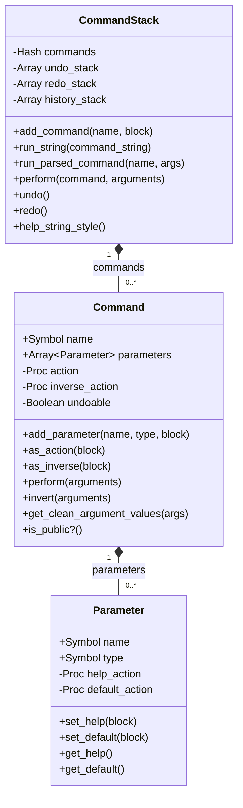
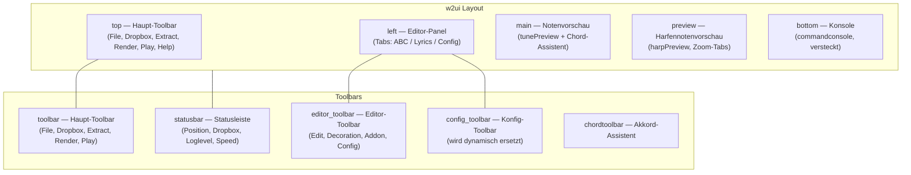
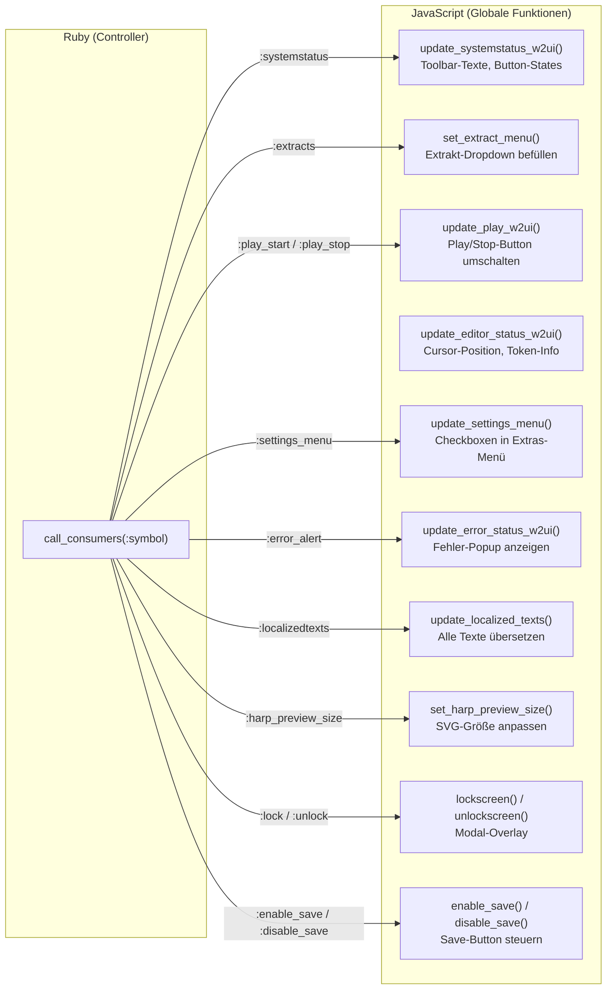
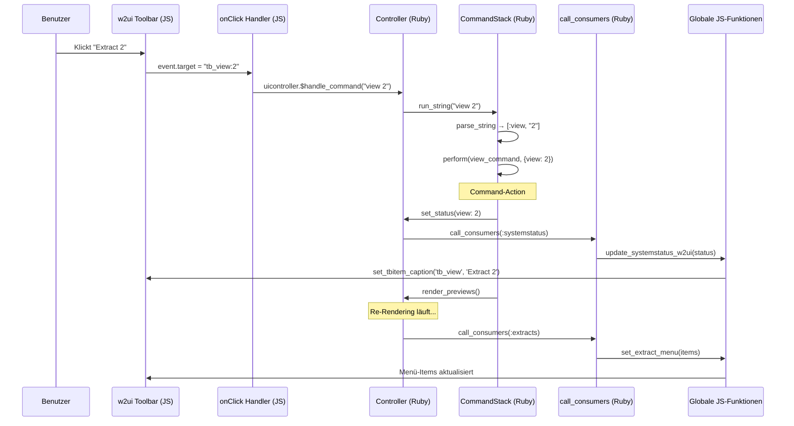

# Architektur: Command-Prozessor und UI-Integration

## 1. Überblick

Zupfnoter verwendet ein Command-Pattern zur Entkopplung von Benutzeroberfläche und
Geschäftslogik. Die UI ist in JavaScript (w2ui-Framework) implementiert, die Logik
in Ruby/Opal. Die Kommunikation läuft bidirektional über Opal-Interop:

```
┌──────────────────────┐          ┌──────────────────────┐
│  JavaScript (w2ui)   │◄────────►│  Ruby/Opal           │
│                      │          │                      │
│  user-interface.js   │  Interop │  controller.rb       │
│  (Toolbar, Menüs,    │◄────────►│  command-controller  │
│   Statusbar, Popups) │          │  command_definitions  │
└──────────────────────┘          └──────────────────────┘
```

### Beteiligte Dateien

| Datei | Rolle |
|-------|-------|
| `command-controller.rb` | Framework: `Parameter`, `Command`, `CommandStack` |
| `controller_command_definitions.rb` | Alle Kommando-Definitionen (DSL) |
| `controller.rb` | Orchestrierung, `call_consumers`, Event-Listener |
| `user-interface.js` | w2ui-Layout, Toolbars, Menüs, globale JS-Funktionen |
| `config-form.rb` | `ConfstackEditor` — Konfig-Formulare und Menü-Einträge |
| `opal-w2ui.rb` | Ruby-Wrapper für `w2popup` / `w2form` |


## 2. Der Command-Prozessor

### 2.1 Architektur



### 2.2 Kommando-Registrierung (DSL)

Kommandos werden über eine Block-basierte DSL registriert. Die Registrierung erfolgt
in Methoden mit dem Namensschema `__ic_XX_...` in `controller_command_definitions.rb`.
Beim Start des Controllers werden alle diese Methoden automatisch aufgerufen:

```ruby
# controller.rb:187-188
@commands = CommandController::CommandStack.new
self.methods.select { |n| n =~ /__ic.*/ }.each { |m| send(m) }
```

#### DSL-Struktur

```ruby
# controller_command_definitions.rb
def __ic_01_internal_commands
  @commands.add_command(:help) do |c|
    c.undoable = false

    c.add_parameter(:what, :string) do |parameter|
      parameter.set_default { "" }
      parameter.set_help { "filter string for help command" }
    end

    c.set_help { "this help" }

    c.as_action do |args|
      # Ausführungslogik
      $log.message(@commands.help_string_style.select { |i|
        i.include? args[:what]
      }.join("\n"))
    end
  end
end
```

Die Gruppen-Methoden organisieren die Kommandos thematisch:

| Methode | Thema |
|---------|-------|
| `__ic_01_internal_commands` | System-Kommandos (help, view, loglevel, undo, redo) |
| `__ic_02_play_commands` | Wiedergabe (play, speed) |
| `__ic_03_edit_commands` | Editor-Befehle (render, editconf, addsnippet, adddecoration) |
| `__ic_04_dropbox_commands` | Dropbox-Integration (dlogin, dsave, dopen, dchoose) |
| `__ic_05_abc_commands` | ABC-Manipulation (c, drop, download_abc) |
| `__ic_06_config_commands` | Konfigurations-Kommandos (setconfig, stdextract, maketemplate) |

### 2.3 Kommando-Ausführung

Es gibt zwei Einstiegspunkte:

#### String-basiert (Konsole, Keyboard-Shortcuts)

```ruby
# controller.rb:366
def handle_command(command)
  $log.clear_errors
  $log.timestamp_start
  @commands.run_string(command)    # parst den String und führt aus
  call_consumers(:error_alert)
end
```

Der String wird mit einem Regex geparst (`STRING_COMMAND_REGEX`):
- Einfache Wörter: `render`, `view 0`
- Quoted Strings: `c 1 "Mein Titel"` → `:id = "1"`, `:title = "Mein Titel"`
- JSON-Objekte: `{key: value}` als einzelnes Argument

#### Hash-basiert (JavaScript-Aufrufe)

```ruby
# controller.rb:382
def handle_parsed_command(command, args)
  $log.clear_errors
  @commands.run_parsed_command(command, Native(args))
  call_consumers(:error_alert)
end
```

Wird von JavaScript aufgerufen, wenn die Argumente bereits strukturiert vorliegen:

```javascript
// user-interface.js
uicontroller.$handle_parsed_command("pasteDatauri", {"key": name, "value": datauri})
```

### 2.4 Undo/Redo

Kommandos mit `undoable = true` (Default) werden nach Ausführung auf den `@undo_stack`
gepusht. `as_inverse` definiert die Umkehroperation:

```ruby
@commands.add_command(:setconfig) do |c|
  c.as_action do |args|
    previous = $conf[args[:key]]
    args[:oldval] = previous        # für Undo merken
    $conf[args[:key]] = args[:value]
  end

  c.as_inverse do |args|
    $conf[args[:key]] = args[:oldval]
  end
end
```

### 2.5 Private Kommandos

Kommandos, deren Name mit `_` beginnt, sind privat (`is_public? == false`).
Sie werden im `help`-Kommando nicht aufgelistet, können aber trotzdem
aufgerufen werden. Beispiel: `_edit_selftest_abc`.


## 3. Die Benutzeroberfläche (w2ui)

### 3.1 Initialisierung

Die UI wird beim Start des Controllers initialisiert. Die JavaScript-Funktion
`init_w2ui` erhält die Ruby-Controller-Instanz als `uicontroller`:

```ruby
# controller.rb:139
@zupfnoter_ui = `new init_w2ui(#{self})`
```

In `user-interface.js` wird damit das komplette w2ui-Layout aufgebaut:

```javascript
// user-interface.js:1
function init_w2ui(uicontroller) {
  // ... alle Toolbars, Menüs, Panels werden hier definiert
}
```

### 3.2 Layout-Struktur



### 3.3 Toolbar-Handler-Muster

Die Toolbar-Events werden über Lookup-Tabellen verarbeitet:

```javascript
// user-interface.js — Handler-Tabellen
var toolbarhandlers = {
  'tb_file:tb_create': createNewSheet,
  'tb_file:tb_export': function() { uicontroller.$handle_command("download_abc") },
  'tb_open':           function() { uicontroller.$handle_command("dchoose") },
  'tb_save':           function() { uicontroller.$handle_command("dsave") },
  'tbRender':          function() { uicontroller.$handle_command("render") },
  'tbPlay':            function() { uicontroller.$play_abc('auto') },
  // ...
};

var perspectives = {
  'tb_perspective:Alle':          function() { /* show all panels */ },
  'tb_perspective:NotenEingabe':  function() { /* editor + notes */ },
  'tb_perspective:HarfenEingabe': function() { /* editor + harp  */ },
  // ...
};

// Im onClick-Handler der Toolbar:
onClick: function(event) {
  if (perspectives[event.target])    perspectives[event.target]();
  if (toolbarhandlers[event.target]) toolbarhandlers[event.target]();
  // Extract-Menü: "tb_view:0" → handle_command("view 0")
  config_event = event.target.split(":");
  if (config_event[0] == "tb_view") {
    uicontroller.$handle_command("view " + config_event[1]);
  }
}
```

**Konvention:** Die Toolbar-Event-IDs sind hierarchisch mit `:` getrennt.
`tb_file:tb_export` bedeutet: Menü `tb_file`, Item `tb_export`.


## 4. Ruby ↔ JavaScript Kommunikation

### 4.1 JS → Ruby: Kommando-Aufrufe

JavaScript ruft Ruby-Methoden über Opal-Interop auf. Die `$`-Präfix-Konvention
markiert Ruby-Methoden auf JS-Seite:

```javascript
// Einfacher Kommando-String
uicontroller.$handle_command("render")
uicontroller.$handle_command("view " + config_event[1])
uicontroller.$handle_command('editconf ' + config_event2[1])

// Strukturierte Argumente
uicontroller.$handle_parsed_command("pasteDatauri", {"key": name, "value": datauri})

// Direkte Methoden-Aufrufe
uicontroller.$play_abc('auto')
uicontroller.$render_a3().$output('datauristring')
uicontroller.$about_zupfnoter()
uicontroller.editor.$resize()
```

### 4.2 Ruby → JS: `call_consumers` Pattern

Der Controller benachrichtigt die UI über Zustandsänderungen mittels `call_consumers`.
Jeder Consumer-Typ ist einem Array von Lambdas zugeordnet, die globale
JavaScript-Funktionen aufrufen:

```ruby
# controller.rb:279-308
def call_consumers(clazz)
  @systemstatus_consumers = {
    systemstatus:     [lambda { `update_systemstatus_w2ui(#{@systemstatus.to_n})` }],
    lock:             [lambda { `lockscreen()` }],
    unlock:           [lambda { `unlockscreen()` }],
    error_alert:      [lambda { `window.update_error_status_w2ui(#{make_error_popup})` }],
    play_start:       [lambda { `update_play_w2ui('start')` }],
    play_stop:        [lambda { `update_play_w2ui('stop')` }],
    extracts:         [lambda {
                        items = @extracts.map { |id, entry| {id: id, text: "#{id}: #{entry}"} }
                        `set_extract_menu(#{items.to_n})`
                      }],
    settings_menu:    [lambda { `update_settings_menu(#{$settings.to_n})` }],
    harp_preview_size:[lambda { `set_harp_preview_size(#{@harp_preview_size})` }],
    localizedtexts:   [lambda { `update_localized_texts(#{self})` }],
    # ...
  }
  @systemstatus_consumers[clazz].each { |c| c.call() }
end
```

### 4.3 Consumer-Übersicht



**Hinweis:** `update_editor_status_w2ui` wird direkt aufgerufen (nicht über
`call_consumers`), weil es bei jedem Cursor-Move feuert und nicht in
den Consumer-Mechanismus passt:

```ruby
# controller.rb:1439
`update_editor_status_w2ui(#{editorstatus.to_n})`
```


## 5. Dynamische Menü-Befüllung

### 5.1 Extrakt-Dropdown

Das Extrakt-Menü (`tb_view`) wird nach jedem Rendering dynamisch befüllt.
Der Controller ermittelt die verfügbaren Extrakte und ruft `call_consumers(:extracts)`:

```ruby
# Im Render-Prozess
@extracts = (0..9).map { |i|
  title = $conf.get("extract.#{i}.title") rescue nil
  [i, title] if title
}.compact
call_consumers(:extracts)
```

Die JavaScript-Funktion ersetzt die Menü-Items:

```javascript
// user-interface.js:1519
function set_extract_menu(items) {
  w2ui.layout_top_toolbar.set('tb_view', {items: items})
}
```

### 5.2 Dekorations-Menü

Das Dekorations-Menü im Editor-Toolbar wird beim Aufbau direkt aus Ruby geholt:

```javascript
// user-interface.js:813 — bei Toolbar-Erstellung
items: uicontroller.$get_decoration_menu_entries().$to_n()
```

Die Ruby-Methode `get_decoration_menu_entries` (controller.rb:320) liefert ein
Array von Menü-Einträgen, das sowohl statische Einträge (Fermata, Breath) als
auch dynamische Einträge aus `$conf['layout.DECORATIIONS_AS_ANNOTATIONS']` enthält:

```ruby
# controller.rb:355
result += $conf['layout.DECORATIIONS_AS_ANNOTATIONS'].map do |name, decoration|
  { id: "!#{name}!", text: "!#{name}!: comes as '#{decoration[:text]}'", icon: 'fa fa-bars' }
end
```

Bei Sprachwechsel wird das Menü aktualisiert:

```javascript
// user-interface.js:1307
function update_localized_texts(uicontroller) {
  w2ui.editortoolbar.set('add_decoration',
    {items: uicontroller.$get_decoration_menu_entries().$to_n()})
}
```

### 5.3 Konfig-Formular-Menü

Das "Edit Config"-Menü wird über `ConfstackEditor.get_config_form_menu_entries`
(config-form.rb:688) befüllt. Diese Methode liefert eine statische Liste von
Formularen (basic_settings, layout, lyrics, printer, etc.):

```javascript
// user-interface.js:851
items: uicontroller.$get_config_form_menu_entries().$to_n()
```

Wenn ein Menü-Eintrag geklickt wird, wird das Kommando `editconf` aufgerufen:

```javascript
// user-interface.js:886
uicontroller.$handle_command("editconf " + config_event2[1])
// z.B. "editconf basic_settings", "editconf layout"
```

### 5.4 Dropbox-Pfad-Menü

Das Dropbox-Statusbar-Menü zeigt die zuletzt verwendeten Pfade.
Es wird über `update_systemstatus_w2ui` dynamisch befüllt:

```javascript
// user-interface.js:1402
var dropbox_path_menu_items = systemstatus.dropboxpathlist.map(function(i) {
  return {text: i}
});
w2ui.layout_statusbar_main_toolbar.get("sb_dropbox_status").items = dropbox_path_menu_items;
```

### 5.5 Login-Popup mit Dropdown

Das Login-Popup zeigt eine Combo-Box mit den gespeicherten Dropbox-Pfaden.
Die Daten kommen direkt aus dem Ruby-Systemstatus:

```javascript
// user-interface.js:325-356
'tb_login': function() {
  openPopup({
    name: 'loginForm',
    fields: [{
      field: 'folder',
      type: 'combo',
      options: {
        items: uicontroller.systemstatus.$to_n().dropboxpathlist,  // ← Ruby → JS
        compare: function(a, b) { return a.text.includes(b) }
      }
    }],
    actions: {
      "Ok": function() {
        uicontroller.$handle_command("dlogin full \"" + this.record.folder + "\"")
      }
    }
  })
}
```


## 6. Editor-Status und kontextabhängige UI

### 6.1 Cursor-Change → UI-Update

Bei jeder Cursor-Bewegung im ABC-Editor wird der Editor-Status ermittelt und
an die JavaScript-Funktion `update_editor_status_w2ui` übergeben:

```ruby
# controller.rb:1418
@editor.on_cursor_change do |e|
  selection_info = @editor.get_selection_info
  editorstatus = {
    position:   "#{line}:#{col}",
    token:      token,            # { type: "zupfnoter.editable.before", value: "..." }
    selections: selections
  }
  `update_editor_status_w2ui(#{editorstatus.to_n})`
end
```

### 6.2 Kontextabhängige Buttons

Die JavaScript-Seite aktiviert/deaktiviert Toolbar-Buttons basierend auf dem
Token-Typ unter dem Cursor:

```javascript
// user-interface.js:1428
if (editorstatus.token.type.startsWith("zupfnoter.editable") && selections.length == 1) {
  w2ui['editortoolbar'].enable('edit_snippet')
} else {
  w2ui['editortoolbar'].disable('edit_snippet')
}

if (editorstatus.token.type.startsWith("zupfnoter.editable.before")) {
  w2ui['editortoolbar'].enable('add_snippet')
  w2ui['editortoolbar'].enable('add_decoration')
} else {
  w2ui['editortoolbar'].disable('add_snippet')
  w2ui['editortoolbar'].disable('add_decoration')
}
```

**Token-Typen:**

| Token-Typ | Bedeutung | Aktive Buttons |
|-----------|-----------|---------------|
| `zupfnoter.editable` | Cursor auf editierbarem Snippet | Edit Addon |
| `zupfnoter.editable.before` | Cursor vor Note (Insert-Position) | Add Snippet, Add Decoration |
| `zupfnoter.editable.beforeBar` | Cursor vor Taktlinie | Add Snippet (eingeschränkt) |
| andere | Normaler ABC-Text | Keine Addon-Buttons |


## 7. Keyboard-Shortcuts

Keyboard-Shortcuts werden im `keydown`-Handler des Body-Elements verarbeitet.
Sie rufen direkt `handle_command` oder Controller-Methoden auf:

```ruby
# controller.rb:1462
Element.find('body').on :keydown do |e|
  if (e.meta_key || e.ctrl_key)
    case (e.key_code)
    when 'R'.ord, 13  then handle_command('render')
    when 'S'.ord      then handle_command("dsave")
    when 'P'.ord      then play_abc('auto')
    when 'K'.ord      then toggle_console
    when 'L'.ord      then `#{@zupfnoter_ui}.toggle_full_screen()`
    when *((0..9).map { |i| i.to_s.ord })
      handle_command("view #{e.key_code.chr}")
    end
  end
end
```

| Shortcut | Kommando |
|----------|----------|
| Ctrl+R / Ctrl+Enter | `render` |
| Ctrl+S | `dsave` |
| Ctrl+P | `play_abc` |
| Ctrl+K | Konsole ein-/ausblenden |
| Ctrl+L | Fullscreen umschalten |
| Ctrl+0..9 | `view 0` .. `view 9` |


## 8. Popup-Formulare (w2form)

### 8.1 JavaScript-Seite

Die Funktion `openPopup` erstellt ein Modal-Popup mit einem w2form:

```javascript
// user-interface.js:1542
function openPopup(theForm) {
  if (!w2ui[theForm.name]) {
    $().w2form(theForm);
  }
  $().w2popup('open', {
    title: theForm.text,
    body: '<div id="form" style="width: 100%; height: 100%;"></div>',
    modal: true,
    onOpen: function(event) {
      event.onComplete = function() {
        $('#w2ui-popup #form').w2render(theForm.name);
      }
    }
  });
}
```

### 8.2 Ruby-Seite

Der `W2ui::Popupform`-Wrapper in `opal-w2ui.rb` ermöglicht auch Ruby-seitige Popups:

```ruby
# opal-w2ui.rb
form = W2ui::Popupform.new({
  name:   'myForm',
  text:   'Titel',
  fields: [...],
  actions: { "Ok" => lambda { ... } }
})
form.open
```


## 9. Konfig-Toolbar (dynamisch)

Die Config-Toolbar im Konfigurations-Tab wird von `ConfstackEditor` dynamisch
ersetzt, wenn ein `editconf`-Kommando ausgeführt wird. Der Toolbar-Inhalt
hängt vom aktiven Formular ab und wird in `config-form.rb` generiert.

```ruby
# Bei editconf wird:
# 1. Das passende Formular erzeugt (ConfstackEditor)
# 2. Die config_toolbar-Items ersetzt
# 3. w2ui.configtoolbar.refresh() aufgerufen
```

Der initiale Toolbar in `user-interface.js` ist leer — nur die onClick-Handler
werden installiert:

```javascript
// user-interface.js:932
var config_toolbar = {
  name: 'configtoolbar',
  style: tbstyle,
  items: [],              // ← leer, wird von Ruby befüllt
  onClick: function(event) {
    config_event2 = event.target.split(":");
    if (['edit_config'].includes(config_event2[0])) {
      uicontroller.$handle_command("editconf " + config_event2[1])
    }
  }
};
```


## 10. Gesamtablauf: Beispiel "Benutzer wählt Extrakt"


