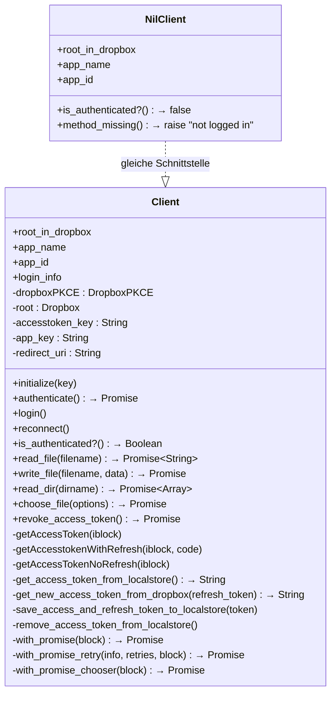
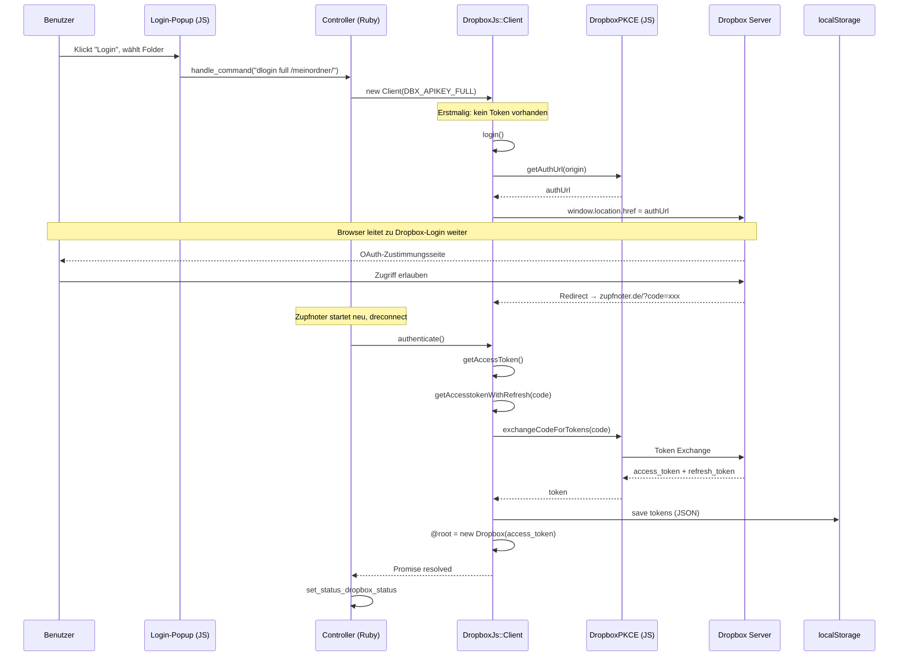
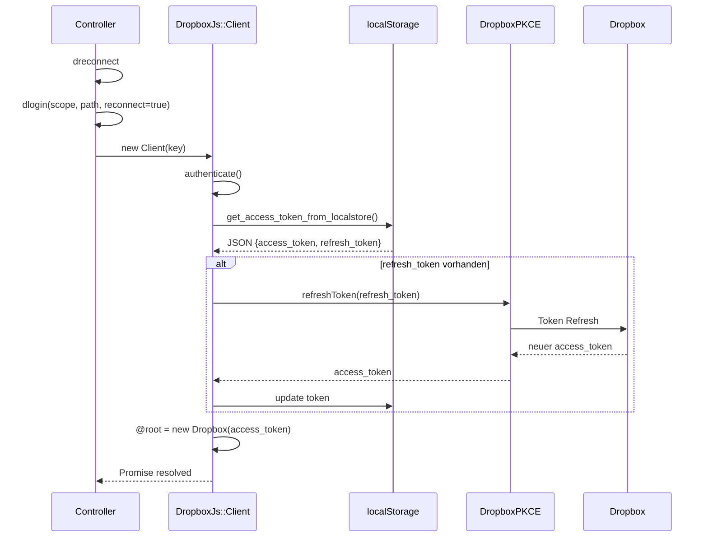
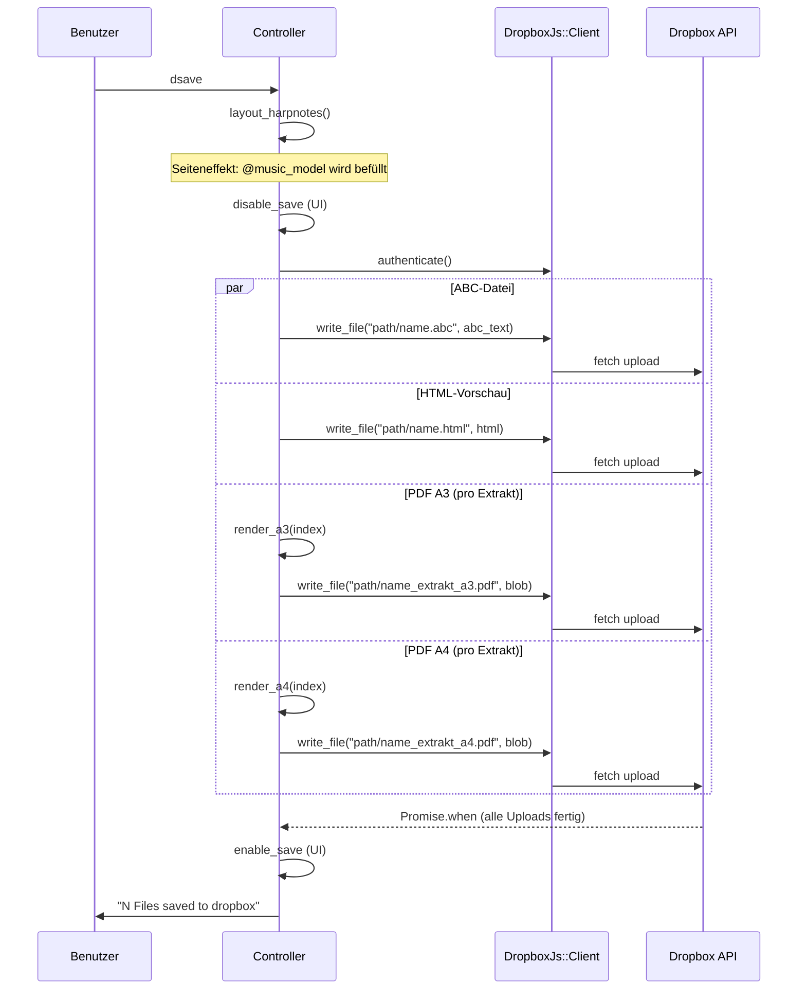
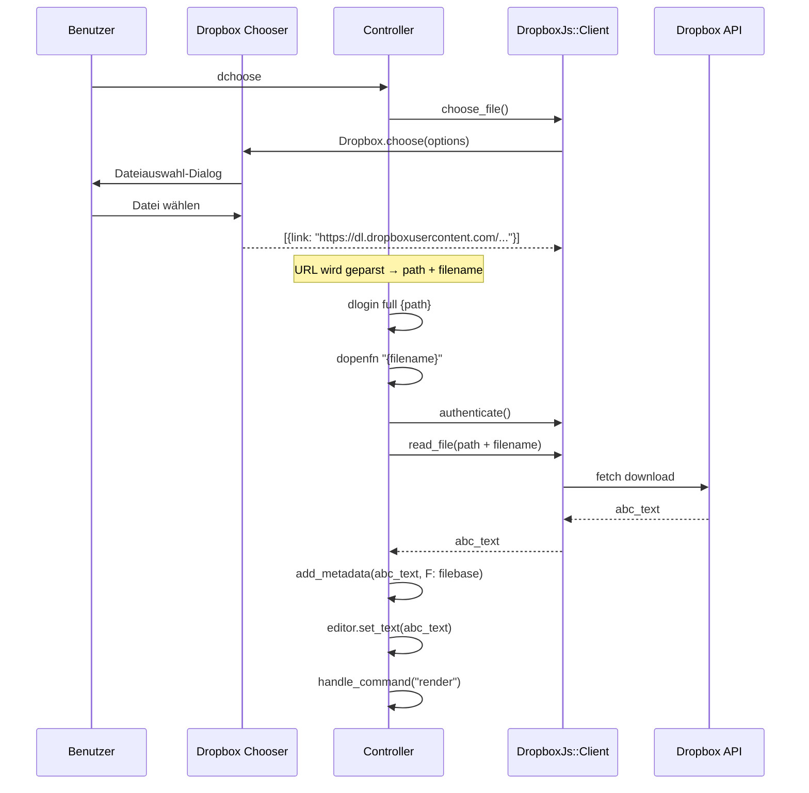

# Architektur: Dropbox-Integration

## 1. Überblick

Zupfnoter nutzt Dropbox als Cloud-Speicher für ABC-Dateien, PDFs und HTML-Vorschauen.
Die Integration verwendet die **Dropbox API v2** mit **PKCE-OAuth-Flow** (kein Client-Secret
im Browser nötig) und setzt für Datei-Operationen direkt auf die **Fetch-API** statt
auf das Dropbox-SDK.

```
┌────────────────┐     ┌──────────────────┐     ┌─────────────────┐
│  Benutzer      │     │  Zupfnoter       │     │  Dropbox API    │
│                │     │                  │     │                 │
│  Login-Button ─┼────►│  dlogin          │     │                 │
│                │     │    │             │     │                 │
│                │     │    ▼             │     │                 │
│  ◄─────────────┼─────┤  PKCE AuthUrl ──┼────►│  OAuth Login    │
│  Dropbox-Login │     │                  │     │                 │
│  Seite         │     │                  │     │                 │
│  ─────────────►┼─────┤  ?code=xxx ─────┼────►│  Token Exchange │
│  Redirect      │     │                  │◄────┤  access_token   │
│                │     │  localStorage ◄──┤     │  refresh_token  │
│                │     │                  │     │                 │
│  Save-Button ──┼────►│  dsave ──────────┼────►│  files/upload   │
│  Open-Button ──┼────►│  dchoose/dopenfn ┼────►│  files/download │
└────────────────┘     └──────────────────┘     └─────────────────┘
```

### Beteiligte Dateien

| Datei | Rolle |
|-------|-------|
| `opal-dropboxjs.rb` | Dropbox-Client-Wrapper (`NilClient`, `Client`) |
| `controller_command_definitions.rb` | Dropbox-Kommandos (`__ic_05_dropbox_commands`) |
| `controller.rb` | Status-Management, UI-Integration |
| `init_conf.rb` | API-Keys (`DBX_APIKEY_FULL`, `DBX_APIKEY_APP`) |
| `user-interface.js` | Login-Popup, Toolbar-Handler |
| `application.rb` | Dropbox-Chooser-SDK (Dropins-Script-Tag) |


## 2. Client-Architektur

### 2.1 Klassenstruktur



### 2.2 NilClient (Nicht eingeloggt)

Vor dem Login wird ein `NilClient` als Platzhalter verwendet. Jeder Methodenaufruf
(außer `is_authenticated?`) löst eine Fehlermeldung aus:

```ruby
# opal-dropboxjs.rb:24
class NilClient
  def method_missing(m, *args, &block)
    raise I18n.t("you are not logged in to dropbox")
  end

  def is_authenticated?
    false
  end
end
```

### 2.3 Client (Eingeloggt)

Der `Client` wird bei Login erstellt und verwaltet:
- **Zwei API-Keys** für verschiedene Zugriffsbereiche:
  - `DBX_APIKEY_FULL` — Zugriff auf gesamte Dropbox
  - `DBX_APIKEY_APP` — Zugriff nur auf App-Ordner
- **`@dropboxPKCE`** — JavaScript `DropboxPKCE`-Objekt für OAuth
- **`@root`** — JavaScript `Dropbox`-Objekt für API-Aufrufe (nur `read_dir`)


## 3. Authentifizierung (PKCE OAuth Flow)

### 3.1 Login-Ablauf



### 3.2 Reconnect-Ablauf (Sitzungswiederherstellung)

Beim Start von Zupfnoter wird automatisch `dreconnect` ausgeführt:

```ruby
# controller.rb:216
handle_command('dreconnect')
```



### 3.3 Token-Speicherung

Tokens werden als JSON im `localStorage` gespeichert:

```
Key: "dbx_token"
Value: {
  "access_token": "sl.B...",     // kurzlebig (~4h)
  "refresh_token": "R1a...",      // langlebig
  "token_type": "bearer",
  "expires_in": 14400
}
```

**Migration:** Alte Token im Plain-String-Format (vor PKCE) werden erkannt und
erfordern einen erneuten Login:

```ruby
# opal-dropboxjs.rb:79
rescue
  $log.info("Old token format detected. Clearing and requiring re-login.")
  `localStorage.removeItem(#{@accesstoken_key})`
  nil
end
```


## 4. Datei-Operationen

### 4.1 Workaround: fetch() statt Dropbox-SDK

**Problem:** Das Dropbox-SDK hat einen Bug mit Blob-Responses — es versucht
auf `responseText` eines `XMLHttpRequest` mit `responseType='blob'` zuzugreifen,
was einen `InvalidStateError` auslöst. Außerdem kann der Token-Refresh nicht
synchron vor API-Aufrufen ausgeführt werden (Async/Await-Problem in Opal).

**Lösung:** `read_file` und `write_file` verwenden direkt die `fetch()`-API
mit manueller Token-Verwaltung:

```javascript
// read_file — opal-dropboxjs.rb:511
const response = await fetch('https://content.dropboxapi.com/2/files/download', {
  method: 'POST',
  headers: {
    'Authorization': 'Bearer ' + token,
    'Dropbox-API-Arg': JSON.stringify({path: filename})
  }
});
const blob = await response.blob();
const reader = new FileReader();
reader.readAsText(blob);
```

```javascript
// write_file — opal-dropboxjs.rb:446
const response = await fetch('https://content.dropboxapi.com/2/files/upload', {
  method: 'POST',
  headers: {
    'Authorization': 'Bearer ' + token,
    'Dropbox-API-Arg': JSON.stringify({path: filename, mode: {'.tag': 'overwrite'}}),
    'Content-Type': 'application/octet-stream'
  },
  body: data
});
```

**Hinweis:** `read_dir` verwendet weiterhin das Dropbox-SDK (`@root.filesListFolder`),
da es keine Blob-Probleme hat.

### 4.2 Inline Token-Refresh

Sowohl `read_file` als auch `write_file` führen vor jedem API-Aufruf
einen Token-Refresh durch, falls ein `refresh_token` vorhanden ist:

```javascript
// Muster in read_file und write_file:
const tokenData = JSON.parse(token);
const refreshToken = tokenData.refresh_token;
if (refreshToken) {
  try {
    const newTokenData = await #{@dropboxPKCE}.refreshToken(refreshToken);
    tokenData.access_token = newTokenData.access_token;
    localStorage.setItem(#{@accesstoken_key}, JSON.stringify(tokenData));
    token = newTokenData.access_token;
  } catch (refreshError) {
    // Fallback: vorhandenen Token verwenden
    token = tokenData.access_token;
  }
}
```

### 4.3 Retry-Mechanismus

`write_file` verwendet `with_promise_retry` mit bis zu 4 Versuchen:

```ruby
# opal-dropboxjs.rb:414
def write_file(filename, data)
  with_promise_retry(filename, 4) do |iblock|
    # ... fetch()-Aufruf
  end
end
```

`read_file` hat keinen Retry — ein Fehler wird direkt gemeldet.


## 5. Kommando-Übersicht

### 5.1 Alle Dropbox-Kommandos

| Kommando | Parameter | Beschreibung |
|----------|-----------|-------------|
| `dlogin` | `scope` (full\|app), `path`, `reconnect` | Login bei Dropbox, erstellt `Client` |
| `dlogout` | — | Revoziert Token, setzt `NilClient` |
| `dreconnect` | — | Intern: Reconnect beim Start |
| `dchoose` | `target` (editor\|template) | Dropbox-Chooser zum Datei-Auswählen |
| `dopenfn` | `fileid`, `path` | Datei per Dateiname öffnen |
| `dopen` | `fileid`, `path` | Datei per ID-Prefix öffnen (legacy) |
| `dopentemplate` | `fileid`, `path` | Template von Dropbox laden |
| `dsave` | `path` | ABC + PDFs + HTML speichern |
| `dls` | `path` | Verzeichnis auflisten (Konsole) |
| `dcd` | `path` | Arbeitsverzeichnis wechseln |
| `dpwd` | — | Aktuelles Verzeichnis anzeigen |
| `download_abc` | — | ABC lokal herunterladen (kein Dropbox) |

### 5.2 Save-Ablauf (dsave)



**Gespeicherte Dateien:**

| Datei | Format | Bedingung |
|-------|--------|-----------|
| `{filename}.abc` | Text | Immer |
| `{filename}.html` | HTML | Kein Template |
| `{filename}_{extrakt}_a3.pdf` | PDF | Saveformat enthält "A3" |
| `{filename}_{extrakt}_a4.pdf` | PDF | Saveformat enthält "A4" |

Das Saveformat wird über `saveformat` konfiguriert (z.B. `"A3-A4"`, `"A3"`, `"A4"`).

### 5.3 Open-Ablauf (dchoose + dopenfn)




## 6. Pfad-Verwaltung

### 6.1 Dropbox-Pfad

Der aktuelle Arbeitsordner (`@dropboxpath`) wird im `systemstatus` persistiert
und beim nächsten Start wiederhergestellt:

```ruby
# controller.rb:1118
def set_status_dropbox_status
  set_status(
    dropbox: "#{@dropboxclient.app_name}: #{@dropboxpath}",
    dropboxapp: @dropboxclient.app_id,
    dropboxpath: @dropboxpath,
    dropboxloginstate: @dropboxloginstate
  )
end
```

### 6.2 Pfad-Validierung

Pfade werden mit einem Regex validiert (`reconcile_dropbox_path`):

```ruby
# controller_command_definitions.rb:1609
def reconcile_dropbox_path(path)
  path = "/#{path}" unless path.start_with? "/"
  path = "#{path}/" unless path.end_with? "/"
  path_pattern = /^\/([a-zA-z0-9_\-]+\/)*$$/
  raise("#{path}: does not match pattern: #{path_pattern}") unless path.match(path_pattern)
  path
end
```

Regeln:
- Muss mit `/` beginnen und enden
- Darf nur Buchstaben, Ziffern, `_` und `-` enthalten
- Beispiel: `/meine_noten/adventslieder/`

### 6.3 Pfad-Historie

Die letzten 10 verwendeten Pfade werden in `systemstatus.dropboxpathlist` gespeichert
und als Dropdown im Login-Popup und in der Statusbar angezeigt:

```ruby
# controller.rb:407
def push_to_dropboxpathlist
  dropboxpathlist = systemstatus[:dropboxpathlist] || []
  dropboxpathlist.push(@dropboxpath)
  dropboxpathlist = dropboxpathlist.uniq.last(10)
  set_status(dropboxpathlist: dropboxpathlist)
end
```


## 7. Promise-Muster

Die Dropbox-API ist asynchron. Alle Operationen liefern Opal-Promises zurück.
Es gibt drei Promise-Wrapper:

### 7.1 `with_promise` (Standard)

Wandelt den Dropbox-SDK-Callback `(error, data)` in eine Promise:

```ruby
def with_promise(&block)
  Promise.new.tap do |promise|
    block.call(lambda { |error, data|
      if error
        promise.reject(error.message)
      else
        promise.resolve(data)
      end
    })
  end
end
```

### 7.2 `with_promise_retry` (Retry-Logik)

Wie `with_promise`, aber bei Fehler bis zu N Wiederholungsversuche:

```ruby
def with_promise_retry(info, retries, &block)
  remaining = retries
  handler = lambda { |error, data|
    if error
      remaining -= 1
      remaining >= 0 ? block.call(handler) : promise.reject(...)
    else
      promise.resolve(data)
    end
  }
  block.call(handler)
end
```

Wird nur für `write_file` verwendet (4 Retries).

### 7.3 `with_promise_chooser` (Dropbox-Chooser)

Für den Dropbox-Chooser, der nur einen Parameter-Callback hat (kein Error-Callback):

```ruby
def with_promise_chooser(&block)
  Promise.new.tap do |promise|
    block.call(lambda { |data|
      data == false ? promise.reject("not logged in") : promise.resolve(data)
    })
  end
end
```


## 8. UI-Integration

### 8.1 Login-Popup

Das Login-Popup wird in `user-interface.js` als w2form definiert:

```javascript
// user-interface.js:325
'tb_login': function() {
  openPopup({
    name: 'loginForm',
    fields: [{
      field: 'folder',
      type: 'combo',
      options: {
        items: uicontroller.systemstatus.$to_n().dropboxpathlist
      }
    }],
    actions: {
      "Ok": function() {
        uicontroller.$handle_command("dlogin full \"" + this.record.folder + "\"")
      }
    }
  })
}
```

### 8.2 Status-Anzeige

Der Dropbox-Status wird in der Statusbar angezeigt und enthält:
- App-Name (`DrBx` oder `App`)
- Aktueller Pfad
- Dropdown mit Pfad-Historie (klickbar → `dcd`)

```javascript
// user-interface.js:1360
function update_systemstatus_w2ui(systemstatus) {
  w2ui.layout_statusbar_main_toolbar.set("sb_dropbox_status", {text: systemstatus.dropbox})
  // Pfad-Menü aktualisieren
  var items = systemstatus.dropboxpathlist.map(function(i) { return {text: i} });
  w2ui.layout_statusbar_main_toolbar.get("sb_dropbox_status").items = items;
}
```

### 8.3 Save-Button-Steuerung

Der Save-Button wird während des Speicherns deaktiviert und zeigt nach
ungesicherten Änderungen eine CSS-Klasse `alert`:

```javascript
// user-interface.js:1393
if (systemstatus.music_model == 'changed') {
  $("#tb_layout_top_toolbar_item_tb_save table").addClass("alert")
}
```

### 8.4 Dropbox-Chooser

Für die Dateiauswahl wird die Dropbox-Chooser-Dropins-API verwendet
(eingebunden als Script-Tag in `application.rb`):

```ruby
# application.rb:62
.append(%Q{<script src="https://www.dropbox.com/static/api/2/dropins.js"
  data-app-key="#{DBX_APIKEY_FULL}"></script>})
```

```ruby
# opal-dropboxjs.rb:573
def choose_file(options)
  with_promise_chooser do |iblock|
    %x{ Dropbox.choose({
      success: #{iblock},
      linkType: "direct",
      extensions: ['.abc']
    }) }
  end
end
```
