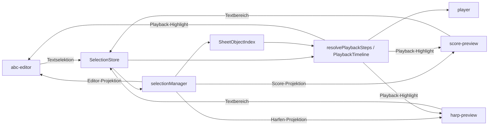
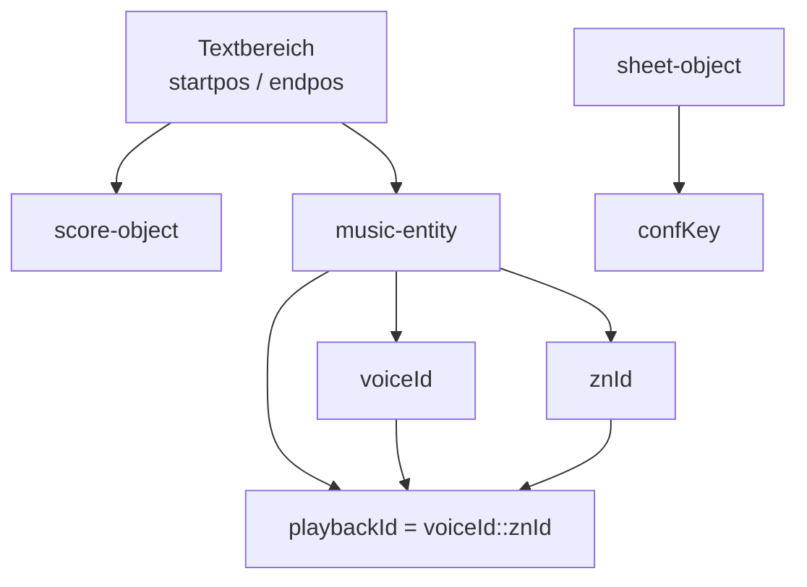
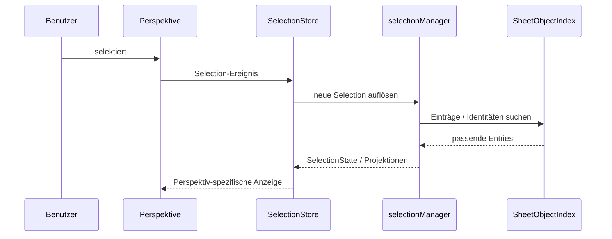
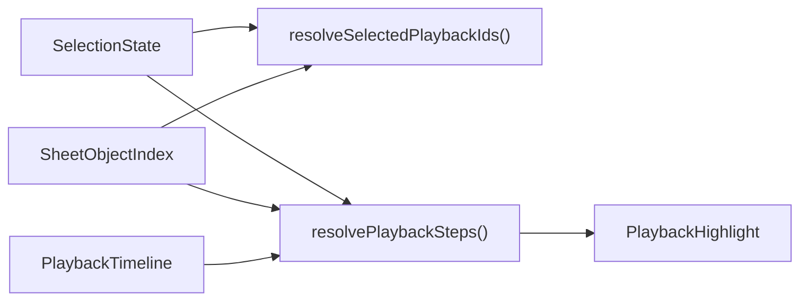
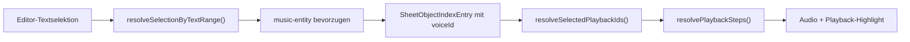

# Ist-Stand: Selection, Perspektiven und Playback

## 1. Zweck

Dieses Dokument beschreibt den aktuellen Ist-Stand von Selection in `apps/web`.

Es verbindet drei bisher getrennt betrachtete Themen:

- die zentrale Selection als fachlicher Zustand
- die Anbindung der Perspektiven `abc-editor`, `score-preview`, `harp-preview`
- die Anbindung des Players, der fachlich ebenfalls als Perspektive behandelt wird

Ziel ist eine belastbare Vergleichsbasis gegenüber älteren Specs und
Konzeptdokumenten.

Beschrieben werden:

- Interaktionen
- Identifizierern
- Projektionen
- Scope-Regeln
- Playback-Kopplung

Das Dokument ist absichtlich keine Zielspezifikation, sondern eine Beschreibung
der aktuell implementierten Architektur einschließlich bekannter Brüche und
Übergangslösungen.

## 2. Lesart dieses Dokuments

Dieses Dokument ist als Ist-Stand zu lesen.

Das bedeutet:

- es beschreibt die aktuelle Implementierung
- es dokumentiert auch Zwischenzustände und Workarounds
- es erhebt nicht den Anspruch, dass alle beschriebenen Teile bereits vollständig
  konsistent oder abgeschlossen sind

Für Vergleiche mit älteren Specs sind deshalb besonders relevant:

- welche Identitäten aktuell wirklich verwendet werden
- welche Interaktionen bereits stabil sind
- welche Perspektiven noch asymmetrisch implementiert sind
- welche Playback-Fälle nur über Fallbacks funktionieren
## 3. Kurzfazit

Im aktuellen Stand gilt:

- Selection ist zentralisiert
- Perspektiven konsumieren Projektionen derselben Selection
- Editor-Selektion ist derzeit der robusteste Pfad
- Score- und Harfeninteraktion sind funktional, aber noch nicht vollständig auf
  dem gleichen Stand
- Playback verwendet inzwischen stimmsichere Identitäten
- Playback-Highlight folgt inzwischen grundsätzlich derselben Filterlogik wie die
  Audio-Ausgabe
- Bereichserweiterung mit `Shift` ist noch nicht in allen Perspektiven fertig

## 4. Grundidee

Selection ist in Phase 5 kein panel-lokaler Zustand, sondern ein zentraler
fachlicher Zustand, der in verschiedene Perspektiven projiziert wird.

Die Perspektiven sind:

- `abc-editor`
- `score-preview`
- `harp-preview`
- `player`

Der `player` wird im aktuellen Stand fachlich wie eine weitere Perspektive
behandelt, auch wenn seine Implementierung technisch noch stärker an der
Playback-Orchestrierung hängt als die sichtbaren UI-Perspektiven.

## 5. Architekturüberblick



## 6. Zentrale Bausteine

### 4.1 `SelectionStore`

Der `SelectionStore` hält den transienten Auswahlzustand des Workbench-Threads.

Er speichert insbesondere:

- `selectedIndexes`
- `anchorIndex`
- `source`
- `voiceScope`

Er ist die einzige zentrale Wahrheit für Benutzerselektion.

### 4.2 `SheetObjectIndex`

Der `SheetObjectIndex` ist die Brücke zwischen unterschiedlichen
Identitätsräumen.

Er enthält Einträge aus:

- `score-object`
- `music-entity`
- `sheet-object`

Er dient dazu, eine Auswahl aus einer Perspektive in die anderen Perspektiven zu
übersetzen.

### 4.3 `selectionManager`

Der `selectionManager` kapselt die zentrale Übersetzungslogik:

- Eingaben aus Perspektiven in `SelectionState` überführen
- Projektionen für Perspektiven auflösen
- Playback-relevante Identitäten ableiten

### 6.4 Playback-Orchestrierung

Die Playback-Orchestrierung liest:

- die zentrale Selection
- den `SheetObjectIndex`
- die expandierte Playback-Timeline

und leitet daraus ab:

- welche Steps gespielt werden
- welche Noten innerhalb eines Steps gespielt werden
- welche Textbereiche im Playback-Highlight erscheinen

## 7. Perspektiven

### 5.1 `abc-editor`

Die Editor-Perspektive arbeitet mit:

- `startpos` / `endpos`
- Zeile/Spalte

Der Editor kennt zunächst nur Textselektion. Die musikalische Bedeutung wird
erst über `selectionManager` und `SheetObjectIndex` aufgelöst.

### 5.2 `score-preview`

Die Score-Perspektive arbeitet mit adressierbaren Textbereichen aus dem SVG:

- `data-start-char`
- `data-end-char`

Score-Objekte repräsentieren notierte Bereiche, tragen aber nicht in jedem Fall
eine vollständige musikalische Identität.

### 7.3 `harp-preview`

Die Harfenperspektive arbeitet mit SVG-Hitboxen. Fachlich ist sie näher am
`Sheet` als der Score, aber auch sie liefert Selection derzeit primär über
Textbereiche ein.

Wichtig für den Ist-Stand:

- die Harfenansicht ist für Highlighting und Sichtbarkeit stark
- die Interaktion ist aber noch nicht in allen Fällen so präzise wie der
  Editor-Pfad
- insbesondere Bereichserweiterung und perspektivisch objektschärfere Selektion
  sind noch nicht voll ausgebaut

### 7.4 `player`

Der `player` ist eine konsumierende Perspektive:

- er erzeugt keine Benutzerselektion
- er liest die zentrale Selection
- er projiziert sie auf Playback-Steps und Playback-Noten
- er erzeugt daraus Playback-Highlighting

## 8. Identifizierer

### 6.1 Überblick

Die Architektur arbeitet bewusst mit mehreren Identifizierern, weil keine
einzelne Kennung alle Perspektiven sauber verbindet.



### 6.2 `SelectionTextRange`

`SelectionTextRange` ist der kleinste gemeinsame Nenner zwischen Editor, Score
und Teilen der Harfenansicht.

Verwendung:

- Editor-Eingabe
- Score-Hitboxen
- Playback-Highlight im Score

Grenze:

- ein Textbereich allein ist nicht stimmeneindeutig

### 6.3 `znId`

`znId` identifiziert notiertes Material im Zupfnoter-Modell.

Wichtig:

- `znId` ist nicht global stimmeneindeutig
- dieselbe `znId` kann in mehreren Stimmen vorkommen

Folgerung:

- `znId` allein reicht nicht als Playback-Identität

### 6.4 `voiceId`

`voiceId` ist die 1-basierte Stimmenidentität einer `music-entity` im
`SheetObjectIndex`.

Sie ist notwendig, um:

- editorgetriebene Einzelstimme fachlich eindeutig zu halten
- gleich aussehende oder gleich gespannte Textbereiche mehrerer Stimmen zu trennen

### 6.5 `confKey`

`confKey` ist vor allem für Harfen-Sheet-Objekte und konfigurierte
Darstellungselemente wichtig.

Verwendung:

- SVG-bezogene Projektionen
- notenbezogene Harfenobjekte
- spätere konfigurationsnahe Interaktionen

### 8.6 `playbackId`

`playbackId` ist die aktuelle stimmsichere Playback-Identität.

Definition:

```text
playbackId = voiceId :: znId
```

Verwendung:

- Playback-Step-Filterung
- Playback-Noten-Filterung
- Playback-Highlight-Filterung

Ist-Stand:

- `playbackId` ist eine relativ junge Konsolidierung
- ältere Teile der Architektur und ältere Specs gehen teils noch implizit von
  `znId` oder Textbereich allein aus
- für Vergleiche mit älteren Dokumenten ist das die wichtigste aktuelle
  Architekturänderung

## 9. `SheetObjectIndexEntry`

Der `SheetObjectIndexEntry` ist die zentrale Übersetzungseinheit.

Relevante Felder:

- `kind`
- `znId`
- `voiceId`
- `confKey`
- `textRange`
- `startPos`
- `endPos`
- `addressableIn`

### 7.1 Bedeutungen von `kind`

- `score-object`
  - SVG-adressierbarer Bereich der klassischen Notenansicht
- `music-entity`
  - fachlich notierte Entity aus `Song`
- `sheet-object`
  - darstellungsbezogenes Objekt aus der Harfenperspektive

### 9.2 Aktuelle Regel

Für editorgetriebene Selection gilt:

- zuerst auf `music-entity` auflösen
- nur wenn das nicht möglich ist, auf `score-object` ausweichen

Grund:

- `music-entity` trägt `voiceId`
- `score-object` trägt diese Identität nicht zuverlässig

### 9.3 Bedeutende Abweichung zu älteren Annahmen

Ältere Specs und frühere Implementierungsschritte gingen an mehreren Stellen
effektiv so vor:

- Editor-Selektion -> `score-object`
- danach erst Rückschluss auf musikalisches Material

Der aktuelle Stand ist bewusst anders:

- Editor-Selektion -> bevorzugt `music-entity`
- nur bei fehlender musikalischer Auflösung -> `score-object`

Diese Änderung ist für Einzelstimme wesentlich.

## 10. Interaktionsmodell

### 8.1 Grundablauf



### 10.2 Aktuell garantierte Interaktionen

Aktuell fachlich stabil:

- Editor-Selektion über Textbereich
- Score-Selektion über Textbereich
- Scope-Umschaltung über Footer

Aktuell noch unvollständig:

- Bereichserweiterung mit `Shift` in Score und Harfe

Das ist wichtig für die Doku:

- die zentrale Architektur unterstützt bereits Scope und Projektion
- die Gestenunterstützung ist noch nicht in allen Perspektiven gleich weit

### 10.3 Interaktionsmatrix des Ist-Stands

| Perspektive | Einfache Selektion | Scope sichtbar | `Shift`-Erweiterung |
|---|---|---|---|
| `abc-editor` | belastbar | ja | belastbar |
| `score-preview` | vorhanden | ja | noch unvollständig |
| `harp-preview` | vorhanden | ja | noch unvollständig |
| `player` | keine direkte Benutzereingabe | n/a | n/a |

## 11. Scope-Modell

`voiceScope` ist Teil des zentralen `SelectionState`.

Unterstützte Werte:

- `single-voice`
- `extract-voices`
- `all-voices`

### 9.1 `single-voice`

- Auswahl gilt nur für die betroffene Stimme
- bei Editor-Selektion wird die Stimme aus `music-entity.voiceId` abgeleitet

### 9.2 `extract-voices`

- Auswahl gilt für die Stimmen des aktiven Auszugs
- Auflösung nutzt `activeVoiceIds`

### 9.3 `all-voices`

- Auswahl gilt für alle Stimmen
- die Projektion wird bewusst über mehrere Stimmen erweitert

## 12. Projektionen

### 10.1 Grundprinzip

Eine zentrale Selection wird nicht 1:1 an alle Perspektiven weitergereicht,
sondern projektiert.

### 10.2 Projektion in den Editor

- als Textbereich

### 10.3 Projektion in den Score

- als `SelectionTextRange[]`

### 10.4 Projektion in die Harfe

- als Mischung aus
  - `textRanges`
  - `confKeys`
  - perspektivisch später auch robusteren Objektidentitäten

### 12.5 Projektion in den Player

- nicht als sichtbare Markierung, sondern als Menge von:
  - Playback-IDs
  - Stimmen
  - relevanten Textbereichen

## 13. Playback als Perspektive

Der `player` liest nicht einfach rohe Textselektion, sondern eine fachlich
angereicherte Projektion.

### 11.1 Datenfluss



### 13.2 Aktuelle Filterebenen

Die Playback-Auflösung filtert in dieser Reihenfolge:

1. `playbackId`
2. `voiceId`
3. selektionsrelevante `textRange`

Das ist absichtlich redundant.

Grund:

- Text allein ist zu ungenau
- `znId` allein ist nicht stimmeneindeutig
- nur die Kombination hält Einzelstimme robust

### 13.3 Playback-Highlight

Playback-Highlight ist getrennt von Benutzerselektion.

Es wird aus den tatsächlich gespielten Playback-Steps abgeleitet und soll nur
diejenigen Bereiche markieren, die im aktuellen Step auch wirklich gespielt
werden.

Das gilt insbesondere für `single-voice`:

- wenn nur eine Stimme abgespielt wird
- darf das Highlight nicht die anderen Stimmen desselben notierten Bereichs
  markieren

Ist-Stand:

- die Filterung des Tons und die Filterung des Playback-Highlights wurden zuletzt
  enger zusammengeführt
- historisch war das Highlight zeitweise breiter als die tatsächlich gespielten
  Noten
- diese Kopplung bleibt ein sensibler Bereich für Regressionen

## 14. Aktuelle Kopplung zwischen Editor-Selektion und Playback

Der derzeit robusteste Pfad ist:



Dieser Pfad ist aktuell robuster als:

- Harfen-Selektion mit Bereichserweiterung
- Score-Selektion mit Bereichserweiterung

## 15. Perspektivenkopplung im aktuellen Stand

| Perspektive | erzeugt Selection | konsumiert Selection | konsumiert Playback-Highlight |
|---|---|---|---|
| `abc-editor` | ja | ja | ja |
| `score-preview` | ja | ja | ja |
| `harp-preview` | ja | ja | ja |
| `player` | nein | ja | indirekt |

## 16. Vergleichshinweise zu älteren Specs

Beim Vergleich mit älteren Specs sollte besonders auf diese Punkte geachtet
werden:

1. Wird Selection dort noch eher als panelnahe Interaktion beschrieben oder schon
   als zentrale Projektion?
2. Wird dort `znId` implizit als ausreichend eindeutig behandelt?
3. Wird Editor-Selektion noch primär über `score-object` gedacht?
4. Wird Playback-Highlight als automatisch deckungsgleich zum Audio betrachtet?
5. Wird `player` dort schon fachlich als Perspektive verstanden oder noch eher
   als Sonderfall?

Die wichtigsten realen Änderungen des aktuellen Stands gegenüber älteren
Annahmen sind:

- `voiceId` ist jetzt ein expliziter Teil der Übersetzungskette
- `playbackId = voiceId::znId` ist die relevante Playback-Identität
- Editor-Selektion bevorzugt `music-entity`
- Playback-Highlight wird nicht mehr nur aus groben Step-Bereichen, sondern aus
  enger gefilterten Textbereichen abgeleitet

## 17. Aktuelle Architekturregeln

Die folgenden Regeln sind für die Phase-5-Architektur verbindlich:

1. Selection bleibt zentral.
2. Perspektiven halten keine eigene fachliche Wahrheit über die Auswahl.
3. Editor-Selektion wird vorrangig auf `music-entity` aufgelöst.
4. `znId` allein ist keine robuste Playback-Identität.
5. Für Playback gilt die stimmsichere Identität `voiceId::znId`.
6. Playback-Highlight muss dieselbe Filterlogik respektieren wie die Audio-Ausgabe.
7. Der `player` ist fachlich als Perspektive zu behandeln.

## 18. Bekannte Grenzen

Aktuelle Grenzen des Systems:

- `Shift`-Erweiterung ist noch nicht in allen Perspektiven gleich implementiert
- Harfeninteraktion verwendet derzeit noch primär Textbereichsselektion
- `sheet-object`-Interaktion ist fachlich noch schwächer an konkrete
  `music-entity` gebunden als der Editor-Pfad

Zusätzlich gilt:

- die aktuelle Architektur ist bereits konsolidierter als mehrere ältere Specs,
  aber noch nicht vollständig homogen in allen Perspektiven
- besonders Interaktion und Bereichserweiterung sind noch nicht überall auf
  demselben Reifegrad wie die zentrale Projektion

## 19. Offene Weiterentwicklungen

Sinnvolle nächste Schritte:

1. Harfen- und Score-Interaktion mit echter Bereichserweiterung (`Shift`)
2. robustere objektbasierte Harfen-Selektion zusätzlich zu Textbereichen
3. explizite Dokumentation des Ankerverhaltens bei `extend`
4. mögliche gemeinsame Perspektiven-Abstraktion für Mirror-Views und Player

## 20. Verwandte Dokumente

- [docs/phase-5/spec-selection.md](../phase-5/spec-selection.md)
- [docs/phase-5/spec-playback-selection.md](../phase-5/spec-playback-selection.md)
- [docs/phase-5/phase-5-ui-architektur.md](../phase-5/phase-5-ui-architektur.md)
