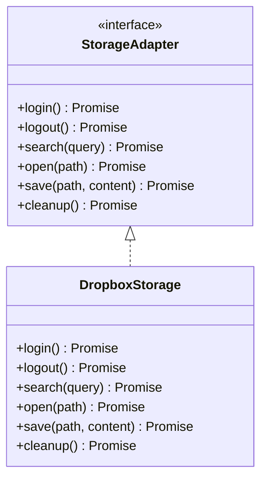

# Architektur: Storage-Abstraktion

## 1. Überblick

Zupfnoter benötigt für das Öffnen und Speichern von Dateien eine austauschbare Storage-Schicht.
Statt die konkrete Cloud-Anbindung direkt in UI oder Command-Logik zu verdrahten, wird eine
abstrakte Storage-Schnittstelle eingeführt. Diese Schnittstelle kapselt alle operationellen
Aufgaben rund um Benutzeranmeldung, Dateisuche und Dateioperationen.

Die erste konkrete Umsetzung dieser Abstraktion ist `Dropbox`. Eine weitere Umsetzung für
`Nextcloud` ist vorgesehen und soll dieselbe Schnittstelle bedienen.

```
┌──────────────────┐     ┌─────────────────────────┐     ┌─────────────────────┐
│  apps/web        │     │  Storage-Interface      │     │  Konkrete Adapter   │
│                  │     │                         │     │                     │
│  Open / Save UI ─┼────►│  login()                │     │  DropboxStorage     │
│  Dateisuche ────┼─────►│  search()               │────►│  NextcloudStorage   │
│  Cleanup ────────┼─────►│  open()                 │     │                     │
│                  │     │  save()                 │     │                     │
└──────────────────┘     │  cleanup()             │     └─────────────────────┘
                         └─────────────────────────┘
```

Die Abstraktion verfolgt drei Ziele:

- UI und Fachlogik bleiben unabhängig von der konkreten Cloud-API
- neue Speicheranbieter können ohne Umbau der aufrufenden Schichten ergänzt werden
- Testbarkeit steigt, weil die Anwendung gegen ein kleines, stabiles Interface arbeitet

## 2. Fachliche Rolle

Die Storage-Schicht ist die gemeinsame Infrastruktur für:

- Öffnen von ABC-Dateien aus einem externen Speicher
- Speichern von geänderten Dateien
- Suchen von Dateien oder Ordnern im verbundenen Speicher
- Anmelden und Wiederverbinden der Session
- Aufräumen von temporären Zuständen und Ressourcen

Zusätzlich muss Zupfnoter den aktiven Storage-Kontext kennen, also wissen, in welchen
konkreten Adapter bzw. Provider die Sitzung gerade eingeloggt ist. Diese Information ist
für UI-Zustand, Session-Wiederherstellung und Logout relevant und soll in der Fußzeile für
den Benutzer anzeigbar sein. Außerdem muss sie im `localStorage` persistiert werden können.

Die Storage-Schicht ist bewusst keine generische Dateisystem-API. Sie bildet nur die
Operationen ab, die Zupfnoter im Web-Workflow benötigt.

## 3. Schnittstelle

Die abstrakte Schnittstelle ist auf folgende Kernoperationen zugeschnitten:

```ts
interface StorageAdapter {
  login(): Promise<void>
  logout(): Promise<void>
  search(query: string): Promise<StorageSearchResult[]>
  open(path: string): Promise<StorageFile>
  save(path: string, content: string): Promise<void>
  cleanup(): Promise<void>
}

interface StorageSearchResult {
  path: string
  name: string
  isFolder: boolean
  modifiedAt?: string
}

interface StorageFile {
  path: string
  name: string
  content: string
  modifiedAt?: string
}
```

### 3.1 Semantik der Methoden

`login()`
: Stellt eine authentifizierte Sitzung her oder erneuert sie. Die Methode ist der Einstieg
  für alle cloudbasierten Speicheradapter.

`logout()`
: Beendet die aktuelle Sitzung kontrolliert und verwirft aktive Authentifizierungsdaten.

Der Adapter selbst bleibt die Quelle der provider-spezifischen Details; die Anwendung hält
nur den aktiven Storage-Adapter bzw. dessen Identität als Zustand.

`search(query)`
: Liefert Treffer für eine Dateisuche zurück. Die genaue Suche kann adapterabhängig sein,
  muss aber für die UI als einheitliches Ergebnisformat verfügbar sein.

`open(path)`
: Lädt eine Datei aus dem Speicher und gibt ihren Inhalt zurück.

`save(path)`
: Schreibt den aktuellen Inhalt an die Zielposition im Storage.

`cleanup()`
: Räumt adapterseitige temporäre Ressourcen auf, etwa Tokens, Handles, Cache-Zustände oder
  laufende UI-Hilfszustände.

### 3.2 OAuth- und Token-Verwaltung

Die Storage-Adapter übernehmen auch die Verwaltung der OAuth-bezogenen Zustände:

- Initialer Login über den jeweiligen Provider
- Speicherung und Wiederverwendung von Access-Tokens
- Erneuerung über Refresh-Tokens, wenn der Provider das unterstützt
- Erkennung abgelaufener oder ungültiger Tokens
- kontrolliertes Logout mit Entfernen gespeicherter Authentifizierungsdaten

Diese Verantwortung liegt im Adapter, nicht in der UI. Die UI darf nur den
Authentifizierungszustand anfordern oder beenden, aber keine provider-spezifische Tokenlogik
implementieren.

## 4. Erste Implementierung: Dropbox

`DropboxStorage` ist die erste produktive Implementierung des Interfaces. Sie übernimmt:

- OAuth-basierte Anmeldung
- Logout und Session-Beendigung
- Verwaltung von Access-Tokens und Refresh-Tokens
- Dateisuche in der verbundenen Dropbox
- Öffnen vorhandener Dateien
- Speichern geänderter Dateien
- Aufräumen nach Abmeldung oder Abbruch

Die Dropbox-Implementierung ist damit nicht mehr isolierte Sonderlogik, sondern ein Adapter
hinter der generischen Storage-Schnittstelle.

### 4.1 Adapterstruktur



### 4.2 Einsatz im UI

Die Weboberfläche spricht nicht direkt mit Dropbox-spezifischen Funktionen, sondern nur mit
dem Storage-Interface. Dadurch bleiben die UI-Komponenten unverändert, wenn später ein
weiterer Adapter hinzukommt.

Der typische Ablauf ist:

1. Benutzer meldet sich an
2. Die UI ruft `login()` auf
3. Die Suche nutzt `search()`
4. Eine ausgewählte Datei wird mit `open()` geladen
5. Änderungen werden mit `save()` geschrieben
6. Beim Verlassen oder Wechsel des Kontextes wird `cleanup()` ausgeführt

## 5. Command-Syntax

In der ersten Implementierung wird Storage über den Command-Prozessor bedient. Dafür wird
die bestehende Command-Notation für Storage auf einen neutralen `s*`-Präfix geführt. Es gibt einen Command zur Auswahl des aktiven
Storage-Providers und danach einen einheitlichen Satz von Commands, der für alle Adapter
gleich bleibt.

### 5.1 Grundform

```text
sstorage <provider> [<context>]
slogout
sstatus
ssearch <query>
schoose <path>
sopen <path>
ssave [<path>]
scleanup
sreconnect
```

### 5.2 Semantik der Commands

`sstorage <provider> [<context>]`
: Wählt den aktiven Storage-Provider aus und stellt bei Bedarf die Sitzung wieder her.
  `provider` ist z. B. `dropbox` oder später `nextcloud`. `context` beschreibt den aktiven
  Storage-Kontext, etwa ein Root-Verzeichnis oder einen benannten Arbeitsbereich.

`slogout`
: Beendet die aktuelle Storage-Sitzung und entfernt die gespeicherten Authentifizierungsdaten
  des aktiven Providers.

`sstatus`
: Zeigt den aktiven Storage-Kontext, den verbundenen Provider und den Login-Zustand an.
  Der Befehl ist für Console, Statusbar und Footer relevant.

`ssearch <query>`
: Sucht im aktiven Storage-Kontext nach Dateien oder Ordnern.

`schoose <path>`
: Setzt den aktiven Storage-Kontext auf einen ausgewählten Pfad. Der Befehl dient der
  Navigation innerhalb des Providers.

`sopen <path>`
: Öffnet eine Datei aus dem aktiven Storage-Kontext.

`ssave [<path>]`
: Speichert die aktuelle Datei im aktiven Storage-Kontext. Wenn `path` fehlt, wird der
  aktuelle Zielpfad verwendet.

`scleanup`
: Räumt temporäre Storage-Zustände auf.

`sreconnect`
: Stellt die letzte Storage-Sitzung anhand des gespeicherten Kontexts wieder her.

### 5.3 Command-Formate für die erste UI-Anbindung

Für die erste Implementierung ist ein schlankes, textbasiertes Command-Format sinnvoll:

- `dstorage dropbox "//mein-ordner/"` für die Auswahl und den initialen Login
- `sstorage dropbox "//mein-ordner/"` für die Auswahl und den initialen Login
- `sstatus` für Anzeige in Console und Fußzeile
- `ssearch "Monbachtal"` für die Dateisuche
- `schoose "//mein-ordner/"` zum Setzen des Arbeitskontexts
- `sopen "//mein-ordner/zupfnoter.abc"` zum Öffnen
- `ssave` oder `ssave "//mein-ordner/zupfnoter.abc"` zum Speichern
- `slogout` zum kontrollierten Abmelden
- `sreconnect` für die Wiederherstellung nach Reload

### 5.4 Architekturregel

Die UI darf keine Dropbox-spezifischen Funktionen direkt aufrufen. Sie spricht nur mit dem
Command-Prozessor, und der Command-Prozessor arbeitet gegen das Storage-Interface.

## 6. Geplante zweite Implementierung: Nextcloud

`NextcloudStorage` ist als nächste Umsetzung vorgesehen. Ziel ist, dass die Anwendung dieselbe
Schnittstelle nutzt und nur der Adapter getauscht wird.

Für Nextcloud ergibt sich damit derselbe funktionale Vertrag:

- Anmeldung
- Suche
- Öffnen
- Speichern
- Cleanup

Die konkrete technische Anbindung kann sich von Dropbox unterscheiden. Die abstrakte
Schnittstelle bleibt stabil und definiert den gemeinsamen Nenner.

## 7. Architekturprinzipien

- Das Storage-Interface ist die einzige öffentliche Abstraktion für Cloud-Dateizugriff
- UI-Code kennt keine Dropbox- oder Nextcloud-spezifischen Details
- Adapter dürfen provider-spezifische Logik kapseln, aber nicht in die Fachlogik ausufern
- Die Auswahl des konkreten Adapters erfolgt über Konfiguration oder Initialisierung
- Erweiterungen um weitere Provider sollen neue Adapter sein, keine Änderungen am UI-Kern

## 8. Abgrenzung

Nicht Teil dieser Abstraktion sind:

- Konfigurationsauflösung über `Confstack`
- ABC-Parsing
- Song- und Sheet-Transformation
- SVG-Rendering
- Druck- oder PDF-Export

Die Storage-Schicht liefert nur den Zugang zu Dateien. Sie ist keine Render- oder
Transformationsschicht.

## 9. Offene Erweiterungspunkte

Für spätere Ausbaustufen sind insbesondere folgende Punkte relevant:

- Persistenz von zuletzt genutzten Pfaden
- erweiterte Suchfilter
- Konfliktbehandlung bei parallelen Speicherständen
- gemeinsame Fehlerklassifikation für alle Adapter
- Offline-Verhalten und Wiederverbindung

## 10. Ergebnis

Die neue Storage-Abstraktion trennt den Datei-Zugriff von der UI und legt ein kleines,
stabil erweiterbares Kern-Interface fest. Dropbox ist die erste konkrete Implementierung,
Nextcloud folgt als geplante zweite Umsetzung.
