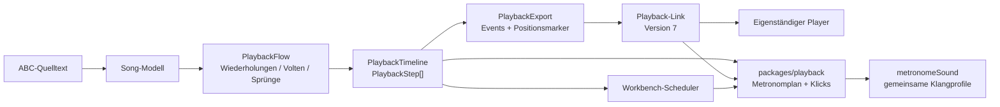
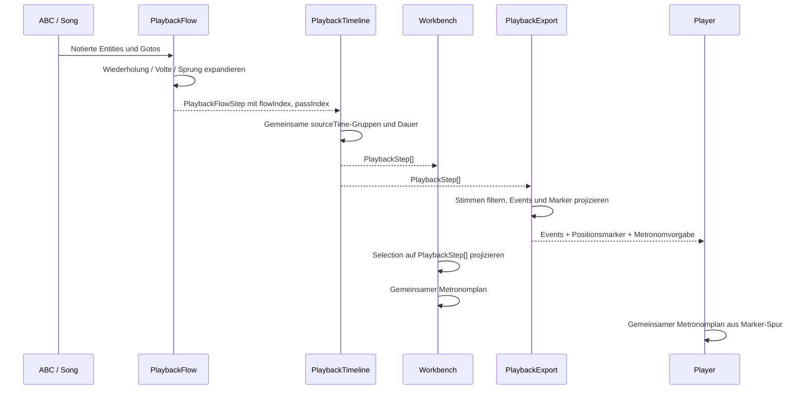
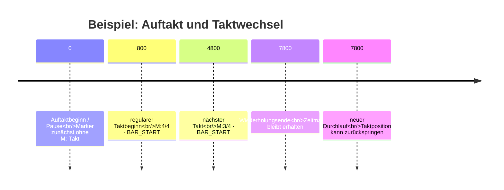
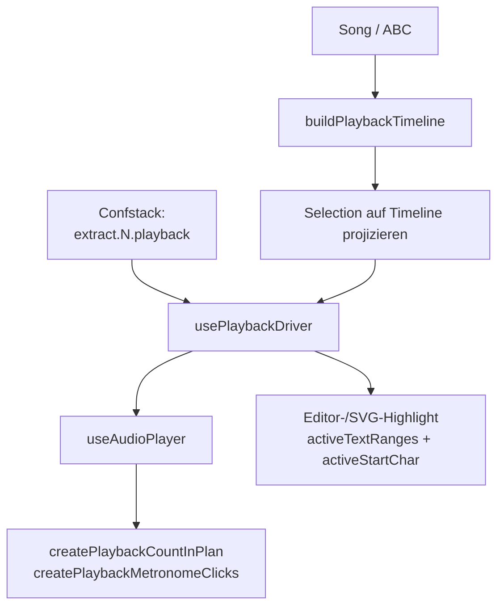
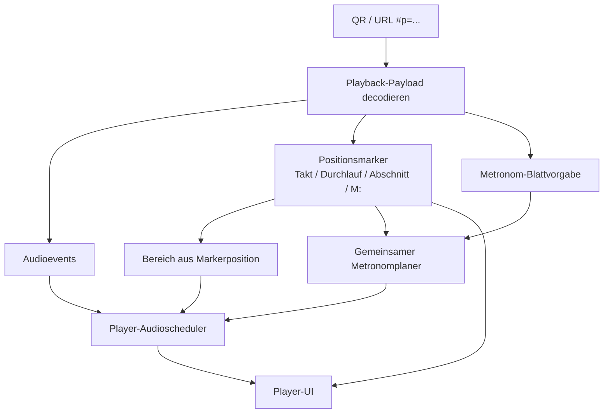
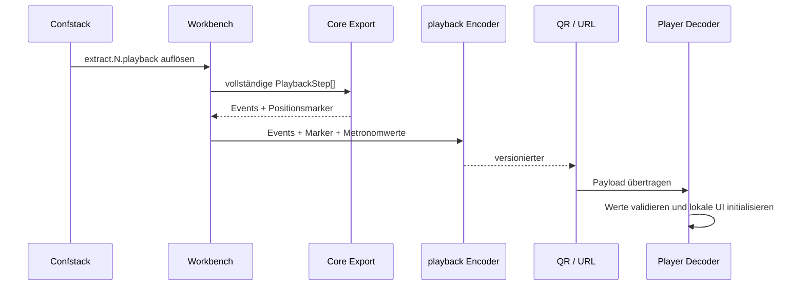

# Metronom und Wiedergabe in Workbench und Player

## Zweck und Geltungsbereich

Dieses Dokument beschreibt den technischen Stand der Wiedergabe am 9. August
2026. Es ist die Referenz für:

- die expandierte Wiedergabereihenfolge mit Wiederholungen und Volten,
- Takt, Durchlauf, Abschnitt und die Zuordnung zum ABC-Quelltext,
- die gemeinsame Metronomlogik für Workbench und eigenständigen Player,
- die Übertragung der Blattvorgabe im Playback-Link,
- die tatsächlich gemeinsame und die weiterhin doppelte Implementierung.

Die fachliche Quelle bleibt ABC. Der Playback-Link ist ein kompaktes,
versioniertes Wiedergabeartefakt. Er enthält weder ABC noch Layoutdaten und
kann die Workbench nicht ersetzen.

## Kurzfazit zur Konsolidierung

Die zentrale fachliche Berechnung ist geteilt:

1. `packages/core/src/PlaybackFlow.ts` expandiert den musikalischen Ablauf.
2. `packages/core/src/PlaybackTimeline.ts` erzeugt daraus eine gemeinsame
   zeitbasierte `PlaybackStep[]`-Timeline.
3. `packages/core/src/PlaybackExport.ts` projiziert dieselbe Timeline in
   Audioereignisse und Positionsmarker.
4. `packages/playback/src/index.ts` berechnet daraus Metronomklicks und
   Einzählpläne und codiert den Playback-Link.
5. `packages/playback/src/metronomeSound.ts` definiert die gemeinsame
   Klangklassifikation und Klangfarben.

Damit gibt es keine zweite fachliche Timeline im Player und keine eigene
Metronom-Mathematik pro Plattform.

Es gibt allerdings weiterhin zwei technische Scheduler:

- die Workbench in
  `apps/web/src/workbench/useAudioPlayer.ts`,
- der eigenständige Player in `apps/player/src/main.ts`.

Beide verwenden die gemeinsamen Funktionen aus `@zupfnoter/playback`, haben
aber eigene Audio-Context-Verwaltung, Lookahead-/Refill-Logik, Pause-/Stop-
Zustände und UI-Rückmeldungen. Das ist aktuell eine bewusste
Adapterduplizierung zwischen zwei Laufzeitumgebungen, keine Duplizierung der
fachlichen Ablaufberechnung.

## Gesamtarchitektur



Die entscheidende Trennung lautet:

```text
Notiertes Material
        ↓
expandierter Ablauf (Reihenfolge)
        ↓
zeitbasierte Timeline (Dauer und Position)
        ↓
Workbench-Audio     oder     Playback-Link/Player
```

Der Player rekonstruiert aus dem Link nicht die ABC-Musik und nicht die
Wiederholungslogik. Er liest die bereits materialisierten Audioereignisse und
Positionsmarker.

## Die expandierte Sequence

### Begriffe

Ein `PlaybackFlowStep` ist eine Position im tatsächlichen Ablauf. Derselbe
notierte Ursprung kann mehrfach vorkommen. Die wichtigsten Felder sind:

| Feld | Bedeutung |
| --- | --- |
| `flowIndex` | Eindeutiger, linearer Index in der tatsächlichen Wiedergabefolge |
| `sourceTime` | Zeitposition des notierten Ursprungs im Song-Modell |
| `originZnIds` | Zupfnoter-Ursprünge, die an diesem Ablaufpunkt aktiv sind |
| `measureNumber` | Notierter, 1-basierter Takt |
| `passIndex` | Linearer, 1-basierter Durchlauf |
| `voltaNumber` | Erste/zweite bzw. weitere Variante, sofern vorhanden |
| `meter` | Taktart am Beginn dieses notierten Taktes |
| `partName` | Partname am Ablaufpunkt, falls direkt aus ABC vorhanden |
| `activeStartChar` | Kleinster ABC-Quelltext-Offset des Ablaufpunkts |
| `activeTextRanges` | Alle zugehörigen ABC-Quelltextbereiche |

`flowIndex` ist die Ablaufidentität. `measureNumber` ist keine
Ablaufidentität: Ein Takt 15 kann im Durchlauf 1, 2 und 5 vorkommen.

### Beispiel einer expandierten Sequence

Für ein Stück mit drei Takten, einer Wiederholung und zwei Volten kann die
Sequence beispielsweise so aussehen:

```text
flowIndex  sourceTime  Abschnitt  Takt  DL#  Volte  sourceChars
─────────  ──────────  ─────────  ────  ───  ─────  ───────────
0          0           A          1     1    –      120..126
1          64          A          2     1    –      127..133
2          128         A          3     1    1      134..140
3          192         A          1     2    –      120..126
4          256         A          2     2    –      127..133
5          320         B          4     2    2      141..149
6          384         B          5     2    –      150..157
```

Die `sourceChars` sind keine neue Sequenznummer. Sie zeigen auf die notierte
Quelle. Beim zweiten Auftreten von Takt 1 bleiben die Quelltextzeichen gleich,
`flowIndex` und `passIndex` ändern sich.

### Sequence-Diagramm des Ablaufs



## Timeline und Zeitbasis

Ein `PlaybackStep` ist ein zeitbasierter Schritt der expandierten Folge.
Die wichtige Struktur ist:

```ts
interface PlaybackStep {
  sourceTime: number
  playbackStartMs: number
  durationMs: number
  flowIndex: number
  passIndex: number
  position?: { measureNumber: number; passIndex: number }
  meter?: TimeSignature
  partName?: string
  activeStartChar?: number
  activeTextRanges: SelectionTextRange[]
  activeNotes: PlaybackNote[]
}
```

`playbackStartMs` und `durationMs` bilden die gemeinsame Zeitachse. Die
Audioereignisse werden nicht aus der sichtbaren UI und auch nicht aus der
Positionsnummer rekonstruiert.

### Warum stille Schritte erhalten bleiben

`PlaybackTimeline` baut die Gruppen aus allen spielbaren Entities, darunter
auch Pausen und Synchronisationspunkte. Beim Export werden Stimmen erst nach
der vollständigen Timeline gefiltert. So bleibt ein Takt oder ein Taktwechsel
auch dann zeitlich vorhanden, wenn der ausgewählte Auszug dort keinen
klingenden Ton besitzt.

Das ist wichtig für:

- Auftakte mit einer Pause,
- Taktwechsel zwischen gebundenen oder pausierenden Stimmen,
- Wiederholungsgrenzen ohne neuen Ton,
- Auszüge, die nur einen Teil der Stimmen enthalten.

### Position und Abschnitt

Die Position wird aus einer eigenen zeitbasierten Marker-Spur abgeleitet:

```ts
interface PlaybackPositionMarker {
  timeMs: number
  position: { measureNumber: number; passIndex: number }
  meter?: { numerator: number; denominator: number; grouping?: number[] }
  partName?: string
}
```

Für `partName` gilt:

1. Nur ein getrimmter, nicht-leerer Name ist relevant.
2. Ein solcher Name bleibt für folgende Schritte wirksam.
3. Leere oder nur aus Leerzeichen bestehende Partnamen löschen den aktuellen
   Abschnitt nicht.
4. Workbench und Player verwenden dieselbe Regel über
   `resolveEffectivePlaybackPartNames` beziehungsweise die Marker-
   Fortschreibung im Export.

Der Player zeigt den Abschnitt nur, wenn überhaupt ein nicht-leerer Partname
übertragen wurde. Takt und Durchlauf bleiben unabhängig davon sichtbar.

## Metronommodell

### Blattvorgabe pro Extrakt

Die Konfiguration liegt unter:

```text
extract.<nummer>.playback
```

Der wirksame Wert wird über Confstack aufgelöst. Die Web-Workbench verwendet
ihn für die lokale Wiedergabe und übergibt dieselben Werte beim Erzeugen des
Playback-Links. Der Link trägt die aufgelöste Vorgabe mit, damit der Player
ohne Zugriff auf das Blatt korrekt starten kann.

```ts
interface PlaybackConfig {
  metronomeMode?: 'off' | 'countIn' | 'playback' | 'always'
  minLeadIn?: number
  bandPreCount?: boolean
  division?: number
  subdivision?: number
}
```

Bedeutung der Modi:

| Modus | Einzählen | Klick während des Stücks |
| --- | ---: | ---: |
| `off` | nein | nein |
| `countIn` | ja | nein |
| `playback` | nein | ja |
| `always` | ja | ja |

`countIn` bezeichnet in der gespeicherten Blattvorgabe das Einzählen vor dem
musikalischen Einsatz. Die fachliche Zählung kann dabei aus einem Vorzähler,
einem Auftakt und zusätzlichen vollständigen Takten bestehen.

### Zählparameter

`minLeadIn` ist die Mindestzahl hörbarer großer Zählschläge vor dem wirklichen
Einsatz. Der Planer zählt vom Einsatz rückwärts und nimmt bei Bedarf weitere
vollständige Takte hinzu. Ein Auftakt ist dabei kein eigener gespeicherter
Sondertyp, sondern ein Fall der Einsatzberechnung.

`division` ist die Zahl der großen Zählschläge pro Takt. Fehlt der Wert, wird
der Zähler der am aktuellen Takt geltenden `M:`-Taktart verwendet.

`subdivision` ist die Zahl der hörbaren Impulse je großem Zählschlag. Die
Anzahl der Klickpositionen pro Takt beträgt damit:

```text
division × subdivision
```

Beispiele:

```text
4/4:  division 4, subdivision 1  →  X . X . X . X .
6/8:  division 2, subdivision 3  →  X . . X . .
12/8: division 4, subdivision 3  →  X . . X . . X . . X . .
```

Die tatsächliche Klangfarbe der Klassen ist in
`packages/playback/src/metronomeSound.ts` zentral definiert:

| Ereignisklasse | Klangrolle |
| --- | --- |
| `PRE_COUNT` | Band-Vorzähler |
| `BAR_START` | betonter erster Schlag des Taktes |
| `MAIN_BEAT` | normaler großer Schlag |
| `SUBDIVISION` | Unterteilung |
| letzter Klick vor dem Einsatz | `entry`, unabhängig von der Grundklasse |

Der letzte Klick vor dem Einsatz hat Vorrang und erhält die eigene Klangfarbe
`entry`. Das ist eine Klangklassifikation, keine eigene Zeitberechnung.

### Band-Vorzählen, Einzählen und Zählen

Die drei sichtbaren Begriffe beschreiben unterschiedliche Phasen:

```text
Band-Vorzählen  →  Einzählen  →  musikalischer Einsatz  →  Zählen im Stück
       optional       minLeadIn / Auftakt                 optional
```

`bandPreCount` fügt den expliziten Zupfnoter-Band-Vorzähler vor den normalen
Einzählplan. Er wird nicht aus `division` oder `subdivision` mathematisch
abgeleitet. Das ist der bewusst verbleibende fachliche Sonderfall dieser
Konvention.

## Metronom-Sequenz als Ereignisfolge

Der gemeinsame Planer erzeugt nicht einfach „einen Timer pro UI-Schlag“.
Erzeugt werden semantische Ereignisse mit Zeitoffset:

```ts
interface PlaybackCountEvent {
  offsetMs: number
  kind: 'PRE_COUNT' | 'BAR_START' | 'MAIN_BEAT' | 'SUBDIVISION'
  beat: number
  isLastBeforeEntry: boolean
}
```

Eine mögliche Folge für `minLeadIn = 4`, `4/4`, ohne Band-Vorzähler lautet:

```text
offset       kind          beat   Klang
───────────  ────────────  ─────  ─────────
0 ms         BAR_START       1    accent
1000 ms      MAIN_BEAT       2    regular
2000 ms      MAIN_BEAT       3    regular
3000 ms      MAIN_BEAT       4    entry      ← letzter Klick vor Einsatz
```

Mit `subdivision = 2` entsteht pro großem Schlag zusätzlich eine
Unterteilung. Die Ereignisfolge lautet dann sinngemäß:

```text
BAR_START  SUBDIVISION  MAIN_BEAT  SUBDIVISION  MAIN_BEAT  SUBDIVISION ...
```

Die konkreten Millisekunden kommen aus Taktart, Tempo und Timeline.

## Taktwechsel, Auftakt und Wiederholungsgrenzen

### Taktwechsel

Ein Taktwechsel wird in der Marker-Spur als neuer `meter`-Wert sichtbar. Die
Klickberechnung verwendet für jeden Takt den dort gültigen Marker. Es gibt
keine globale Annahme „jeder Takt hat vier Schläge“.

Die Taktart wird dort wirksam, wo die Song-/Timeline-Pipeline den Taktbeginn
markiert. Bei einer Auftaktstruktur kann der erste Marker zunächst ohne
`meter` sein; die vollständige Taktart folgt am Beginn des regulären Taktes.
Das ist notwendig, weil der Auftakt mit einer Pause beginnen kann und trotzdem
zeitlich zum anschließenden Takt gehört.



### Wiederholungsende

Die Wiederholung wird zuerst in `PlaybackFlow` expandiert. Erst danach werden
Zeit und Metronommarker erzeugt. Der Metronomplan darf deshalb nicht nur die
numerische Folge der Taktnummern betrachten, sondern muss der tatsächlichen
Zeitposition und der jeweils gültigen Taktart folgen.

```text
notiert:       Takt 1 | Takt 2 | Takt 3 |: Takt 4 :|
PlaybackFlow:  1.1   →   2.1   →   3.1   →   4.1
                                  ↘ Wiederholung
               1.2   →   2.2   →   3.2   →   4.2
```

Takt 1 im Durchlauf 2 ist ein neuer Zeitabschnitt, auch wenn seine
`sourceTime` wieder auf das notierte Material von Takt 1 zeigt. Die Timeline
führt dafür einen neuen `flowIndex`, neue `playbackStartMs` und dieselbe
notierte Quelle.

### Volten

Volten sind Ablaufentscheidungen in `PlaybackFlow`. Player und Workbench
erhalten danach nur die ausgewählte lineare Folge. Ein Metronomklick darf
nicht aus der notierten Taktfolge rekonstruiert werden, sondern muss der
expandierten Timeline folgen. Dadurch können beliebig viele
Wiederholungsgrenzen und Varianten hintereinander auftreten.

## Workbench-Ablauf



Die Workbench:

1. baut aus Song und aktiven Stimmen die vollständige Timeline,
2. projiziert die Selection auf diese Timeline,
3. übergibt die Schritte an `useAudioPlayer`,
4. erzeugt dort Marker aus den ausgewählten Schritten,
5. verwendet für Einzählen und Stückklicks die Shared-Funktionen,
6. meldet Schrittbeginn, Position und Metronomschlag an die UI.

Die Editorposition wird nicht durch eine zweite Suche im ABC erzeugt. `source`
und `sourceOffsets` werden über `activeTextRanges` sowie `activeStartChar`
weitergereicht.

## Player-Ablauf



Der Player:

1. liest `#p=...`,
2. validiert und decodiert den versionierten Payload,
3. materialisiert Events und Positionsmarker,
4. nimmt die Metronomvorgabe aus demselben Payload,
5. verwendet Marker für Bereichsauswahl, Position, Taktart und Abschnitt,
6. ruft `createPlaybackCountInPlan` und
   `createPlaybackMetronomeClicks` auf,
7. verwendet `resolvePlaybackMetronomeEventSound` und
   `schedulePlaybackMetronomeClick` für die Audioausgabe.

Der Player braucht deshalb keine Sonderbehandlung für eine konkrete
Wiederholungsnummer oder einen konkreten Takt. Er arbeitet auf der
materialisierten Zeitspur.

## Playback-Link und Konfigurationsfluss



Die Metronomwerte werden nicht aus der UI-Anzeige „erraten“. Sie kommen aus
`extract.N.playback`, werden beim Export als `PlaybackMetronomeConfig`
übergeben und im Payload gespeichert. Der Player darf die Blattvorgabe durch
lokale Bedienung ändern, aber beim erneuten Laden eines Links wird wieder die
gespeicherte Vorgabe als Ausgangspunkt verwendet.

## Prüfung auf Sonderlocken und Duplikate

### Zentral und nicht dupliziert

| Fachliche Aufgabe | Single Source of Truth | Verbraucher |
| --- | --- | --- |
| Wiederholungs-/Voltenexpansion | `expandPlaybackFlow` | Core-Timeline |
| Gruppierung nach Quellzeit | `buildPlaybackTimeline` | Workbench und Export |
| Stimme erst nach Timeline filtern | `buildPlaybackExportDataFromTimeline` | Link/QR/CLI |
| Metronomklicks | `createPlaybackMetronomeClicks` | Workbench und Player |
| Einzählplan | `createPlaybackCountInPlan` | Workbench und Player |
| Klick-Klangfarbe | `metronomeSound.ts` | Workbench und Player |
| Blattvorgabe | `extract.N.playback` / Payload | Workbench und Player |
| Part-Fortschreibung | letzter getrimmter nicht-leerer Partname | Timeline/Export/UI |

### Bewusst verbleibende Sonderfälle

Diese Regeln sind fachlich begründet und keine versehentlichen Duplikate:

- Ein Auftaktmarker kann zunächst ohne `meter` sein. Der reguläre
  Taktmarker liefert die Taktart später nach.
- Der Planer behandelt einen Auftakt mit Pause genauso wie einen Auftakt mit
  Ton: entscheidend ist die Zeitposition, nicht ob der erste Schritt klingt.
- `bandPreCount` ist eine explizite Zupfnoter-Konvention und wird nicht aus
  `division`/`subdivision` hergeleitet.
- `division` fällt bei fehlender Extraktvorgabe auf den Zähler der aktuellen
  `M:`-Taktart zurück.
- `PlaybackFlow` enthält eine Sicherheitsgrenze gegen endlose
  Wiederholungsexpansion. Das ist eine Schutzmaßnahme, keine alternative
  Ablaufberechnung.
- Der Player liest ältere Payload-Versionen. Das ist Formatkompatibilität,
  keine zweite aktuelle Fachlogik.

### Tatsächliche Duplikate / Konsolidierungsrisiken

Diese Stellen sind nicht vollständig vereinheitlicht:

1. **Audio-Scheduling:** Workbench und Player schedulen Noten und Klicks in
   getrennten Dateien. Der Klickplan ist geteilt, der Audio-Lookahead nicht.
2. **Positionstraversierung im Player:** Der Player besitzt eigene Hilfen wie
   `positionAtTime`, `partNameAtTime` und Bereichssuche über Marker. Das ist
   nötig, weil der Player nur den kompakten Link kennt, muss aber bei jeder
   Änderung der Markersemantik mit der Workbench geprüft werden.
3. **Metronom-Laufzeitstatus:** `metronomeEnabled`, Modus, Lautstärke und
   Auswahlzustand werden in beiden Anwendungen separat gehalten. Die
   gespeicherte Konfiguration und die Planer sind geteilt, der lokale
   Bedienzustand nicht.
4. **Visualisierung:** Workbench und Player zeichnen ihren aktuellen Schlag
   mit eigenen UI-Komponenten. Sie erhalten jedoch dieselbe semantische
   Klickfolge; die Darstellung ist nicht die Berechnung.

Diese Punkte sind konkrete, begrenzte Adapterduplikate. Eine Behauptung, dass
Player und Workbench bereits denselben Scheduler-Code verwenden, wäre falsch.
Die fachliche Timeline- und Metronomduplizierung ist dagegen beseitigt.

## Invarianten für Änderungen

1. ABC bleibt die Quelle der notierten Bedeutung.
2. `PlaybackFlow` expandiert den Ablauf genau einmal.
3. `PlaybackTimeline` wird vor einem Stimmenfilter gebaut.
4. `flowIndex` beschreibt die tatsächliche Reihenfolge; `measureNumber`
   allein darf nicht als Reihenfolge verwendet werden.
5. `passIndex` ist 1-basiert und darf bei Wiederholungen zurückspringende
   Taktnummern begleiten.
6. `activeStartChar` und `activeTextRanges` bleiben auf die notierte
   ABC-Quelle bezogen, auch wenn der Ursprung wiederholt wird.
7. Ein leerer getrimmter Partname überschreibt keinen zuvor wirksamen Namen.
8. Taktart und Gruppierung kommen aus dem jeweiligen Markerbereich.
9. Workbench und Player rufen dieselben Funktionen für Klickplan und
   Klangklassifikation auf.
10. Die Blattvorgabe liegt unter `extract.N.playback` und wird unverändert in
    den Playback-Link übernommen.

## Empfohlene Paritätstests

Die bestehende Testbasis deckt zentrale Teile ab. Für eine belastbare
Plattformparität sollten die folgenden Artefakte als gemeinsame Fixture
materialisiert werden:

```text
ABC
  → PlaybackFlowStep[]
  → PlaybackStep[]
  → PlaybackExportData
  → Playback-Link decode
  → Metronomklickfolge
```

Für jede Fixture sollte mindestens verglichen werden:

- `flowIndex`, `sourceTime`, Takt, Durchlauf und Volte,
- `activeStartChar` und Quelltextbereiche,
- Markerzeit, Marker-Meter und fortgeschriebener Abschnitt,
- Klickzeit, Ereignisklasse, Beat, Division und Subdivision,
- Einzähl-Dauer und Markierung des letzten Klicks vor dem Einsatz,
- dekodierte Metronomkonfiguration.

Ein Browser-Test kann anschließend prüfen, dass Workbench und Player dieselbe
Fixture an denselben Zeitpunkten mit demselben Abschnitt, Takt, Durchlauf und
Metronomschlag anzeigen. Er prüft damit die Adapter, nicht eine zweite
fachliche Implementierung.

## Offene technische Konsolidierung

Wenn künftig auch die letzten Scheduler-Duplikate entfernt werden sollen,
sollte der nächste Schritt nicht eine weitere Sonderbehandlung in einer UI
sein. Stattdessen sollte ein gemeinsames, UI-neutrales Scheduling-Modul
entstehen, das aus `PlaybackStep[]`, Marker-Spur und Metronomplan eine Folge
zeitgestempelter Audio- und Visual-Events liefert. Workbench und Player würden
dann nur noch ihre jeweilige Audioausgabe und Darstellung adaptieren.

Das ist eine zukünftige Architekturarbeit. Für den aktuellen Stand gilt:

```text
gemeinsame fachliche Timeline:       ja
gemeinsamer Metronomplan:             ja
gemeinsame Klangklassifikation:       ja
gemeinsame lokale Scheduler-Logik:   nein
```
