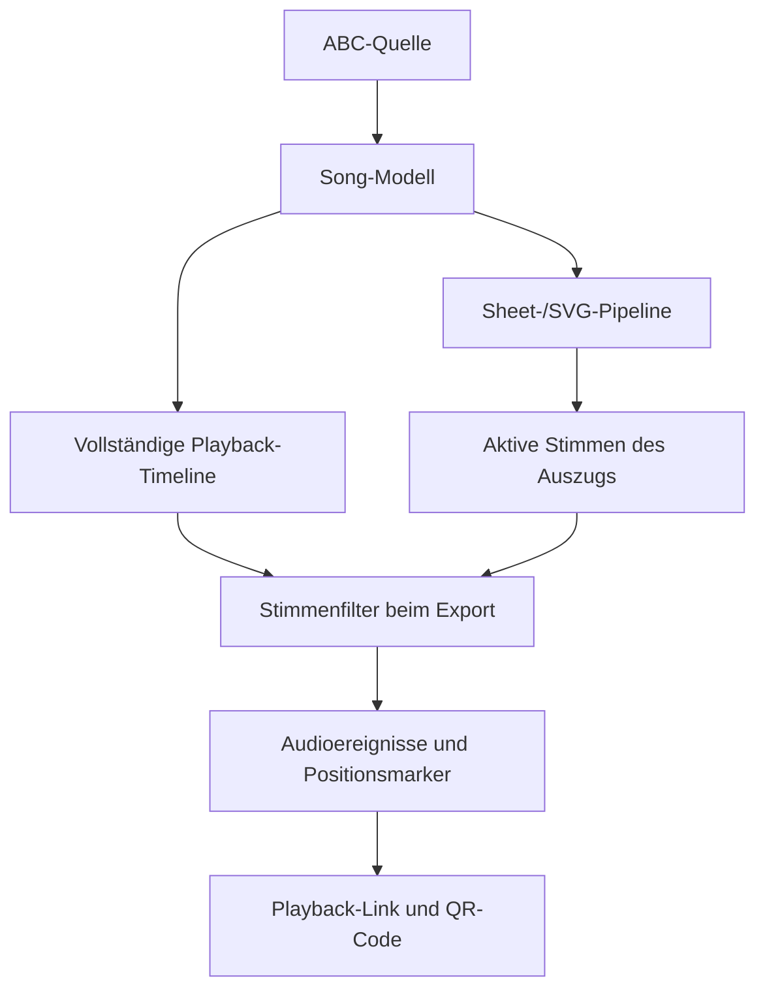

# Phase 6 – Playback-Link für Zupfnoter-TS

**Status: weitgehend umgesetzt.** Web-Workbench, Practice, Positionsspur,
Metronomdaten, QR-Einbettung und öffentliche FLink-Bereitstellung sind
implementiert. Offen bleibt die vollständige Konsolidierung des eigenständigen
CLI-Playback-Link-Exports.

## Ziel

Zupfnoter-TS erzeugt einen kompakten, versionierten Datensatz für die eigenständige Practice-Webanwendung. Der Datensatz dient ausschließlich dem Üben und der Wiedergabe. Er ist kein Austauschformat für ABC, MIDI oder Zupfnoter-Dokumente.

Der Link wird vollständig ohne Serverzustand übertragen:

```text
Playback-Timeline
        ↓
Playback-Export pro Auszug
        ↓
Binärformat mit Audio- und Ablaufereignissen
        ↓
Deflate Raw
        ↓
Base64URL
        ↓
https://practice.zupfnoter.de/#p=...
```

Practice stellt eine Timeline mit Taktnummer und Durchlauf dar. Die Anzeige
verwendet beispielsweise `27 : 1`; ein Bereich wie `27.1-3.2` kann direkt zur
Wiedergabe ausgewählt werden. Die zweite Zahl ist die Durchlaufnummer.

## Bestehende Quelle und Auszugsbildung

Die vollständige `PlaybackStep[]`-Timeline aus `apps/web/src/workbench/playback.ts` ist die einzige Quelle. Sie wird nicht erneut pro Auszug erzeugt.

Für jeden konfigurierten `produce`-Auszug wird die vollständige Timeline aus dem
Song-Modell erzeugt. Das Sheet-/SVG-Layout bestimmt anschließend, welche Stimmen
für den Auszug aktiv sind. Diese Stimmen werden erst bei der Projektion in
Audioereignisse gefiltert. Ohne `produce` wird Auszug 0 verwendet.

Damit Workbench, CLI und der Zupfmanager-QR-Sheet-Generator zeitlich identisch
bleiben, gilt folgende Pipeline:



Die Timeline darf nicht bereits beim Aufbau auf die aktiven Stimmen reduziert
werden. Auch stumme Flow-Schritte und Zeitpunkte anderer Stimmen können die
zeitliche Struktur des Stücks bestimmen. Die zentrale Funktion
`packages/core/src/PlaybackExport.ts` baut deshalb zuerst die vollständige
Timeline und filtert danach die `activeNotes`. Anwendungen dürfen für den
Playback-Export keine eigene Variante dieser Berechnung einführen.

Die bestehende Playback-Erzeugung bleibt für die Timeline verantwortlich. Der Export darf nur:

- Stimmen aus bereits vorhandenen `PlaybackStep`-Objekten filtern,
- `activeNotes` in Exportereignisse abflachen,
- Takt-/Durchlaufdaten übernehmen,
- Zeitwerte quantisieren und codieren.

Nur `PlaybackNote`-Einträge mit `attack === true` werden exportiert. Gebundene Noten sind bereits über `durationMs` zusammengeführt. Pausen und reine Flow-Schritte erzeugen keine Audioereignisse.

## Ablaufposition

Die Ablaufposition wird als eigene zeitbasierte Spur exportiert. Dadurch bleibt
der Taktwechsel auch dann erhalten, wenn eine gebundene Note über den
Taktanfang hinweg klingt und dort kein neues Audioereignis startet.

```ts
interface PlaybackPosition {
  measureNumber: number
  passIndex: number
}

interface PlaybackPositionMarker {
  timeMs: number
  position: PlaybackPosition
  meter?: {
    numerator: number
    denominator: number
    grouping?: readonly number[]
  }
}
```

Die Marker werden aus allen positionierten `PlaybackStep`-Einträgen erzeugt,
einschließlich stiller Schritte. Optional tragen sie die am Taktanfang geltende
Taktart und deren Gruppierung, etwa `2+2+3` für `7/8`. Practice verwendet den
letzten Marker mit `timeMs <= aktuelle Wiedergabezeit` für die Positionsanzeige
und kann daraus den Metronomschlag berechnen.

Die Taktnummer stammt aus `VoiceEntity.measureCount` der bereits transformierten Song-Daten. Für eine gemeinsame `sourceTime` wird zuerst die erste sichtbare Stimme mit einer Taktnummer verwendet; fehlt sie, wird die kleinste positive Taktnummer der verfügbaren Stimmen verwendet. Fehlende Werte fallen auf Takt 1 zurück.

Die Wiederholungslogik liefert `passIndex` bereits über `PlaybackFlowStep`/`PlaybackStep`. Eine Wiederholung erzeugt deshalb beispielsweise:

```text
27.1
28.1
27.2
28.2
3.2
```

Die Ereignisreihenfolge bleibt die tatsächliche Playback-Reihenfolge (`flowIndex`), nicht die numerische Reihenfolge der Taktnummern.

## Portable Ereignisse

Das logische Exportmodell lautet:

```ts
interface PortablePlaybackEvent {
  dt: number
  d: number
  p: number
  v: number
}
```

Bedeutung:

- `dt`: Zeit seit dem vorherigen Ereignisstart
- `d`: Dauer
- `p`: MIDI-Tonhöhe, 0–127
- `v`: Velocity, standardmäßig 127; Version 5 speichert Abweichungen optional

Mehrere gleichzeitig startende Töne erhalten `dt = 0`.

Die Zeitwerte werden standardmäßig auf 10 ms quantisiert. Positive Dauern werden mindestens auf eine Zeiteinheit angehoben. Die Exportreihenfolge ist stabil: zuerst Startzeit, dann Pitch.

## Binärformat Version 7

Der Header ist unkomprimiert:

```text
Magic             3 Bytes: ZNP
Formatversion     1 Byte: 7
Flags             1 Byte: Deflate Raw, optionale Velocity, Positionsspur
Zeitauflösung     VarUInt, Millisekunden
Event Count       VarUInt
Marker Count      VarUInt
```

Danach folgt die Deflate-Raw-Payload. Pro Ereignis werden geschrieben:

```text
Delta-Zeit        VarUInt
Dauer             VarUInt
MIDI-Pitch        1 Byte
Event-Flags       1 Byte
optionale Velocity  1 Byte, nur wenn nicht überall 127
```

Danach folgt die Positionsspur. Jeder Marker enthält Delta-Zeit seit dem
vorherigen Marker, Taktnummer und Durchlaufnummer. Ab Version 5 kann zusätzlich
pro Marker einen nicht-leeren Partnamen übertragen. Practice zeigt dann
beispielsweise `15 · 'Refrain' · DL2`; ohne Partnamen bleibt die Anzeige bei
`15 · DL2`. Audio- und Markerbereiche werden gemeinsam mit Deflate Raw
komprimiert.

Version 7 überträgt zusätzlich die per Extrakt aufgelöste
Metronom-Konfiguration mit `metronomeMode` (`off`, `countIn`, `playback`,
`always`), `minLeadIn`, `bandPreCount`, `division` und `subdivision`. Dadurch
bleibt die Blattvorgabe in Practice reproduzierbar, während lokale
Practice-Overrides sie nicht verändern.

Version 1 bis Version 5 werden weiterhin gelesen; neue Links werden in Version
7 geschrieben. Die fehlerhafte, nie fachlich freigegebene Version 6 wird nicht
unterstützt. In Version 2 werden Takt und Durchlauf noch als Zustand an den
Audioereignissen fortgeschrieben.

Das Format enthält außer der reproduzierbaren Metronom-Blattvorgabe keine ABC-Daten, Zupfnoter-IDs, Stimmen, weitere Konfiguration, Layoutdaten, Wiederholungsobjekte, Bindungen, Annotationen oder Editorpositionen.

Der Decoder validiert Magic, Version, Flags, VarUInt-Grenzen, Event-Anzahl, Pitch-/Velocity-Bereiche und eine maximale entpackte Payload-Größe.

Die gemeinsame Encoder-API ist implementiert und wird von der Web-Workbench
verwendet. `apps/cli` enthält den Workspace und die Playback-Abhängigkeit, der
fachliche CLI-Befehl `playback-link` ist jedoch noch nicht fertig verdrahtet.
Er soll später eine bereits materialisierte Timeline-Datei übernehmen. Die
Erzeugung der Timeline bleibt Aufgabe der Anwendungspipeline; die CLI darf keine
zweite ABC-/Song-/Playback-Transformation einführen:

```text
zupfnoter playback-link \
  --events timeline.json \
  --practice-url https://practice.zupfnoter.de/ \
  --output playback-url.txt
```

## Shared-Paket und APIs

Ein neues kleines Paket `packages/playback` kapselt Binary-Format, Kompression, Base64URL und URL-Erzeugung. Es kennt weder Song-, ABC- noch Layouttypen.

```ts
interface PlaybackEvent {
  startMs: number
  durationMs: number
  pitch: number
  velocity?: number
  position: PlaybackPosition
}

interface PlaybackLinkOptions {
  playerUrl: string
  timeResolutionMs?: number
  compression?: 'deflate-raw'
  positionMarkers?: readonly PlaybackPositionMarker[]
}

interface PlaybackLinkResult {
  url: string
  payload: Uint8Array
  encodedPayload: string
}

export function exportPlaybackLink(
  events: readonly PlaybackEvent[],
  options: PlaybackLinkOptions,
): Promise<PlaybackLinkResult>
```

Die Web-Anwendung stellt zusätzlich Adapter von `PlaybackStep[]` zu
`PlaybackEvent[]` und `PlaybackPositionMarker[]` bereit. Beide projizieren die
bestehende Timeline pro Auszug und erzeugen keine neue Timeline.

Deflate Raw wird im Browser über `CompressionStream`/`DecompressionStream` und im CLI über `node:zlib` bereitgestellt. Beide Implementierungen lesen und schreiben denselben Payload.

## Practice-App

Eine neue Anwendung `apps/practice` liest `location.hash` im Format `#p=<base64url>`.

Practice:

1. liest den Parameter `p`,
2. decodiert Base64URL,
3. prüft Header und Formatversion,
4. dekomprimiert Deflate Raw,
5. validiert und materialisiert die Ereignisse,
6. baut daraus die Timeline,
7. spielt die MIDI-Tonhöhen über WebAudio/Soundfont ab.

Die Practice-Timeline zeigt mindestens:

- Position `Taktnummer.Durchlauf`, beispielsweise `27.1`,
- relative oder absolute Zeit,
- aktive Tonhöhen,
- aktuellen Wiedergabepunkt.

### Bereichsauswahl

Unterstützt werden:

```text
27.1
27.1-3.2
```

Die Werte werden anhand der Ereignisreihenfolge aufgelöst. `27.1-3.2` ist ein inklusiver Bereich vom Beginn des ersten passenden Ereignisses in Takt 27/Durchlauf 1 bis zum Ende des letzten passenden Ereignisses in Takt 3/Durchlauf 2. Dadurch funktionieren Bereiche über einen Wiederholungsübergang hinweg.

Nicht vorhandene Positionen, ungültige Durchlaufnummern und ein Bereich mit Start nach Ende werden verständlich als Eingabefehler angezeigt.

Die Bereichswiedergabe startet zeitlich bei 0 ms, auch wenn der Bereich später in der Gesamttimeline liegt.

## Web-Export und CLI-Stand

Für ein Dokument mit `produce` werden in der Web-Workbench standardmäßig alle
konfigurierten Auszüge exportiert. Mit einer expliziten Auszugsnummer wird genau
dieser Auszug exportiert.

Web und CLI erzeugen je Auszug:

```text
stück-extract-0.playback.url
```

Der CLI-Befehl für einen eigenständigen Playback-Link lautet:

```text
zupfnoter playback-link <input.abc> \\
  --practice-url https://practice.zupfnoter.de/ \\
  --output <target-folder> \\
  [--extract <number>] \\
  [--qr svg|png|pdf]
```

Ohne `--qr` wird nur der Link geschrieben. Mit `--qr` wird pro Auszug zusätzlich erzeugt:

```text
stück-extract-0.playback.qr.svg
stück-extract-0.playback.qr.png
stück-extract-0.playback.qr.pdf
```

In der Web-Workbench wird der QR-Code beim Export aus dem aktuellen
Playback-Link erzeugt und als JPG über die bestehende Bildpipeline in SVG/PDF
eingebettet. Teilen und PDF verwenden dabei dieselbe Web-Timeline. Der QR-Code
wird nicht als Ressource gespeichert oder hochgeladen.

Der CLI-Batch-Export kann einen `$player_qr` mit `--practice-url` ebenfalls
temporär erzeugen. Der eigenständige `playback-link`-Befehl schreibt derzeit
noch keinen separaten QR-Artefakt-Export; dieser Ausbau bleibt offen.

Bei zu großer QR-Payload bleibt die URL verfügbar; nur das QR-Artefakt erhält einen konkreten Kapazitätsfehler. Ein serverseitiger Kurzlink ist in Version 1 nicht vorgesehen.

## Tests

### Timeline und Positionsdaten

- Takt-/Durchlaufwerte werden aus dem bestehenden Flow übernommen.
- Wiederholungen erzeugen dieselben Taktnummern mit unterschiedlichen Durchläufen.
- `PlaybackStep[]` wird nur einmal erzeugt.
- Auszüge filtern nur vorhandene `originVoiceIds`.
- Gebundene Noten werden als ein Ereignis mit verlängerter Dauer exportiert.
- Pausen erzeugen keine Ereignisse.
- Gleichzeitige Töne erhalten `dt = 0`.

### Binärformat

- Header, Magic, Version und Flags
- VarUInt-Grenzwerte
- Zeitquantisierung auf 10 ms
- Pitch-/Velocity-Grenzen
- Positionsmarker unabhängig von Audioereignis-Starts
- Deflate-Raw-Roundtrip
- deterministische Ausgabe
- Base64URL ohne Padding
- unbekannte Versionen und beschädigte Payloads

### Practice

- gültiger Link wird geladen und abgespielt
- Timeline zeigt `measure.pass` aus der Positionsspur
- optionaler Metronommodus berechnet Schläge aus Taktart und Gruppierung
- `27.1-3.2` wird korrekt ausgewählt
- Wiederholungen bleiben in Playback-Reihenfolge sichtbar
- mehrere Ereignisse mit `dt = 0` starten gemeinsam
- ungültige Links und ungültige Bereiche werden angezeigt
- Practice benötigt keine ABC- oder Konfigurationsdaten

### QR und CLI

- Web-Links und QR-JPGs werden pro Auszug erzeugt
- Web-SVG und Web-PDF enthalten denselben Link
- `$player_qr` wird temporär über die normale Bildpipeline eingebettet
- Dateinamen verwenden die Auszugsnummer
- `produce`-Fallback auf Auszug 0
- expliziter Einzelauszug
- eigenständige CLI-QR-Artefakte und vollständige Web-/CLI-Pipeline-Parität sind
  noch offen

## Annahmen

- `p` ist eine MIDI-Tonhöhe.
- `v` ist standardmäßig 127 und wird in Version 5 nur bei Bedarf gespeichert.
- Deflate Raw ist die einzige Kompression in Version 5.
- Version-1-Payloads bleiben abwärtskompatibel lesbar.
- Practice wird als `apps/practice` im selben Monorepo angelegt.
- Takt und Durchlauf stehen in einer eigenen zeitbasierten Positionsspur.
- Die Ablaufordnung wird durch die Ereignisreihenfolge bestimmt.
- `27.1-3.2` ist inklusiv.
- Es gibt keinen serverseitigen Kurzlink- oder Payload-Speicher in Version 1.
