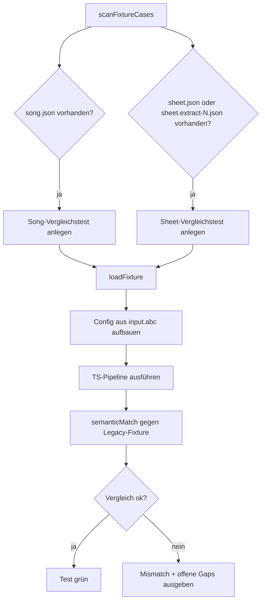
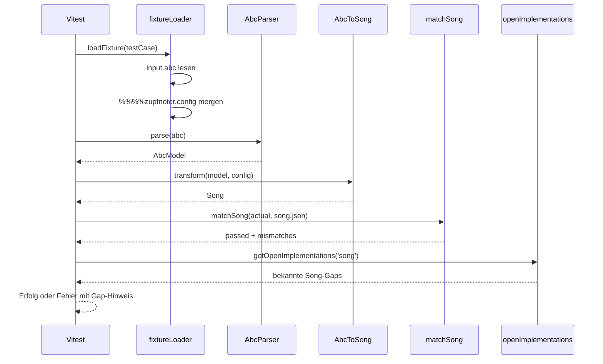
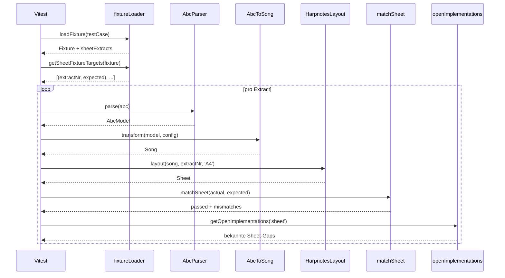
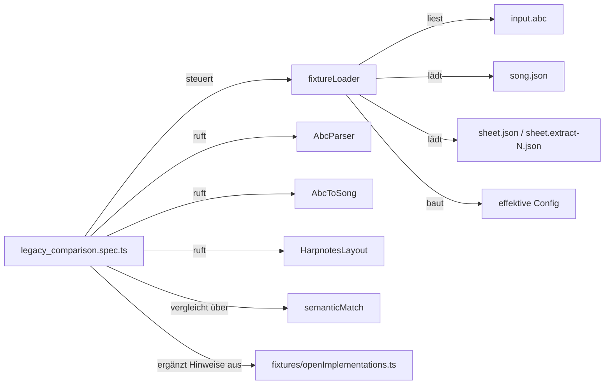

# Fixture-Driven Testing Strategy

## Übersicht

Die Test-Strategie basiert auf **Fixtures**, die den Zustand jeder Transformationsstufe
als JSON speichern. Tests vergleichen TypeScript-Ausgabe mit Legacy-Referenzen.

```
ABC-Datei + Config
    ↓
[Stufe 1: AbcParser]
    ↓
[Stufe 2: AbcToSong] → fixture: song.json
    ↓
[Stufe 3: HarpnotesLayout] → fixture: sheet.json oder sheet.extract-<nr>.json
    ↓
[Stufe 4: SvgEngine] → fixture: output.svg (geplant)
```

Alle Fixtures liegen unter `fixtures/` und sind **versioniert**.

---

## Fixture-Struktur

```
fixtures/
└── cases/
    ├── <test-case>/
    │   ├── input.abc          # ABC-Notation + optionaler %%%%zupfnoter.config Block
    │   ├── song.json          # Stufe 2: Song-Modell (Legacy Reference)
    │   ├── sheet.json         # Stufe 3: Sheet-Modell für Extract 0 (Legacy Reference, Fallback)
    │   ├── sheet.extract-0.json
    │   ├── sheet.extract-1.json
    │   ├── ...
    │   ├── output.svg         # Stufe 4: SVG-String (Legacy Reference, geplant)
    │   └── _ts_output/        # TypeScript-Ausgabe (generiert)
    │       ├── song.json
    │       ├── sheet.json
    │       └── output.svg
    └── ...
```

**Konvention:**
- Input: `fixtures/cases/<test-case>/input.abc`
- Legacy Reference: `fixtures/cases/<test-case>/<stufe>.json` (hand-gepflegt oder exportiert)
- TypeScript Output: `fixtures/cases/<test-case>/_ts_output/<stufe>.json` (generiert)
- Discovery: Tests scannen `fixtures/cases/*/input.abc`.
- Stage-Aktivierung: Song-Tests laufen für Testfälle mit `song.json`; Sheet-Tests für Testfälle mit `sheet.json` oder mindestens einer `sheet.extract-<nr>.json`.
- Config: inline im ABC via `%%%%zupfnoter.config`; fehlt der Block, gelten `initConf()`-Defaults.
- Keine separate `input.config.json`: Fixture-Tests verwenden genau dieselbe Config-Quelle wie die Pipeline.
- Legacy-ABC-Direktiven wie `%%%%hnc`, `%%%%hna` oder `%%%%hn.legend` sind davon getrennt und müssen bei Bedarf explizit in die TS-Config-Extraktion überführt werden.

---

## Test-Implementierung

### 1. Überblick über den Testablauf

Die Vergleichstests werden generisch aus `fixtures/cases/*/input.abc` erzeugt.
Sie enthalten keine fallweise handgeschriebenen Assertions. Stattdessen entscheidet
der Fixture-Bestand, welche Song- und Sheet-Vergleiche ausgeführt werden.



### 2. Ablauf Song-Vergleich



### 3. Ablauf Sheet-Vergleich

Für Sheet-Fixtures gibt es zwei Modi:
- `sheet.extract-<nr>.json`: explizite Legacy-Referenz pro Extrakt
- `sheet.json`: Fallback für Extrakt `0`



### 4. Verantwortung der Bausteine



---

## Fixture-Extraktion aus Legacy-System

Der Legacy-CLI besitzt einen expliziten Exportmodus. Er liest ABC-Dateien, führt die
produktive Legacy-Pipeline aus und schreibt pro Testfall `input.abc`, `song.json` und
für das Sheet entweder `sheet.extract-<nr>.json` oder als Fallback `sheet.json` in
`fixtures/cases/<test-case>/`.

```bash
npm run test:loadsample -- "~/Dropbox/RuthVeehNoten/78*.abc"
```

Der Wrapper expandiert den Glob lokal und ruft die Legacy-CLI pro Datei einzeln in
dieser Form auf:

```bash
node zupfnoter-cli.min.js --export-fixtures <input.abc> <target-dir>
```

Der Standardpfad zur Legacy-CLI ist im Wrapper relativ zum Repository hinterlegt.
Details und Overrides stehen in `fixtures/README.md`.

### Fixtures versionieren

Nach dem Export:

```bash
cd zupfnoter-ts
git add fixtures/*/
git commit -m "docs(fixtures): export legacy references for Phase 2-4 tests"
```

---

## Test-Ausführung

### 1. Alle Unit- und Legacy-Vergleichstests laufen

```bash
pnpm test
```

### 2. Nur den Gap-Report erzeugen

```bash
pnpm test:gaps
```

Wichtig:

- `pnpm test:gaps` liest **nicht** die Ergebnisse eines vorherigen `test:unit`-Laufs.
- Stattdessen führt es einen **eigenen** Report-Testlauf aus, der die aktuellen Fixture-Vergleiche selbst neu berechnet.
- Wenn man nur wissen will, **welche Fixture-Vergleichsfälle aktuell noch fehlschlagen**, reicht `pnpm test:gaps` in der Regel aus.
- Wenn man den **vollen normalen Fehlkontext** der eigentlichen Vergleichstests sehen will, braucht man `pnpm test:unit` oder die direkten `legacy_comparison.spec.ts`-Läufe.

Der Report enthält pro Stage jetzt konkrete Einträge mit `id`, `fixtures` und `prompt`:

```text
[gap-report:sheet]
Open implementations for this stage (N): ...
Entries:
- id: sheet.example-gap
  fixtures: fixture_a, fixture_b
  prompt: Investigate ...
```

### 3. Watch-Mode für Entwicklung

```bash
pnpm --filter @zupfnoter/core run test:unit -- --watch
```

### 4. Snapshot-Updates (nach Absicht-Änderungen)

```bash
pnpm --filter @zupfnoter/core run test:unit -- --update
```

### 5. Fixtures neu exportieren (nach Legacy-Änderung)

Siehe `npm run test:loadsample -- "<glob>"` und die ausführliche Beschreibung in `fixtures/README.md`.

---

## CI-Integration

```yaml
# .github/workflows/test.yml

- name: Run fixture tests
  run: pnpm test

- name: Check for snapshot changes
  run: |
    if [[ -n $(git status -s) ]]; then
      echo "❌ Snapshot changes detected. Run pnpm --filter @zupfnoter/core run test:unit -- --update"
      exit 1
    fi
```

---

## Fehlerbehandlung

## Offene Implementierungen (`fixtures/openImplementations.ts`)

Die Datei [openImplementations.ts](/Users/beweiche/beweiche_noTimeMachine/zupfnoter-ts/fixtures/openImplementations.ts:1) ist die zentrale Liste bekannter Paritätslücken zwischen Legacy und TypeScript.

Wichtig:

- Die Liste ist **manuell gepflegt**.
- Sie ist **keine automatische Fehlerdatenbank**.
- Sie enthält nur **bewusst identifizierte systematische Lücken**, nicht jede einzelne Testabweichung.

### Wie wird die Datei verwendet?

Die generischen Legacy-Vergleichstests lesen die Datei:

- `packages/core/src/testing/__tests__/song/legacy_comparison.spec.ts`
- `packages/core/src/testing/__tests__/sheet/legacy_comparison.spec.ts`

Wenn ein Vergleich fehlschlägt, wird die passende Gap-Liste (`song` oder `sheet`) an die Fehlermeldung angehängt. Dadurch sieht man im Testlauf sofort, welche bekannten offenen Punkte für diese Stufe bereits dokumentiert sind.

Zusätzlich gibt es:

```bash
pnpm test:gaps
```

Dieses Kommando führt keinen normalen Legacy-Testlauf aus, sondern berechnet selbst
einen Gap-Report aus den Vergleichshelfern. Es erzeugt:

- eine kompakte Zusammenfassung der aktuell eingetragenen Gap-IDs
- eine Liste direkt nutzbarer Arbeits-Prompts für neue unklassifizierte Fehler
- die Datei `fixtures/reports/open_implementations_template.ts`

Die Template-Datei wird bei jedem Lauf neu geschrieben:

- **leer bzw. leeres Array**: es wurden keine neuen unklassifizierten Fehler gefunden
- **gefüllt**: es gibt fehlschlagende Legacy-Vergleiche, die noch nicht durch `fixtures/openImplementations.ts` abgedeckt sind

### Wie kommt ein neuer Eintrag hinein?

Nicht automatisch. Ein neuer Eintrag wird manuell ergänzt, wenn:

1. ein Testfehler analysiert wurde,
2. die Ursache eine echte Implementierungslücke ist,
3. die Lücke nicht bloß ein fehlerhaft exportiertes Fixture ist,
4. und sie als wiederverwendbare Arbeitsposition sichtbar bleiben soll.

Praktisches Vorgehen:

1. `fixtures/openImplementations.ts` öffnen
2. im Array `OPEN_IMPLEMENTATIONS` einen neuen Eintrag ergänzen
3. passende Stufe setzen:
   - `song`
   - `sheet`
   - nur in Ausnahmefällen `both`
4. eine stabile, kurze `id` vergeben, z. B.:
   - `sheet.barnumbers-config`
   - `song.bar-bound-variant-annotations`
5. `scope` so wählen, dass der betroffene Konfig-Pfad oder Fachbereich direkt erkennbar ist
6. in `summary` knapp beschreiben, **was** fehlt und **woran** man die Abweichung erkennt
7. in `refs` die relevanten Quelldateien angeben, damit die Abarbeitung direkt an der richtigen Stelle startet
8. optional einen direkt nutzbaren `prompt` ergänzen, damit die Lücke sofort als Arbeitsauftrag verwendet werden kann
9. optional `notes` für kuratierte Zusatzhinweise verwenden

Beispiel für einen sinnvollen Eintrag:

- `id`: `sheet.example-gap`
- `stage`: `sheet`
- `scope`: `extract.example`
- `summary`: kurze fachliche Beschreibung der fehlenden Legacy-Parität
- `refs`: z. B. `packages/core/src/HarpnotesLayout.ts`
- `prompt`: direkt nutzbarer Arbeitsauftrag inklusive Reproduktion und Entfernung des Eintrags nach Abschluss

Regeln für gute Einträge:

- `id` bleibt stabil und wird nachträglich nicht dauernd umbenannt
- ein Eintrag beschreibt **eine konkrete Lücke**, nicht einen unscharfen Sammelrest
- wenn zwei Fehler dieselbe Ursache haben, lieber **ein** sauberer Eintrag statt vieler Duplikate
- wenn eine Abweichung nur ein einzelnes kaputtes Fixture betrifft, **kein** neuer Gap-Eintrag, sondern Exporter/Fixture prüfen

### Wie nutze ich `open_implementations_template.ts`?

Die Datei ist ein **Vorschlagsbuffer**, kein aktiver Teil der Vergleichstests.

Typischer Ablauf:

1. `pnpm test:unit`
2. `pnpm test:gaps`
3. `fixtures/reports/open_implementations_template.ts` ansehen
4. für jeden sinnvollen Kandidaten entscheiden:
   - zu bestehendem Eintrag in `fixtures/openImplementations.ts` zuordnen
   - oder als neuen Eintrag manuell übernehmen
   - oder verwerfen, wenn die Ursache ein Exporter-/Fixture-Problem ist

Jeder Template-Eintrag enthält:

- eine vorgeschlagene `id`
- `stage`, `scope`, `refs`
- eine kurze `summary`
- einen direkt nutzbaren `prompt`
- die aktuelle `mismatchSummary`

Die kuratierte Hauptdatei `fixtures/openImplementations.ts` verwendet jetzt dasselbe Grundschema, nur ohne automatisch erzeugte `mismatchSummary`. Dadurch lassen sich sinnvolle Template-Einträge fast 1:1 übernehmen und anschließend manuell verdichten.

Der `prompt` ist absichtlich so formuliert, dass man ihn direkt als Arbeitsauftrag für die Implementierung verwenden kann.

### Wie kommt ein Eintrag wieder heraus?

Ebenfalls manuell:

1. Implementierung ergänzen
2. gezielte Tests ausführen
3. relevante Legacy-Vergleichstests erneut prüfen
4. Eintrag aus `fixtures/openImplementations.ts` entfernen, wenn die Lücke tatsächlich geschlossen ist

### Wie prüfe ich, ob die Liste noch aktuell ist?

Empfohlener Ablauf:

1. `pnpm test:unit` ausführen
2. `pnpm test:gaps` ausführen
3. vergleichen:
   - Gibt es fehlschlagende Tests ohne passenden Gap-Eintrag?
   - Gibt es Gap-Einträge, deren Verhalten inzwischen implementiert und verifiziert ist?

Die Datei ist aktuell genau dann in gutem Zustand, wenn sie die **bekannten systematischen Restlücken** beschreibt, aber keine bereits erledigten Punkte mehr enthält.

### Wie arbeite ich die Liste gezielt ab?

Ein praktikabler Ablauf ist:

1. `pnpm test:unit`
2. `pnpm test:gaps`
3. eine Gap-ID auswählen, z. B. `sheet.barnumbers-config`
4. die referenzierten Stellen im Code öffnen
5. mit einem kleinen Fixture oder `3015_reference_sheet` reproduzieren
6. Implementierung ergänzen
7. gezielte Tests laufen lassen
8. Legacy-Vergleich erneut prüfen
9. erledigten Eintrag aus `fixtures/openImplementations.ts` entfernen

Damit bleibt die Datei eine explizite, steuerbare Arbeitsliste für die noch fehlende Legacy-Parität.

### Fall 1: Legacy-Referenz ist "falsch"

Im aktuellen Projektmodell gehen wir davon aus:

- Die Legacy-Pipeline ist die fachliche Referenz.
- Wenn ein Fixture falsch ist, liegt der Fehler zunächst im **Fixture-Exporter**.

Deshalb gilt:

1. **Keine parallelen `*.corrected.json`-Referenzen einführen.**
2. Den Exporter im Legacy-System prüfen und korrigieren.
3. Das betroffene Fixture **neu exportieren** und die bestehende Referenzdatei ersetzen:
   - `song.json`
   - `sheet.json`
   - oder `sheet.extract-<nr>.json`
4. Die generischen Vergleichstests bleiben unverändert.

Begründung:

- Die aktuellen Vergleichstests werden generisch aus `fixtures/cases/*` erzeugt.
- Es gibt bewusst **eine kanonische Referenz pro Fall**.
- Sonderpfade wie `sheet.corrected.json` würden die Testlogik unnötig komplizieren und mehrere Wahrheiten einführen.

### Fall 2: TypeScript-Output unterscheidet sich unbeabsichtigt

```bash
pnpm --filter @zupfnoter/core exec vitest run src/testing/__tests__/song/legacy_comparison.spec.ts --reporter=verbose
pnpm --filter @zupfnoter/core exec vitest run src/testing/__tests__/sheet/legacy_comparison.spec.ts --reporter=verbose
```

---

## Best Practices

1. **Kleine, fokussierte Testfälle:** Ein ABC pro Funktion (1–2 Maßnahmen)
2. **Aussagekräftige Namen:** `twostaff`, `synchlines`, `variations` statt `test1`, `test2`
3. **Config inline in ABC:** Nutze `%%%%zupfnoter.config`-Block statt separater JSON
4. **Fixtures versionieren:** Kein `.gitignore` für `fixtures/`
5. **Nur Legacy-Referenzen committieren:** `_ts_output/` wird bei jedem Run regeneriert

---

## Roadmap

- [x] Phase 2: Song-Fixtures bootstrap + Tests aktivieren
- [x] Phase 3: Sheet-Fixtures bootstrap + Tests aktivieren  
- [ ] Phase 4: SVG-Fixtures + Snapshot-Tests
- [ ] Phase 4: PDF-Fixtures (nur "valides PDF", kein Byte-Vergleich) 
