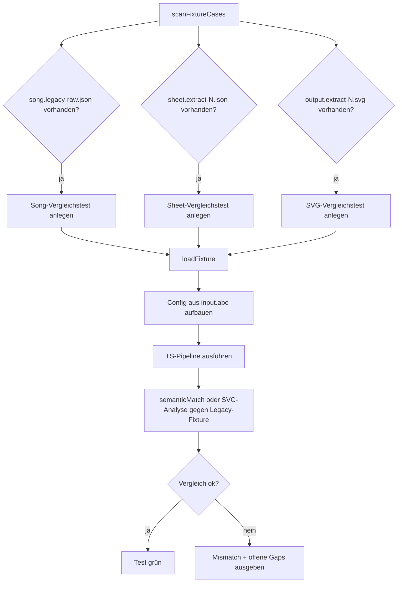
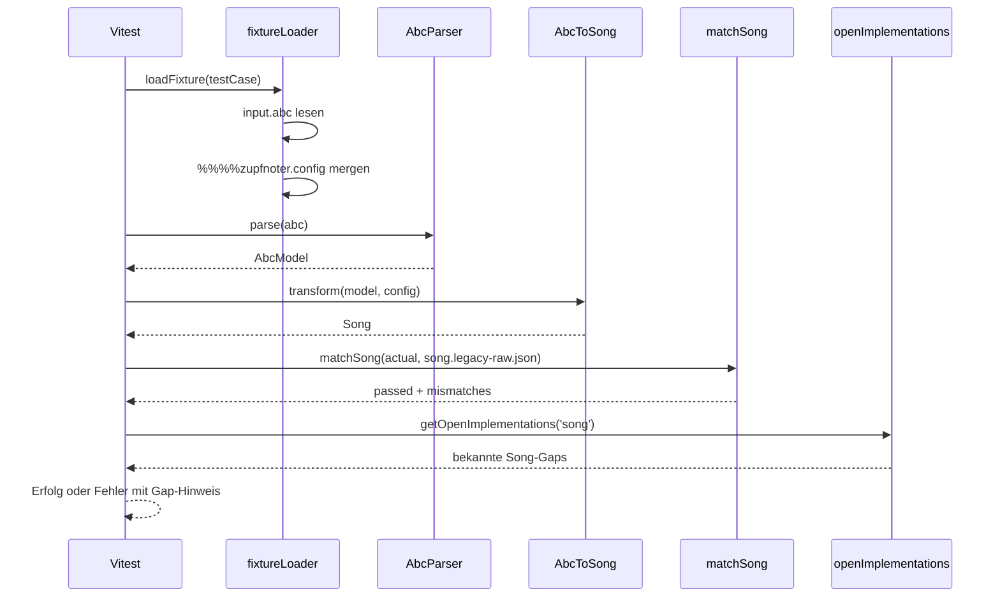
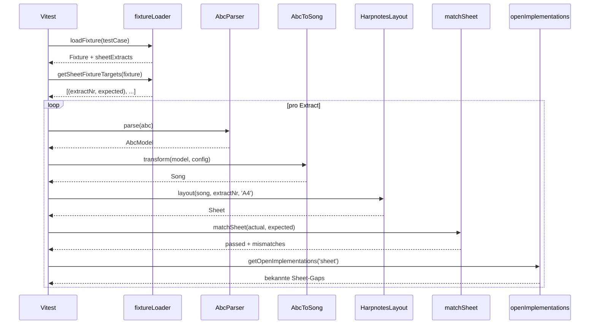
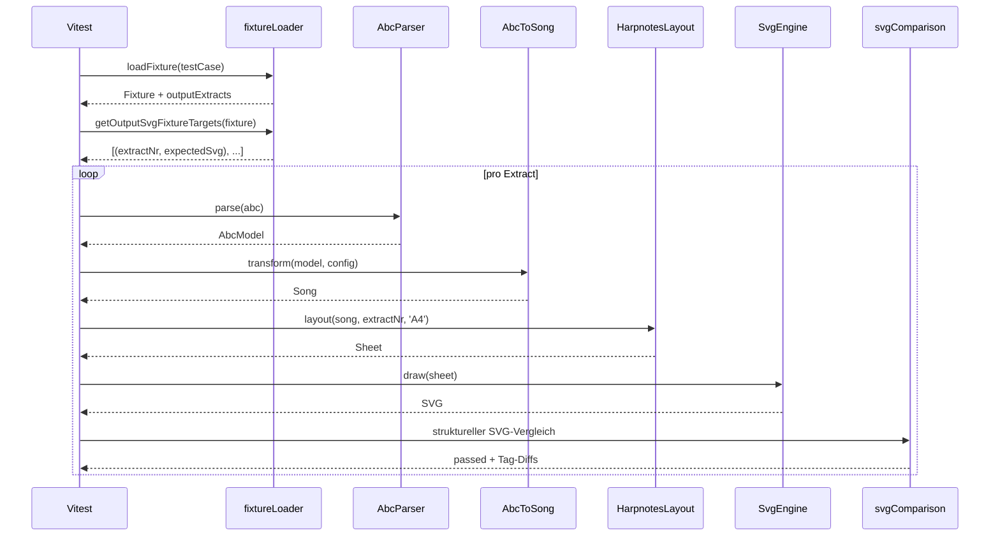
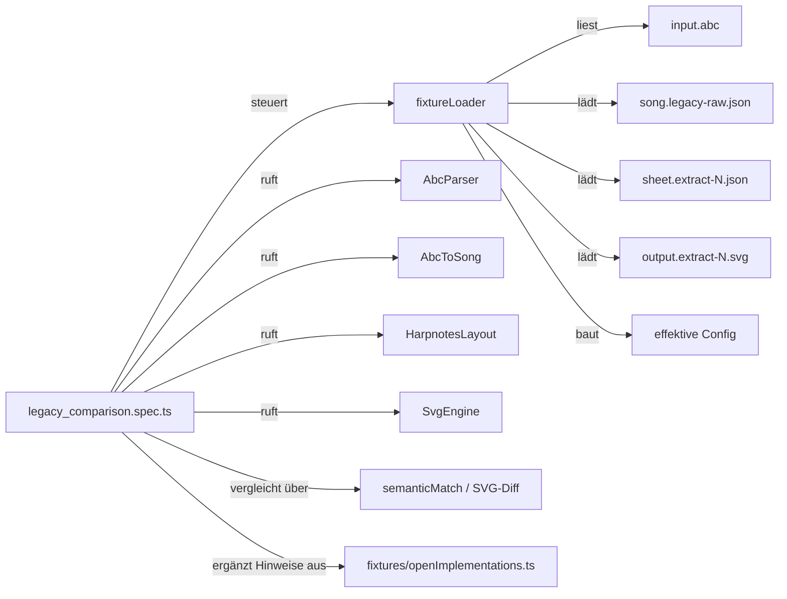

# 	Fixture-Driven Testing Strategy

Diese Datei beschreibt das **Konzept und den Ablauf** des fixture-driven Testings:
- Vergleichslogik
- Testfluss
- Gap-Workflow
- Pflege von `fixtures/openImplementations.ts`

Für die **praktische Nutzung** der Fixtures, Export-Kommandos und die konkreten
Arbeitsdateien unter `fixtures/` siehe
[fixtures/README.md](/Users/beweiche/beweiche_noTimeMachine/zupfnoter-ts/fixtures/README.md:1).

## Übersicht

Die Test-Strategie basiert auf **Fixtures**, die den Zustand jeder Transformationsstufe
als JSON speichern. Tests vergleichen TypeScript-Ausgabe mit Legacy-Referenzen.

```
ABC-Datei + Config
    ↓
[Stufe 1: AbcParser]
    ↓
[Stufe 2: AbcToSong] → fixture: song.legacy-raw.json
    ↓
[Stufe 3: HarpnotesLayout] → fixture: sheet.extract-<nr>.json
    ↓
[Stufe 4: SvgEngine] → fixture: output.extract-<nr>.svg
```

Alle Fixtures liegen unter `fixtures/cases/`: `public/` ist versioniert,
`protected/` bleibt als lokaler, per `.gitignore` ausgeschlossener Bereich auf dem
Entwicklungsrechner.

---

## Fixture-Struktur

```
fixtures/
└── cases/
    ├── public/
    │   └── <test-case>/
    │   ├── input.abc          # ABC-Notation + optionaler %%%%zupfnoter.config Block
    │   ├── song.legacy-raw.json # Stufe 2: Song-Modell (kanonische Song-Referenz)
    │   ├── sheet.extract-0.json
    │   ├── sheet.extract-1.json
    │   ├── ...
    │   ├── output.extract-0.svg
    │   ├── output.extract-1.svg
    │   ├── ...
    │   └── _ts_output/        # TypeScript-Ausgabe (generiert)
    │       ├── song.json
    │       ├── sheet.extract-0.json
    │       └── output.extract-0.svg
    └── protected/
        └── <test-case>/  # gleiche Struktur, nicht versioniert
```

**Konvention:**
- Input: `fixtures/cases/<bereich>/<test-case>/input.abc`
- Legacy Reference: `song.legacy-raw.json`, `sheet.extract-<nr>.json`, `output.extract-<nr>.svg`
- TypeScript Output: `_ts_output/song.json`, `_ts_output/sheet.extract-<nr>.json`, `_ts_output/output.extract-<nr>.svg`
- Discovery: Tests scannen `fixtures/cases/public/*/input.abc` und lokal zusätzlich `fixtures/cases/protected/*/input.abc`.
- Stage-Aktivierung: Song-Tests laufen für Testfälle mit `song.legacy-raw.json`; Sheet-Tests für Testfälle mit mindestens einer `sheet.extract-<nr>.json`; SVG-Tests für Testfälle mit mindestens einer `output.extract-<nr>.svg`.
- Config: inline im ABC via `%%%%zupfnoter.config`; fehlt der Block, gelten `initConf()`-Defaults.
- Keine separate `input.config.json`: Fixture-Tests verwenden genau dieselbe Config-Quelle wie die Pipeline.
- Legacy-ABC-Direktiven wie `%%%%hnc`, `%%%%hna` oder `%%%%hn.legend` sind davon getrennt und müssen bei Bedarf explizit in die TS-Config-Extraktion überführt werden.

---

## Test-Implementierung

### 1. Überblick über den Testablauf

Die Vergleichstests werden generisch aus den ABC-Dateien in beiden Fixture-Wurzeln erzeugt.
Sie enthalten keine fallweise handgeschriebenen Assertions. Stattdessen entscheidet
der Fixture-Bestand, welche Song-, Sheet- und SVG-Vergleiche ausgeführt werden.


```mermaid
flowchart TD
  A[scanFixtureCases] --> B{song.legacy-raw.json vorhanden?}
  A --> C{sheet.extract-N.json vorhanden?}
  A --> D{output.extract-N.svg vorhanden?}
  B -->|ja| E[Song-Vergleichstest anlegen]
  C -->|ja| F[Sheet-Vergleichstest anlegen]
  D -->|ja| G[SVG-Vergleichstest anlegen]
  E --> H[loadFixture]
  F --> H
  G --> H
  H --> I[Config aus input.abc aufbauen]
  I --> J[TS-Pipeline ausführen]
  J --> K[semanticMatch oder SVG-Analyse gegen Legacy-Fixture]
  K --> L{Vergleich ok?}
  L -->|ja| M[Test grün]
  L -->|nein| N[Mismatch + offene Gaps ausgeben]
```

### 2. Ablauf Song-Vergleich


```mermaid
sequenceDiagram
  participant Vitest
  participant Loader as fixtureLoader
  participant Parser as AbcParser
  participant Song as AbcToSong
  participant Match as matchSong
  participant Gaps as openImplementations

  Vitest->>Loader: loadFixture(testCase)
  Loader->>Loader: input.abc lesen
  Loader->>Loader: %%%%zupfnoter.config mergen
  Vitest->>Parser: parse(abc)
  Parser-->>Vitest: AbcModel
  Vitest->>Song: transform(model, config)
  Song-->>Vitest: Song
  Vitest->>Match: matchSong(actual, song.legacy-raw.json)
  Match-->>Vitest: passed + mismatches
  Vitest->>Gaps: getOpenImplementations('song')
  Gaps-->>Vitest: bekannte Song-Gaps
  Vitest-->>Vitest: Erfolg oder Fehler mit Gap-Hinweis
```

### 3. Ablauf Sheet-Vergleich

Für Sheet-Fixtures ist `sheet.extract-<nr>.json` die explizite Legacy-Referenz pro Extrakt.


```mermaid
sequenceDiagram
  participant Vitest
  participant Loader as fixtureLoader
  participant Parser as AbcParser
  participant Song as AbcToSong
  participant Layout as HarpnotesLayout
  participant Match as matchSheet
  participant Gaps as openImplementations

  Vitest->>Loader: loadFixture(testCase)
  Loader-->>Vitest: Fixture + sheetExtracts
  Vitest->>Loader: getSheetFixtureTargets(fixture)
  Loader-->>Vitest: [(extractNr, expected), ...]
  loop pro Extract
    Vitest->>Parser: parse(abc)
    Parser-->>Vitest: AbcModel
    Vitest->>Song: transform(model, config)
    Song-->>Vitest: Song
    Vitest->>Layout: layout(song, extractNr, 'A4')
    Layout-->>Vitest: Sheet
    Vitest->>Match: matchSheet(actual, expected)
    Match-->>Vitest: passed + mismatches
    Vitest->>Gaps: getOpenImplementations('sheet')
    Gaps-->>Vitest: bekannte Sheet-Gaps
  end
```

### 4. Ablauf SVG-Vergleich

Für SVG-Fixtures ist `output.extract-<nr>.svg` die explizite Legacy-Referenz pro Extrakt.


```mermaid
sequenceDiagram
  participant Vitest
  participant Loader as fixtureLoader
  participant Parser as AbcParser
  participant Song as AbcToSong
  participant Layout as HarpnotesLayout
  participant Svg as SvgEngine
  participant Match as svgComparison

  Vitest->>Loader: loadFixture(testCase)
  Loader-->>Vitest: Fixture + outputExtracts
  Vitest->>Loader: getOutputSvgFixtureTargets(fixture)
  Loader-->>Vitest: [(extractNr, expectedSvg), ...]
  loop pro Extract
    Vitest->>Parser: parse(abc)
    Parser-->>Vitest: AbcModel
    Vitest->>Song: transform(model, config)
    Song-->>Vitest: Song
    Vitest->>Layout: layout(song, extractNr, 'A4')
    Layout-->>Vitest: Sheet
    Vitest->>Svg: draw(sheet)
    Svg-->>Vitest: SVG
    Vitest->>Match: struktureller SVG-Vergleich
    Match-->>Vitest: passed + Tag-Diffs
  end
```

### 5. Verantwortung der Bausteine


```mermaid
flowchart LR
  A[fixtureLoader] -->|liest| B[input.abc]
  A -->|lädt| C[song.legacy-raw.json]
  A -->|lädt| D[sheet.extract-N.json]
  A -->|lädt| E[output.extract-N.svg]
  A -->|baut| F[effektive Config]
  G[legacy_comparison.spec.ts] -->|steuert| A
  G -->|ruft| H[AbcParser]
  G -->|ruft| I[AbcToSong]
  G -->|ruft| J[HarpnotesLayout]
  G -->|ruft| K[SvgEngine]
  G -->|vergleicht über| L[semanticMatch / SVG-Diff]
  G -->|ergänzt Hinweise aus| M[fixtures/openImplementations.ts]
```

---

## Fixture-Extraktion aus Legacy-System

Der Legacy-CLI besitzt einen expliziten Exportmodus. Er liest ABC-Dateien, führt die
produktive Legacy-Pipeline aus und schreibt pro Testfall `input.abc`,
`song.legacy-raw.json`, `sheet.extract-<nr>.json` und
`output.extract-<nr>.svg` in `fixtures/cases/<bereich>/<test-case>/`.

Der Export ist ein fachlicher Vertrag: Alles, was eine nachfolgende Stufe liest
oder für Editor-, Kontextmenü- oder Render-Verhalten nutzt, muss im Export
enthalten sein. Wenn ein solches Feld fehlt, ist nicht die Parität „leicht
anders“, sondern der Export unvollständig.

Für die Praxis hilft diese Einteilung:
- **exportpflichtig**: muss vollständig im Fixture stehen
- **teilweise exportierbar**: fachliche Hülle ja, interne Unterfelder nein
- **UI-transient**: gehört nicht in den Fixture-Contract

`draginfo` fällt meist in die zweite Kategorie: relevant ist die Struktur samt
Handler- und Positionsdaten, nicht aber UI-interne Details wie `callback`.

```bash
npm run test:loadsample
```

Wenn ein Glob übergeben wird, expandiert der Wrapper ihn lokal und ruft die
Legacy-CLI pro Datei einzeln in dieser Form auf:

```bash
node zupfnoter-cli.min.js --export-fixtures <input.abc> <target-dir>
```

Zusätzlich speichert der Wrapper für jeden in `produce` konfigurierten Auszug
die Legacy-A3-Ausgabe als `output.extract-<nr>_a3.pdf` beim jeweiligen Fixture.
Der PDF-Vergleich verwendet diese Datei direkt; er erzeugt die Legacy-Referenz
nicht erneut.

Ohne Glob verwendet der Wrapper standardmäßig die Fälle aus `public/` und dem lokalen Bereich `protected/`.
Der Standardpfad zur Legacy-CLI ist im Wrapper relativ zum Repository hinterlegt.
Details und Overrides stehen in `fixtures/README.md`.

### Fixtures versionieren

Nach dem Export:

```bash
cd zupfnoter-ts
git add fixtures/cases/public/
git commit -m "docs(fixtures): export legacy references for Phase 2-4 tests"
```

---

## Test-Ausführung

### 1. Alle Unit- und Legacy-Vergleichstests laufen

```bash
pnpm test
```

`pnpm test` ist der normale Entwicklungsmodus. Der Lauf berechnet die TS-Ausgabe
frisch, führt die Vergleichstests aus und schreibt zusätzlich TS-Dumps nach
`fixtures/cases/<bereich>/<name>/_ts_output/`.

Für gezielte Dump-Läufe gibt es zusätzlich:

```bash
pnpm test:dump:song
pnpm test:dump:sheet
pnpm test:dump:svg
pnpm test:dump:pdf
```

Der PDF-Dump schreibt pro konfiguriertem `produce`-Auszug ein A3-PDF als
`_ts_output/output.extract-<nr>_a3.pdf`. Diese Dateien dienen der
Sichtprüfung und bleiben wie alle `_ts_output`-Artefakte unversioniert.

### 2. Nur den Gap-Report erzeugen

```bash
pnpm test:gaps
```

Wichtig:

- `pnpm test:gaps` liest **nicht** die Ergebnisse eines vorherigen `test:unit`-Laufs.
- `pnpm test:gaps` liest **nicht** die Ergebnisse eines vorherigen `pnpm test`-Laufs.
- Stattdessen führt es einen **eigenen** Report-Testlauf aus, der die aktuellen Fixture-Vergleiche selbst neu berechnet.
- Wenn man nur wissen will, **welche Fixture-Vergleichsfälle aktuell noch fehlschlagen**, reicht `pnpm test:gaps` in der Regel aus.
- Wenn man den **vollen normalen Fehlkontext** der eigentlichen Vergleichstests sehen will, braucht man `pnpm test` oder die direkten `legacy_comparison.spec.ts`-Läufe.

### 3. Voller Lauf inklusive Reports

```bash
pnpm test:full
```

`pnpm test:full` führt zuerst `pnpm test` und danach `pnpm test:gaps` aus.

Der Report enthält pro Stage jetzt konkrete Einträge mit `id`, `fixtures` und `prompt`:

```text
[gap-report:sheet]
Open implementations for this stage (N): ...
Entries:
- id: sheet.example-gap
  fixtures: fixture_a, fixture_b
  prompt: Investigate ...
```

### 3. Watch-Mode für Entwicklung

```bash
pnpm --filter @zupfnoter/core run test:unit -- --watch
```

### 4. Snapshot-Updates (nach Absicht-Änderungen)

```bash
pnpm --filter @zupfnoter/core run test:unit -- --update
```

### 5. Fixtures neu exportieren (nach Legacy-Änderung)

Siehe `npm run test:loadsample` und die ausführliche Beschreibung in `fixtures/README.md`.

---

## CI-Integration

```yaml
# .github/workflows/test.yml

- name: Run fixture tests
  run: pnpm test

- name: Check for snapshot changes
  run: |
    if [[ -n $(git status -s) ]]; then
      echo "❌ Snapshot changes detected. Run pnpm --filter @zupfnoter/core run test:unit -- --update"
      exit 1
    fi
```

---

## Fehlerbehandlung

## Offene Implementierungen (`fixtures/openImplementations.ts`)

Die Datei [openImplementations.ts](/Users/beweiche/beweiche_noTimeMachine/zupfnoter-ts/fixtures/openImplementations.ts:1) ist die zentrale Liste bekannter Paritätslücken zwischen Legacy und TypeScript.

Wichtig:

- Die Liste ist **manuell gepflegt**.
- Sie ist **keine automatische Fehlerdatenbank**.
- Sie enthält nur **bewusst identifizierte systematische Lücken**, nicht jede einzelne Testabweichung.

### Wie wird die Datei verwendet?

Die generischen Legacy-Vergleichstests lesen die Datei:

- `packages/core/src/testing/__tests__/song/legacy_comparison.spec.ts`
- `packages/core/src/testing/__tests__/sheet/legacy_comparison.spec.ts`

Wenn ein Vergleich fehlschlägt, wird die passende Gap-Liste (`song` oder `sheet`) an die Fehlermeldung angehängt. Dadurch sieht man im Testlauf sofort, welche bekannten offenen Punkte für diese Stufe bereits dokumentiert sind.

Zusätzlich gibt es:

```bash
pnpm test:gaps
```

Dieses Kommando führt keinen normalen Legacy-Testlauf aus, sondern berechnet selbst
einen Gap-Report **pro Pipeline-Stufe** aus den Vergleichshelfern. Es erzeugt drei
unabhängige Berichte:

- `fixtures/reports/song-gap-report.md` — Stufe 2 (Song), registry-basiert
- `fixtures/reports/sheet-gap-report.md` — Stufe 3 (Sheet), registry-basiert
- `fixtures/reports/svg-gap-report.md` — Stufe 4 (SVG), strukturell (Tag-Count-Diff)

Die ersten beiden Reports basieren auf `fixtures/openImplementations.ts` und sind
„leer", wenn keine bekannten oder neuen Failures vorliegen. Der SVG-Report ist
rein strukturell und vergleicht für jedes Fixture die Tag-Typ-Verteilung von
Legacy- gegen TS-Ausgabe.

Wichtig: Die Song-/Sheet-Reports verwenden dieselbe Paritätsregel wie die
Legacy-Tests. Alles, was in einer späteren Stufe gelesen oder für Editor-,
Interaktions- oder Render-Verhalten ausgewertet wird, gilt als fachlich
relevant und gehört in die Prüfung. Für Sheet gehören dazu insbesondere
`confKey`, `confKey.*`, `lineWidth`, `more_conf_keys`, `draginfo`, `path`
und `znId`, wenn sie im Legacy-Export vorhanden sind.

Für den Export gilt dieselbe Regel umgekehrt: Alles, was spätere Stufen lesen,
muss im Fixture enthalten sein. Dabei gibt es drei Kategorien:
- **exportpflichtig**: muss vollständig im Fixture stehen
- **teilweise exportierbar**: fachliche Hülle ja, interne Unterfelder nein
- **UI-transient**: gehört nicht in den Fixture-Contract

`draginfo` ist dafür das typische Beispiel für teilweise exportierbare
Metadaten: Struktur und Handler gehören dazu, interne Details wie `callback`
oder `tuplet_options` werden bewusst entfernt.

### Feldmatrix für Sheet-Metadaten

Diese Tabelle zeigt, welche nachfolgende Stufe welches Feld tatsächlich liest:

| Feld | SvgEngine | Controller/UI | PdfEngine | Kategorie |
|------|-----------|---------------|-----------|-----------|
| `lineWidth` | ja, für Stroke-Dicke | nein | ja, für Zeichnung | exportpflichtig |
| `confKey` | ja, für Editierbarkeit / SVG-Interaktion | ja, für Edit-Menü und Status | nein | exportpflichtig |
| `confKey.*` | ja, als Wert von `confKey` mit Edit-Marker | ja, gleiche Edit-Relevanz | nein | exportpflichtig |
| `more_conf_keys` | ja, für zusätzliche Edit-Optionen | ja, für Kontextmenü-Einträge | nein | exportpflichtig |
| `draginfo` | ja, für Drag-Handler | indirekt, über den gesetzten Handler | nein | teilweise exportierbar |
| `path` | ja, für SVG-Pfad-Ausgabe | nein | ja, für PDF-Pfad-Ausgabe | exportpflichtig |
| `znId` | nein | nein | nein | exportpflichtig, weil fachliche Identität für spätere Stufen |

`draginfo` bleibt dabei teilweise exportierbar: Die Struktur ist fachlich
relevant, aber interne Unterfelder wie `callback` oder `tuplet_options`
gehören nicht in den Fixture-Contract.

Die Report-Dateien werden bei jedem Lauf neu geschrieben.

### Wie kommt ein neuer Eintrag hinein?

Nicht automatisch. Ein neuer Eintrag wird manuell ergänzt, wenn:

1. ein Testfehler analysiert wurde,
2. die Ursache eine echte Implementierungslücke ist,
3. die Lücke nicht bloß ein fehlerhaft exportiertes Fixture ist,
4. und sie als wiederverwendbare Arbeitsposition sichtbar bleiben soll.

Praktisches Vorgehen:

1. `fixtures/openImplementations.ts` öffnen
2. im Array `OPEN_IMPLEMENTATIONS` einen neuen Eintrag ergänzen
3. passende Stufe setzen:
   - `song`
   - `sheet`
   - nur in Ausnahmefällen `both`
4. eine stabile, kurze `id` vergeben, z. B.:
   - `sheet.barnumbers-config`
   - `song.bar-bound-variant-annotations`
5. `scope` so wählen, dass der betroffene Konfig-Pfad oder Fachbereich direkt erkennbar ist
6. in `summary` knapp beschreiben, **was** fehlt und **woran** man die Abweichung erkennt
7. in `refs` die relevanten Quelldateien angeben, damit die Abarbeitung direkt an der richtigen Stelle startet
8. optional einen direkt nutzbaren `prompt` ergänzen, damit die Lücke sofort als Arbeitsauftrag verwendet werden kann
9. optional `notes` für kuratierte Zusatzhinweise verwenden

Beispiel für einen sinnvollen Eintrag:

- `id`: `sheet.example-gap`
- `stage`: `sheet`
- `scope`: `extract.example`
- `summary`: kurze fachliche Beschreibung der fehlenden Legacy-Parität
- `refs`: z. B. `packages/core/src/HarpnotesLayout.ts`
- `prompt`: direkt nutzbarer Arbeitsauftrag inklusive Reproduktion und Entfernung des Eintrags nach Abschluss

Regeln für gute Einträge:

- `id` bleibt stabil und wird nachträglich nicht dauernd umbenannt
- ein Eintrag beschreibt **eine konkrete Lücke**, nicht einen unscharfen Sammelrest
- wenn zwei Fehler dieselbe Ursache haben, lieber **ein** sauberer Eintrag statt vieler Duplikate
- wenn eine Abweichung nur ein einzelnes kaputtes Fixture betrifft, **kein** neuer Gap-Eintrag, sondern Exporter/Fixture prüfen

### Wie nutze ich die Gap-Reports?

Die generierten Markdown-Dateien sind die lesbaren Arbeitsansichten des aktuellen
Zustands — pro Pipeline-Stufe eine Datei:

- `fixtures/reports/song-gap-report.md`
- `fixtures/reports/sheet-gap-report.md`
- `fixtures/reports/svg-gap-report.md`

Typischer Ablauf:

1. `pnpm test:gaps`
2. den jeweiligen Stufen-Report öffnen
3. die offenen Punkte Abschnitt für Abschnitt abarbeiten
4. erledigte Song-/Sheet-Einträge aus `fixtures/openImplementations.ts` entfernen
5. `pnpm test:gaps` erneut laufen lassen

Die Dateien sind bewusst generiert:

- man kann sie temporär abhaken oder lesen wie eine Checkliste
- beim nächsten Lauf werden sie vollständig neu erzeugt
- falsch erledigte Punkte tauchen dadurch automatisch wieder auf

Der SVG-Report enthält zusätzlich pro Fixture eine Tag-Typ-Diff-Tabelle und die
ersten fünf positionalen Tag-Abweichungen, damit strukturelle Lücken im SVG-Engine
direkt sichtbar sind.

### Wie kommt ein Eintrag wieder heraus?

Ebenfalls manuell:

1. Implementierung ergänzen
2. gezielte Tests ausführen
3. relevante Legacy-Vergleichstests erneut prüfen
4. Eintrag aus `fixtures/openImplementations.ts` entfernen, wenn die Lücke tatsächlich geschlossen ist

### Wie prüfe ich, ob die Liste noch aktuell ist?

Empfohlener Ablauf:

1. `pnpm test` ausführen
2. `pnpm test:gaps` ausführen
3. vergleichen:
   - Gibt es fehlschlagende Tests ohne passenden Gap-Eintrag?
   - Gibt es Gap-Einträge, deren Verhalten inzwischen implementiert und verifiziert ist?

Die Datei ist aktuell genau dann in gutem Zustand, wenn sie die **bekannten systematischen Restlücken** beschreibt, aber keine bereits erledigten Punkte mehr enthält.

### Wie arbeite ich die Liste gezielt ab?

Ein praktikabler Ablauf ist:

1. `pnpm test`
2. `pnpm test:gaps`
3. eine Gap-ID auswählen, z. B. `sheet.barnumbers-config`
4. die referenzierten Stellen im Code öffnen
5. mit einem kleinen Fixture oder `3015_reference_sheet` reproduzieren
6. Implementierung ergänzen
7. gezielte Tests laufen lassen
8. Legacy-Vergleich erneut prüfen
9. erledigten Eintrag aus `fixtures/openImplementations.ts` entfernen

Damit bleibt die Datei eine explizite, steuerbare Arbeitsliste für die noch fehlende Legacy-Parität.

### Fall 1: Legacy-Referenz ist "falsch"

Im aktuellen Projektmodell gehen wir davon aus:

- Die Legacy-Pipeline ist die fachliche Referenz.
- Wenn ein Fixture falsch ist, liegt der Fehler zunächst im **Fixture-Exporter**.

Deshalb gilt:

1. **Keine parallelen `*.corrected.json`-Referenzen einführen.**
2. Den Exporter im Legacy-System prüfen und korrigieren.
3. Das betroffene Fixture **neu exportieren** und die bestehende Referenzdatei ersetzen:
   - `song.legacy-raw.json`
   - `sheet.extract-<nr>.json`
   - `output.extract-<nr>.svg`
4. Die generischen Vergleichstests bleiben unverändert.

Begründung:

- Die aktuellen Vergleichstests werden generisch aus den Fällen unter `fixtures/cases/public/` und lokal zusätzlich `fixtures/cases/protected/` erzeugt.
- Es gibt bewusst **eine kanonische Referenz pro Fall**.
- Sonderpfade wie `sheet.corrected.json` würden die Testlogik unnötig komplizieren und mehrere Wahrheiten einführen.

### Fall 2: TypeScript-Output unterscheidet sich unbeabsichtigt

```bash
pnpm --filter @zupfnoter/core exec vitest run src/testing/__tests__/song/legacy_comparison.spec.ts --reporter=verbose
pnpm --filter @zupfnoter/core exec vitest run src/testing/__tests__/sheet/legacy_comparison.spec.ts --reporter=verbose
```

---

## Best Practices

1. **Kleine, fokussierte Testfälle:** Ein ABC pro Funktion (1–2 Maßnahmen)
2. **Aussagekräftige Namen:** `twostaff`, `synchlines`, `variations` statt `test1`, `test2`
3. **Config inline in ABC:** Nutze `%%%%zupfnoter.config`-Block statt separater JSON
4. **Fixtures versionieren:** Kein `.gitignore` für `fixtures/`
5. **Nur Legacy-Referenzen committieren:** `_ts_output/` wird bei jedem Run regeneriert

---

## Roadmap

- [x] Phase 2: Song-Fixtures bootstrap + Tests aktivieren
- [x] Phase 3: Sheet-Fixtures bootstrap + Tests aktivieren  
- [ ] Phase 4: SVG-Parität gegenüber `output.extract-<nr>.svg` schließen
- [x] Phase 4: fokussierter PDF-Paritätslauf für A3: Legacy- und TS-PDF werden
  gerendert und als Bild verglichen; kein Byte-Vergleich.

### PDF-Parität ausführen

Der fokussierte PDF-Lauf verwendet die gespeicherte Legacy-Referenz
`output.extract-0_a3.pdf`, rendert sie zusammen mit dem neu erzeugten TS-PDF
seitenweise mit Poppler und schreibt die Bilddifferenz nach
`/private/tmp/zupfnoter-pdf-artifacts/`. Damit braucht der Vergleich keine
lokale Legacy-Codebasis.

Der Test akzeptiert eine kleine, explizit begrenzte Pixelabweichung. Sie entsteht
durch Standardfont- und Dash-Rasterung zwischen Legacy-jsPDF 1.5.2 und dem
aktuellen jsPDF 4.x; sie ist kein Ersatz für den exakten Sheet-Vergleich, der die
fachliche Zeichengeometrie absichert.

```bash
pnpm --filter @zupfnoter/core run test:pdf-parity
```

Bis eine A4-Referenzdatei erfasst ist, bleibt A4 außerhalb dieses visuellen
Vergleichs.
